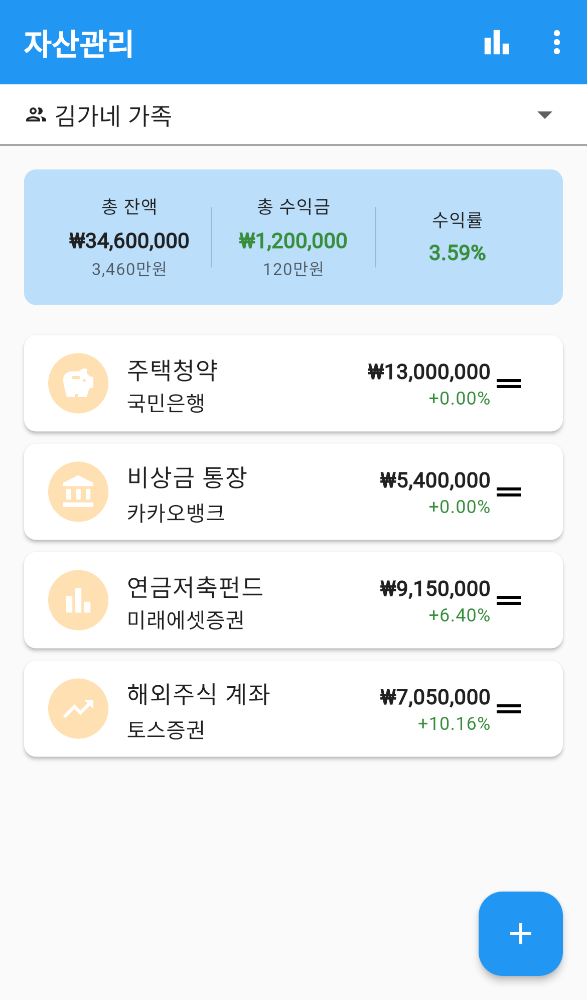
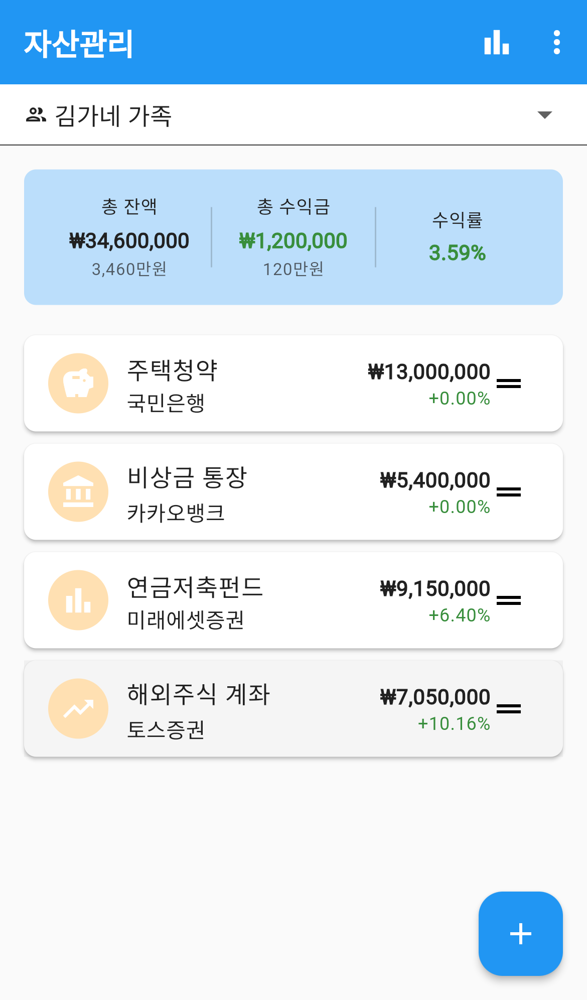
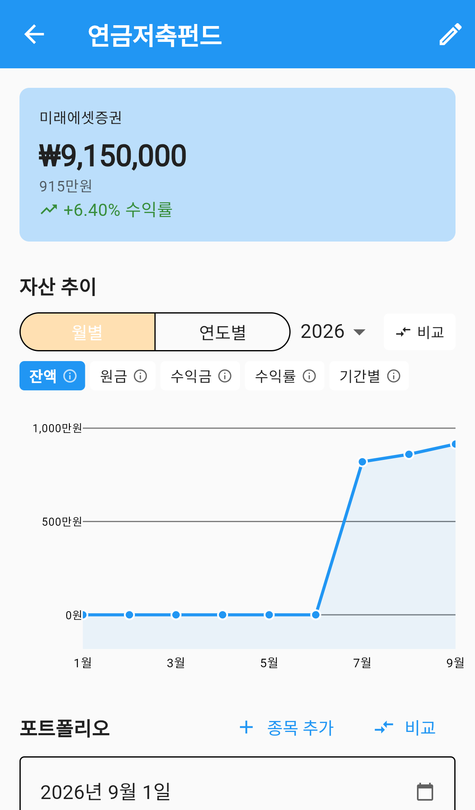
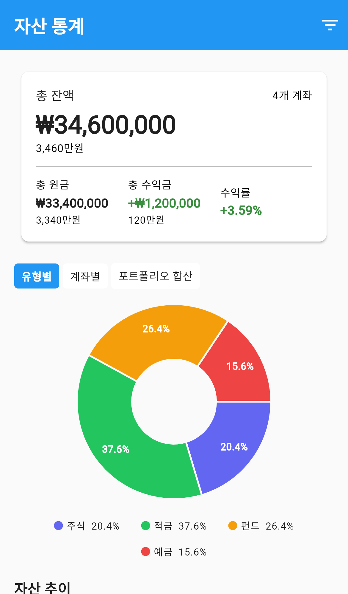

# 자산

가족의 통장·예금·펀드·주식을 한곳에 모아 보는 메뉴입니다.
계좌를 등록하고 매달 잔액을 기록해두면, 자산이 어떻게 늘고 있는지 그래프로 확인할 수 있습니다.

가계부가 **매일의 수입·지출**을 다룬다면, 자산은 **쌓인 돈의 현재 상태**를 봅니다.

---

## 화면 구성

*자산관리 — 총 잔액 요약과 계좌 목록*

| 영역 | 설명 |
|---|---|
| 그룹 선택 | 어느 가족의 자산을 볼지 고릅니다 |
| 요약 카드 | 총 잔액 · 총 수익금 · 수익률 |
| 계좌 목록 | 등록한 계좌가 잔액순으로 표시됩니다 |

- 금액 아래에 **`3,460만원`** 처럼 읽기 쉬운 표기가 함께 나옵니다.
- 수익금과 수익률은 **이익이면 초록, 손실이면 빨강**으로 표시됩니다.

### 앱바 버튼

| 버튼 | 하는 일 |
|---|---|
| 막대그래프 아이콘 | 자산 통계 화면으로 이동 |
| `⋮` | 추가 메뉴 |

---

## 계좌 목록

*계좌 목록 — 유형별 잔액과 수익률*

계좌마다 다음이 표시됩니다.

- 왼쪽 동그란 아이콘 — 계좌 **유형**을 나타냅니다
- 계좌 이름과 금융기관
- 최신 잔액과 수익률

오른쪽 **≡ 손잡이**를 잡고 끌면 순서를 바꿀 수 있습니다.

### 계좌 유형

| 유형 | 예 |
|---|---|
| 적금 | 주택청약, 정기적금 |
| 예금 | 비상금 통장, 파킹통장 |
| 주식 | 국내·해외 주식 계좌 |
| 펀드 | 연금저축펀드, ETF |
| 부동산 | 아파트, 토지 |
| 금 | 골드바, 금 통장 |
| 기타 | 위에 없는 것 |

> **저금통과의 관계** — [저금통](../savings/index.md)에서 만든 목표 중
> `자산에 포함` 을 켠 것은 계좌 목록 아래에 함께 표시되고 총액에도 합산됩니다.

---

## 계좌 등록하기

1. 오른쪽 아래 **＋** 버튼을 누릅니다.
2. **계좌 이름**을 입력합니다. (필수)
3. **유형**을 고릅니다.
4. 금융기관·계좌번호는 선택 사항입니다.
5. 저장합니다.

**자산 기록 알림 일자**를 정해두면 매달 그날 잔액을 입력하라고 알려줍니다.

---

## 계좌 상세 보기

*계좌 상세 — 잔액 추이 그래프와 포트폴리오*

계좌를 누르면 상세 화면으로 들어갑니다.

### 자산 추이 그래프

- **월별 / 연도별** 을 골라 기간을 바꿉니다.
- 아래 칩으로 무엇을 그릴지 고릅니다 — `잔액` · `원금` · `수익금` · `수익률` · `기간별`
- **비교** 를 누르면 두 시점을 나란히 놓고 얼마나 늘었는지 봅니다.

### 기록 남기기

매달 잔액을 기록해야 그래프가 그려집니다.

1. **기록 추가** 를 누릅니다.
2. 날짜를 고르고 **잔액**을 입력합니다.
3. 원금과 수익금을 나눠 적으면 수익률이 자동 계산됩니다.

### 출금 기록

계좌에서 돈을 뺐다면 **출금**으로 남깁니다.
출금을 기록해두면 "잔액이 줄어든 것"과 "손실이 난 것"을 구분해서 볼 수 있습니다.

### 포트폴리오

주식·펀드 계좌라면 어떤 종목을 담고 있는지 기록할 수 있습니다.
날짜별로 종목 구성을 남겨두고, 시점 간 변화를 비교해 봅니다.

---

## 자산 통계

*자산 통계 — 유형별 구성과 전체 추이*

앱바의 **막대그래프 아이콘**을 누르면 들어갑니다.

- **유형별 현황** — 적금·예금·주식이 각각 얼마인지
- **전체 자산 추이** — 모든 계좌를 합친 그래프
- **저금통 합계** — 자산에 포함한 저금통 목표의 총액

---

## 자주 묻는 질문

**Q. 그래프가 그려지지 않습니다.**
기록이 2개 이상 있어야 선이 그려집니다. 계좌 상세에서 **기록 추가**로 지난달 잔액도 함께 넣어보세요.

**Q. 수익률이 0%로 나옵니다.**
기록할 때 **원금**을 넣지 않으면 수익을 계산할 수 없습니다. 원금과 잔액을 함께 적어주세요.

**Q. 계좌를 지우면 기록도 사라지나요?**
네, 그 계좌에 남긴 기록과 종목 정보가 함께 삭제됩니다.

**Q. 가족 각자의 자산을 따로 보고 싶습니다.**
현재는 그룹 단위로만 볼 수 있습니다. 구성원별로 나눠 보는 기능은 아직 제공하지 않습니다.

**Q. 저금통이 자산 목록에 안 보입니다.**
저금통 목표를 만들 때 **자산에 포함** 을 켜야 표시됩니다. 저금통 상세에서 언제든 바꿀 수 있습니다.
