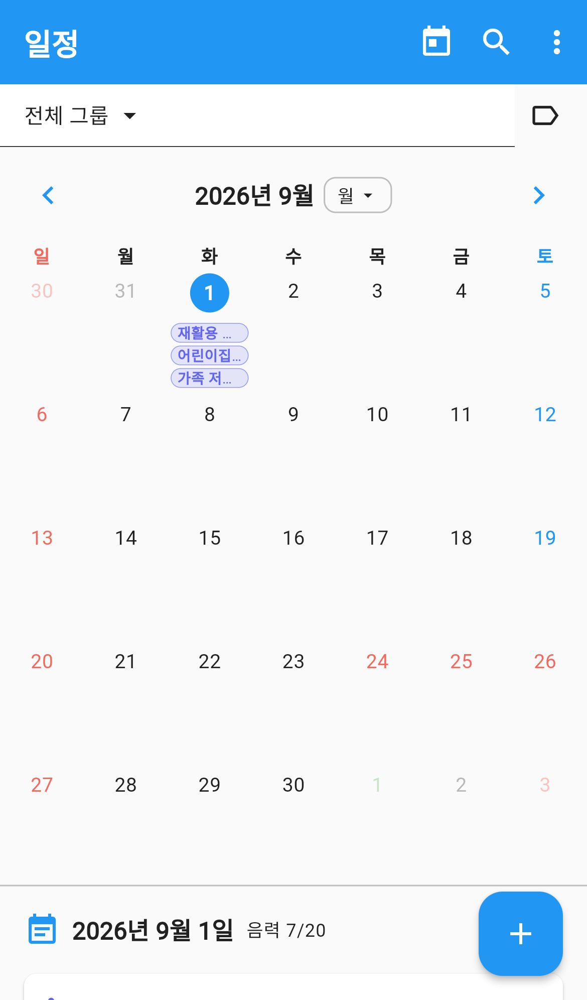
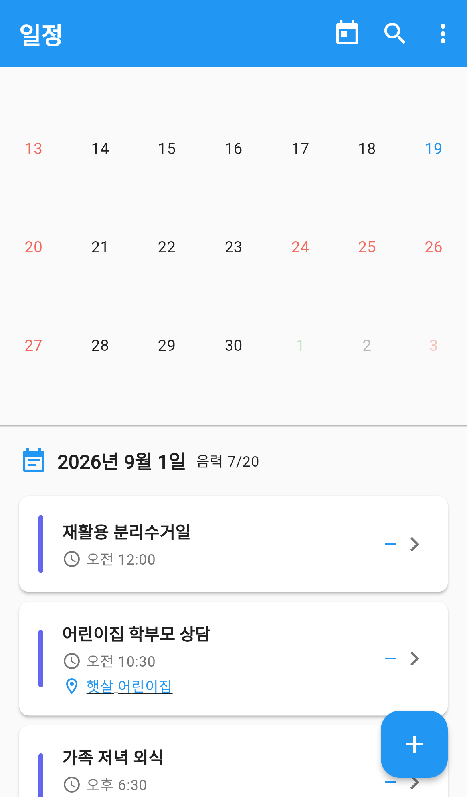
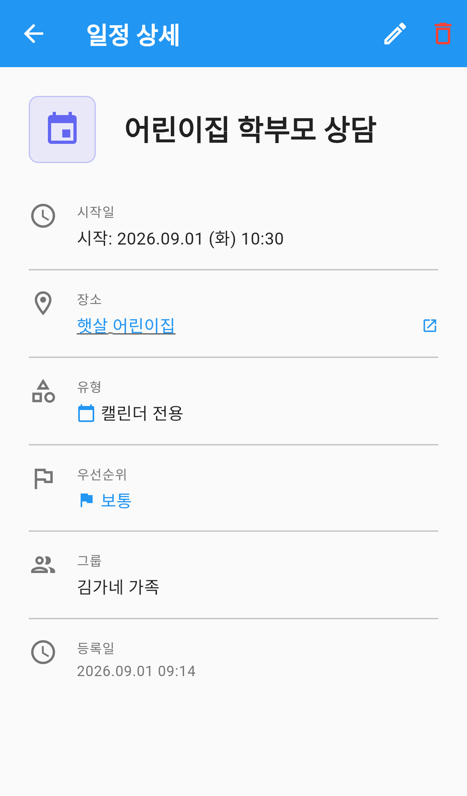
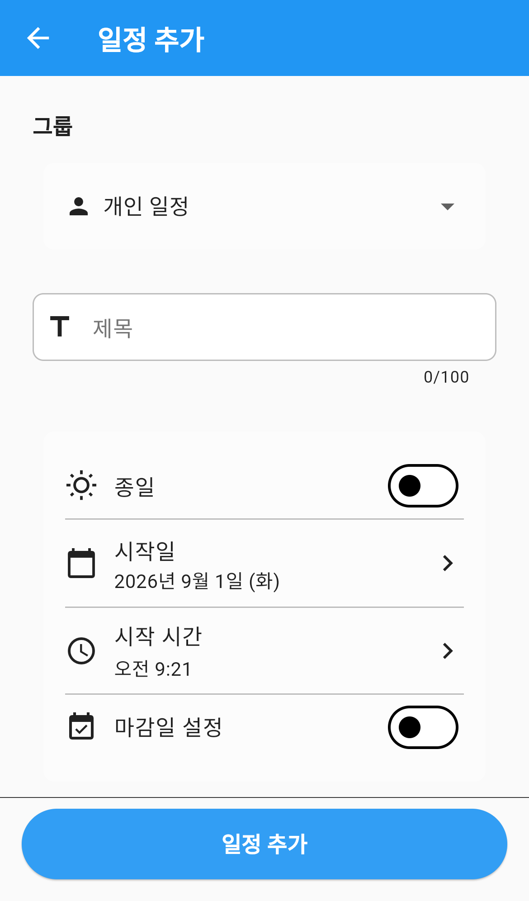
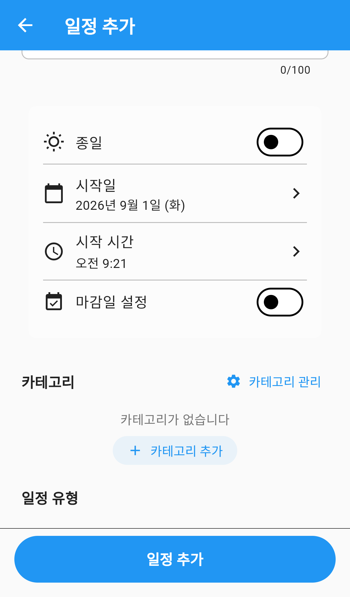

# 일정

가족의 일정을 한 달력에 모아 보는 메뉴입니다.
내 개인 일정과 그룹 일정을 함께 보거나, 특정 그룹 것만 골라 볼 수 있습니다.

일정을 등록하면 그룹 구성원 모두에게 보이고, 알림을 걸어두면 시작 전에 알려줍니다.

---

## 화면 구성

*일정 — 월간 달력과 그날의 일정 목록*

화면은 위에서부터 이렇게 이루어져 있습니다.

| 영역 | 설명 |
|---|---|
| 그룹 선택 | `전체 그룹`을 누르면 볼 그룹을 고릅니다 |
| 태그 아이콘 | 카테고리로 걸러 봅니다 |
| 연·월 이동 | 양옆 `<` `>` 로 지난달·다음 달을 오갑니다 |
| 보기 전환 | `월` 을 눌러 월간·주간을 바꿉니다 |
| 달력 | 일정이 있는 날에는 제목이 작은 칩으로 표시됩니다 |
| 날짜별 목록 | 고른 날짜의 일정이 아래에 펼쳐집니다 |

- **일요일은 빨간색, 토요일은 파란색**으로 표시됩니다.
- 공휴일도 함께 표시됩니다.
- 오늘 날짜에는 진한 원이 그려집니다.

### 앱바 버튼

| 버튼 | 하는 일 |
|---|---|
| 달력 아이콘 | 오늘 날짜로 돌아갑니다 |
| 돋보기 | 일정을 검색합니다 (제목·설명·장소) |
| `⋮` | 카테고리 관리, 기념일 관리 등 |

---

## 날짜별 일정 보기

*날짜를 누르면 그날 일정이 아래에 펼쳐집니다*

달력에서 날짜를 누르면 아래에 그날의 일정이 나옵니다.
날짜 옆에는 **음력 날짜**도 함께 표시됩니다.

각 일정 카드에는 제목과 시간이 표시되고, 장소를 넣었다면 장소명도 함께 보입니다.
종일 일정은 시간 대신 `오전 12:00` 으로 표시됩니다.

카드를 누르면 상세 화면으로 들어갑니다.

---

## 일정 상세 보기

*일정 상세 — 시간·장소·유형·그룹*

| 항목 | 설명 |
|---|---|
| 시작일 | 날짜와 시각 |
| 장소 | 누르면 지도로 위치를 확인합니다 |
| 유형 | `캘린더 전용` · `할일 연동` · `할일 전용` |
| 우선순위 | 긴급 / 높음 / 보통 / 낮음 |
| 그룹 | 어느 그룹의 일정인지 |
| 등록일 | 언제 만들어졌는지 |

오른쪽 위 **연필** 로 수정하고, **휴지통** 으로 삭제합니다.

> 장소를 지도로 볼 때, 장소명만 저장돼 있고 좌표가 없으면
> `위치 정보가 없어 지도를 표시할 수 없습니다` 라고 안내합니다.
> 일정을 수정해 장소를 다시 고르면 지도가 나타납니다.

---

## 일정 등록하기

*일정 등록 — 제목과 날짜만 넣어도 저장됩니다*

1. 오른쪽 아래 **＋** 버튼을 누릅니다.
2. **제목**을 입력합니다. (필수)
3. 필요한 항목만 채우고 저장합니다.

*반복·알림·참여자 설정*

### 채울 수 있는 항목

| 항목 | 설명 |
|---|---|
| 유형 | 캘린더에만 둘지, 할일에도 넣을지 고릅니다 |
| 카테고리 | 색으로 구분되는 분류 |
| 날짜·시간 | 시작일과 마감일을 따로 정할 수 있습니다 |
| 종일 | 켜면 시간 없이 하루 전체로 잡힙니다 |
| 장소 | 검색해서 고르면 주소와 지도가 함께 저장됩니다 |
| 우선순위 | 긴급 / 높음 / 보통 / 낮음 |
| 반복 | 매일 · 매주 · 매월 · 매년 |
| 알림 | 시작 전 또는 마감 전 기준으로 여러 개 |
| 참여자 | 그룹 일정일 때 구성원을 지정합니다 |
| 그룹 | 개인 일정으로 둘지, 어느 그룹에 넣을지 |
| 메모 | 자유롭게 적습니다 |

### 반복 일정

`매일` · `매주` · `매월` · `매년` 중에서 고릅니다.
**주말 건너뛰기**, **공휴일 건너뛰기** 를 켜면 그 날짜는 자동으로 빠집니다.

만들어진 반복 일정은 상세 화면에서 **일시정지**하거나, 특정 회차만 **건너뛸** 수 있습니다.

### 알림

`5분 전` · `15분 전` · `30분 전` · `1시간 전` · `1일 전` 중에서 고릅니다.
여러 개를 함께 걸 수 있고, 시작 기준인지 마감 기준인지도 정합니다.

> 알림을 받으려면 `설정 → 알림 설정` 에서 **일정 알림**이 켜져 있어야 합니다.

---

## 빠르게 등록하기

달력에서 날짜를 길게 누르면 **빠른 등록 시트**가 열립니다.
제목과 시간만 넣고 바로 저장할 수 있어, 간단한 일정에 편합니다.

---

## 다른 보기 방식

`월` 드롭다운에서 보기 방식을 바꿉니다.

| 보기 | 설명 |
|---|---|
| 월 | 한 달 전체를 격자로 |
| 주 | 한 주만 크게 |

주간 보기에서는 **시간표 형태**로도 볼 수 있어, 하루 중 언제 일정이 몰려 있는지 한눈에 들어옵니다.

---

## 카테고리 관리

앱바 `⋮` → **카테고리 관리** 로 들어갑니다.

- 카테고리마다 **이름과 색**을 정합니다.
- 그룹별로 따로 관리되므로, 가족용과 모임용을 다르게 둘 수 있습니다.
- 달력의 일정 칩 색이 카테고리 색을 따릅니다.

---

## 기념일

결혼기념일·생일처럼 해마다 챙기는 날을 등록해 둡니다.
앱바 `⋮` → **기념일 관리** 로 들어갑니다.

1. **＋** 로 기념일을 만듭니다.
2. 이름, 날짜, 이모지를 넣습니다.
3. **100일 단위**와 **매년 주년** 을 켜면 그 날짜들이 자동으로 일정에 생깁니다.

등록한 기념일은 대시보드 **기념일 위젯**에도 띄울 수 있습니다
(자세한 방법은 [대시보드](../dashboard/index.md) 매뉴얼 참고).

---

## 자주 묻는 질문

**Q. 다른 가족이 만든 일정이 안 보입니다.**
위쪽 **그룹 선택**이 `개인` 이나 다른 그룹으로 되어 있지 않은지 확인하세요. `전체 그룹`으로 두면 참여 중인 모든 그룹의 일정이 함께 보입니다.

**Q. 할일로 만든 항목이 달력에 안 보입니다.**
일정 유형이 `할일 전용` 이면 달력에는 표시되지 않고 [할일](../todo/index.md) 메뉴에만 나옵니다. 양쪽에 모두 보이게 하려면 `할일 연동` 으로 바꾸세요.

**Q. 반복 일정 중 하루만 빼고 싶습니다.**
그 날짜의 일정 상세로 들어가 **건너뛰기** 를 누르세요. 나머지 회차는 그대로 유지됩니다.

**Q. 장소를 눌렀는데 지도가 안 나옵니다.**
좌표 없이 장소명만 저장된 일정입니다. 일정을 수정해 장소를 검색으로 다시 고르면 지도가 표시됩니다.
