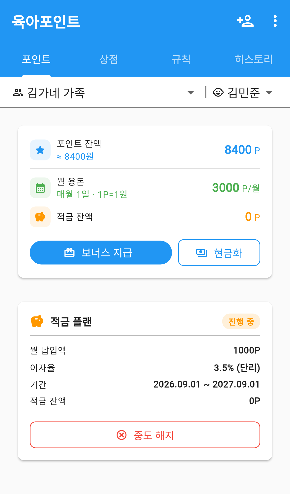
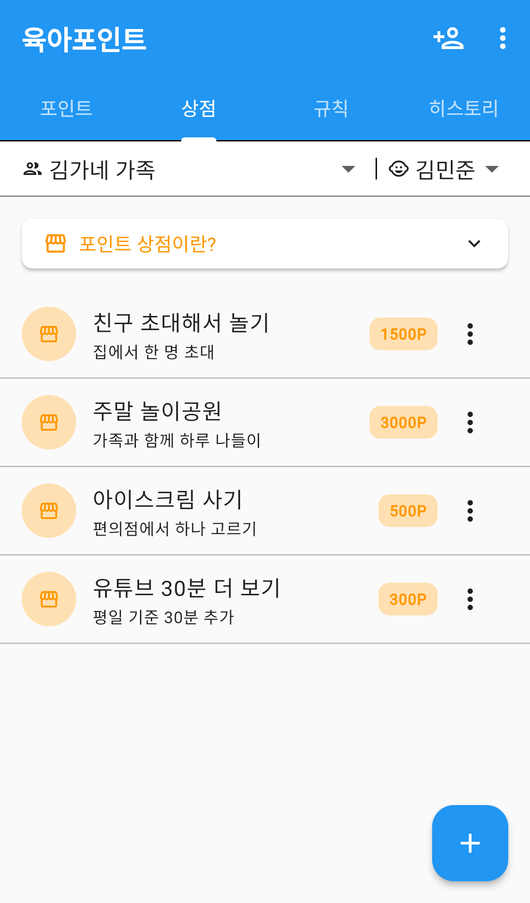
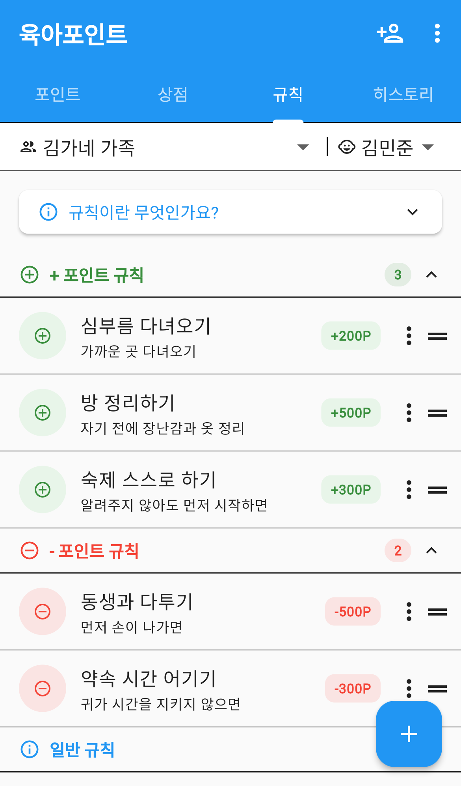
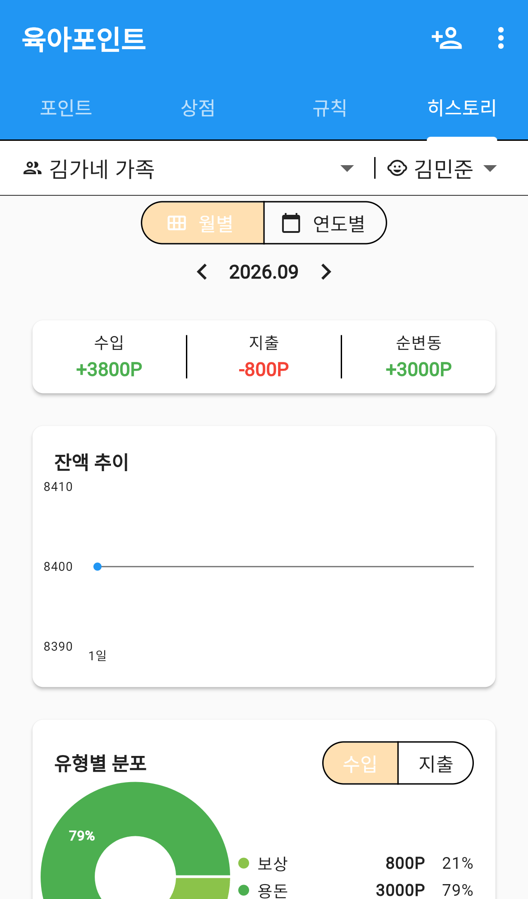
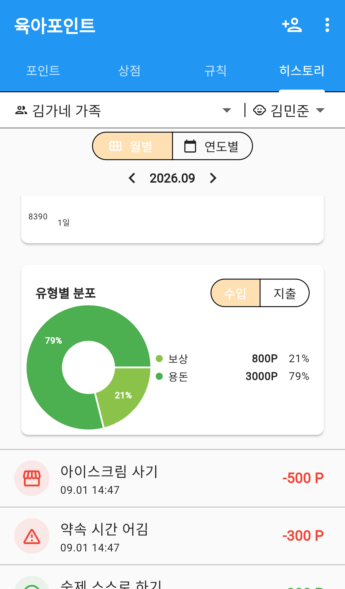

# 육아 포인트

아이가 집안일을 돕거나 약속을 지키면 **포인트**를 주고, 모은 포인트로 원하는 것을 바꿔 쓰게 하는 메뉴입니다.

용돈을 그냥 주는 대신 "무엇을 하면 얼마"를 미리 정해두면, 아이도 부모도 기준이 분명해집니다.
모은 포인트는 상점에서 쓰거나, 적금에 넣어 이자를 받을 수도 있습니다.

`더보기` 탭 → **육아포인트** 로 들어갑니다.

---

## 화면 구성

*육아포인트 — 그룹·자녀 선택과 포인트 잔액*

화면 맨 위에 **그룹**과 **자녀**를 고르는 줄이 있고, 그 아래로 네 개의 탭이 이어집니다.

| 탭 | 무엇을 하는 곳 |
|---|---|
| 포인트 | 잔액 확인, 포인트 주고 빼기, 적금 |
| 상점 | 포인트로 바꿔 쓸 수 있는 것 관리 |
| 규칙 | 무엇을 하면 얼마인지 정해두기 |
| 히스토리 | 지금까지의 포인트 흐름 |

> 여러 아이를 등록했다면 오른쪽 위 **자녀 이름**을 눌러 아이를 바꿉니다.
> 탭을 옮겨도 고른 아이는 그대로 유지됩니다.

### 앱바 버튼

| 버튼 | 하는 일 |
|---|---|
| 사람＋ 아이콘 | 자녀를 새로 등록합니다 |
| `⋮` → 용돈 플랜 설정 | 매달 자동으로 줄 포인트를 정합니다 |
| `⋮` → 앱 계정 연동 | 아이가 앱에 가입했다면 계정을 연결합니다 |

---

## 자녀 등록하기

포인트를 주려면 먼저 아이를 등록해야 합니다.
**아이가 앱에 가입하지 않아도 됩니다.** 부모가 대신 관리할 수 있습니다.

1. 오른쪽 위 **사람＋** 버튼을 누릅니다.
2. 아이 **이름**과 **생년월일**을 넣습니다.
3. 저장하면 포인트 계정이 함께 만들어집니다.

나중에 아이가 직접 앱을 쓰게 되면, `⋮` → **앱 계정 연동** 으로 아이 계정을 연결합니다.
연결하면 아이도 자기 포인트를 볼 수 있습니다.

---

## 포인트 탭

*포인트 탭 — 적금 플랜과 최근 거래*

맨 위 카드에 지금 상태가 모여 있습니다.

| 항목 | 설명 |
|---|---|
| 포인트 잔액 | 지금 쓸 수 있는 포인트. 아래에 원 환산 금액이 함께 표시됩니다 |
| 월 용돈 | 매달 자동으로 들어오는 포인트와 지급일 |
| 적금 잔액 | 적금에 넣어둔 포인트 |

### 포인트 주고 빼기

- **보너스 지급** — 규칙에 없는 일을 했을 때 그때그때 포인트를 줍니다.
- **현금화** — 모은 포인트를 실제 용돈으로 바꿔줄 때 눌러 차감합니다.

포인트를 줄 때는 **금액**과 **설명**을 넣습니다. 설명은 나중에 히스토리에서 무엇 때문이었는지 알아보는 데 쓰이니 적어두는 편이 좋습니다.

### 용돈 플랜

매달 같은 날 자동으로 포인트를 주는 설정입니다.
`⋮` → **용돈 플랜 설정** 에서 정합니다.

| 항목 | 설명 |
|---|---|
| 월 지급 포인트 | 매달 줄 포인트 |
| 지급일 | 매달 며칠에 줄지 (1~31일) |
| 포인트 : 원 비율 | 1포인트를 몇 원으로 볼지 |
| 다음 협상일 | 용돈을 다시 이야기할 날 (선택) |

**다음 협상일**을 정해두면 그날이 가까워질 때 화면에 안내가 뜹니다.
"용돈 올려달라"는 이야기를 매번 즉흥적으로 하는 대신, 정해진 날에 함께 이야기하자는 뜻입니다.

### 적금

포인트를 당장 쓰지 않고 모아두면 **이자**를 붙여주는 기능입니다.

1. 포인트 탭에서 **적금 시작** 을 누릅니다.
2. 월 납입액, 이자율, 단리/복리, 기간을 정합니다.
3. 만들면 카드에 `진행 중` 배지와 함께 조건이 표시됩니다.

- **단리** — 원금에만 이자가 붙습니다.
- **복리** — 이자에도 이자가 붙습니다.

만들기 전에 **예상 이자**를 미리 보여주므로, 아이와 함께 "이만큼 두면 이만큼 늘어난다"를 확인할 수 있습니다.

만기 전에 그만두려면 **중도 해지** 를 누릅니다.

---

## 상점 탭

*상점 — 포인트로 바꿔 쓸 수 있는 보상*

모은 포인트로 무엇을 바꿀 수 있는지 목록으로 만들어 둡니다.

### 보상 등록하기

1. 오른쪽 아래 **＋** 버튼을 누릅니다.
2. **보상 이름**과 **포인트 비용**을 넣습니다. 설명은 선택입니다.
3. 저장합니다.

값을 여러 단계로 벌려두면 좋습니다 — 작은 보상(간식)은 자주, 큰 보상(나들이)은 오래 모아야 닿도록.

### 보상 사용하기

항목 오른쪽 `⋮` 를 눌러 **사용** 하면 그만큼 포인트가 빠지고 히스토리에 남습니다.
같은 메뉴에서 수정·삭제도 할 수 있습니다.

목록을 길게 눌러 끌면 순서를 바꿀 수 있습니다.

> 위쪽 **포인트 상점이란?** 을 누르면 처음 쓰는 사람을 위한 안내가 펼쳐집니다.

---

## 규칙 탭

*규칙 — 적립·차감 규칙을 눌러 바로 적용*

"무엇을 하면 얼마"를 미리 정해두는 곳입니다. 세 가지 종류가 있습니다.

| 종류 | 설명 |
|---|---|
| **＋ 포인트 규칙** | 하면 포인트를 받습니다 (방 정리, 숙제) |
| **− 포인트 규칙** | 어기면 포인트가 빠집니다 (약속 시간, 다툼) |
| **일반 규칙** | 포인트와 무관한 가족 약속 (손 씻기) |

각 섹션 오른쪽 숫자가 그 종류의 규칙 개수이고, `∧` 로 접을 수 있습니다.

### 규칙 등록하기

1. 오른쪽 아래 **＋** 버튼을 누릅니다.
2. **규칙 이름**과 **종류**를 고릅니다.
3. ＋/− 규칙이면 **포인트**를 넣습니다. 일반 규칙은 포인트를 넣지 않습니다.

### 규칙 바로 적용하기

규칙 왼쪽의 **＋ / −** 동그라미를 누르면 그 규칙의 포인트가 **바로 적용**됩니다.
매번 금액을 입력할 필요 없이, 규칙을 눌러 처리하면 됩니다.

`⋮` 로 수정·삭제하고, 오른쪽 **≡ 손잡이**로 순서를 바꿉니다.

---

## 히스토리 탭

*히스토리 — 월별 요약과 잔액 추이*

포인트가 어떻게 들어오고 나갔는지 봅니다.

### 월별 / 연도별

위쪽에서 보기 단위를 고르고, 양옆 `<` `>` 로 기간을 옮깁니다.

**월별**에서는 이렇게 보여줍니다.

| 항목 | 설명 |
|---|---|
| 수입 | 그달에 들어온 포인트 합계 |
| 지출 | 그달에 빠져나간 포인트 합계 |
| 순변동 | 수입 − 지출 |

### 잔액 추이

그달 동안 잔액이 어떻게 움직였는지 선 그래프로 보여줍니다.

### 유형별 분포

*유형별 도넛 차트와 거래 내역*

포인트가 어떤 이유로 들고 났는지 도넛 차트로 나눠 봅니다.
오른쪽에서 **수입 / 지출** 을 바꿔가며 확인합니다.

| 유형 | 뜻 |
|---|---|
| 용돈 | 매달 자동 지급된 포인트 |
| 보상 | 규칙을 지켜 받은 포인트 |
| 보너스 | 그때그때 따로 준 포인트 |
| 차감 | 규칙을 어겨 빠진 포인트 |
| 구매 | 상점에서 쓴 포인트 |
| 현금화 | 실제 용돈으로 바꾼 포인트 |
| 적금 입금·출금 | 적금에 넣고 뺀 포인트 |
| 이자 | 적금에서 붙은 이자 |

그 아래에 **거래 내역**이 최신순으로 이어집니다.

### 연도별

한 해 전체를 월별 막대 그래프로 봅니다. 어느 달에 많이 벌고 많이 썼는지 한눈에 들어옵니다.

---

## 자주 묻는 질문

**Q. 아이가 앱에 가입해야 쓸 수 있나요?**
아니요. 부모가 자녀 프로필만 등록하면 됩니다. 나중에 아이가 가입하면 `⋮` → **앱 계정 연동** 으로 연결할 수 있습니다.

**Q. 아이가 여러 명이면 어떻게 하나요?**
사람＋ 버튼으로 각각 등록하면 됩니다. 아이마다 포인트·상점·규칙·적금이 따로 관리되고, 화면 위 자녀 이름을 눌러 오갑니다.

**Q. 규칙을 눌렀는데 포인트가 안 빠집니다.**
왼쪽 동그란 **＋ / −** 버튼을 눌러야 적용됩니다. 규칙 이름을 누르는 것만으로는 적용되지 않습니다.

**Q. 히스토리가 비어 있습니다.**
히스토리는 고른 **기간 기준**입니다. 위쪽 연·월을 확인하고, 거래가 있던 달로 옮겨보세요.

**Q. 월 용돈이 자동으로 안 들어옵니다.**
`⋮` → **용돈 플랜 설정** 에서 지급일을 정했는지 확인하세요. 설정하지 않으면 자동 지급되지 않습니다.

**Q. 적금을 중간에 깨면 이자는 어떻게 되나요?**
중도 해지하면 원금은 포인트 잔액으로 돌아오지만 이자는 붙지 않습니다.

**Q. 포인트를 실제 돈으로 주고 싶습니다.**
포인트 탭의 **현금화** 를 누르세요. 포인트가 차감되고 히스토리에 기록으로 남습니다. 얼마로 바꿀지는 용돈 플랜의 `포인트 : 원 비율` 을 기준으로 정하면 됩니다.
