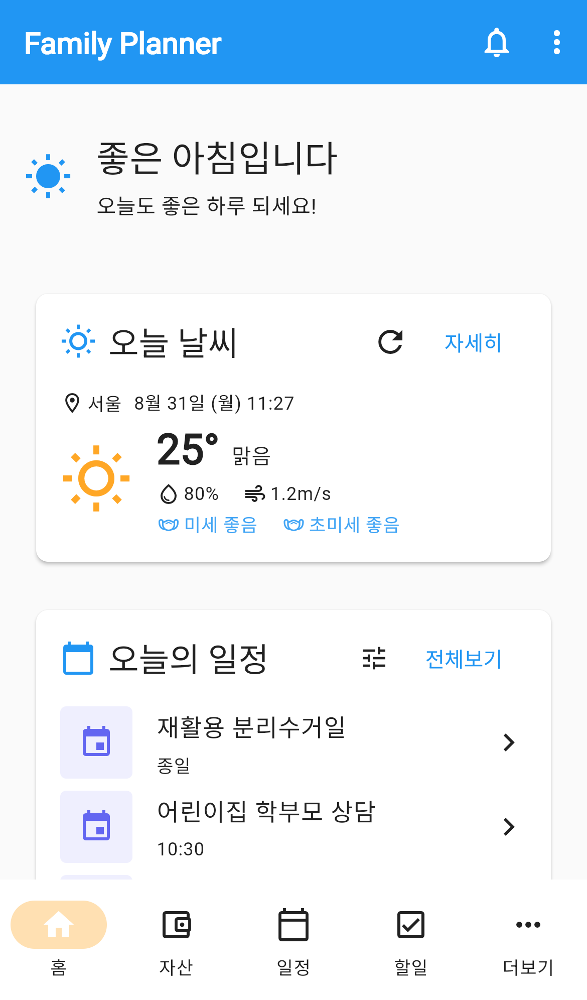
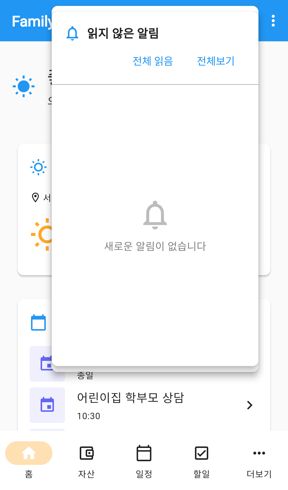
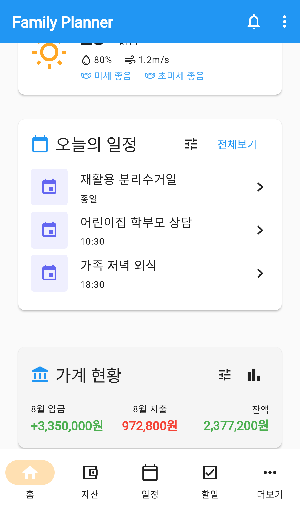
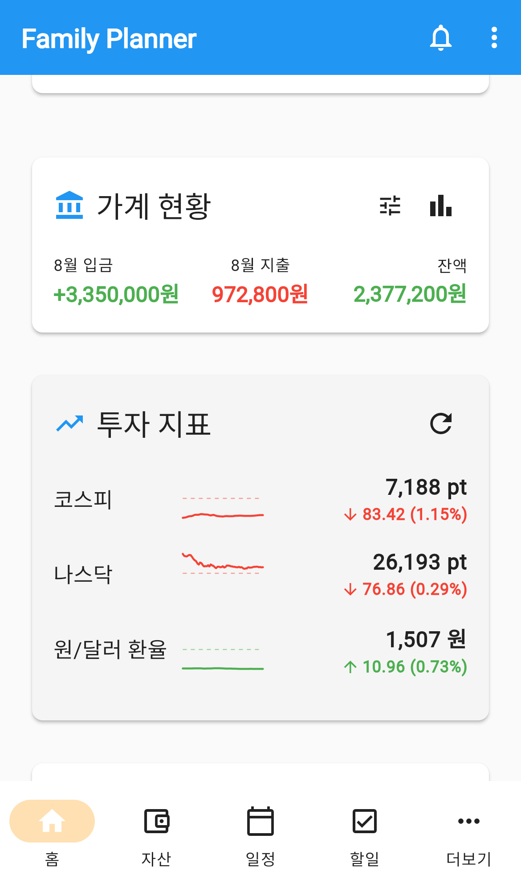
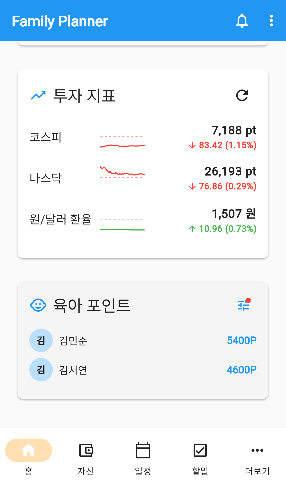
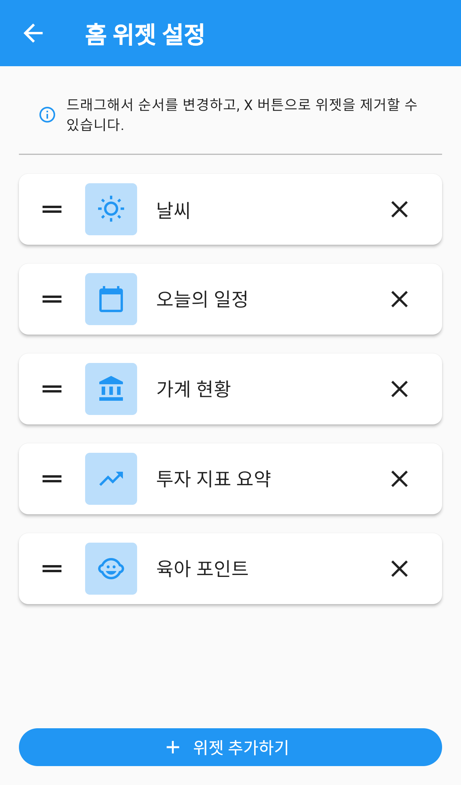
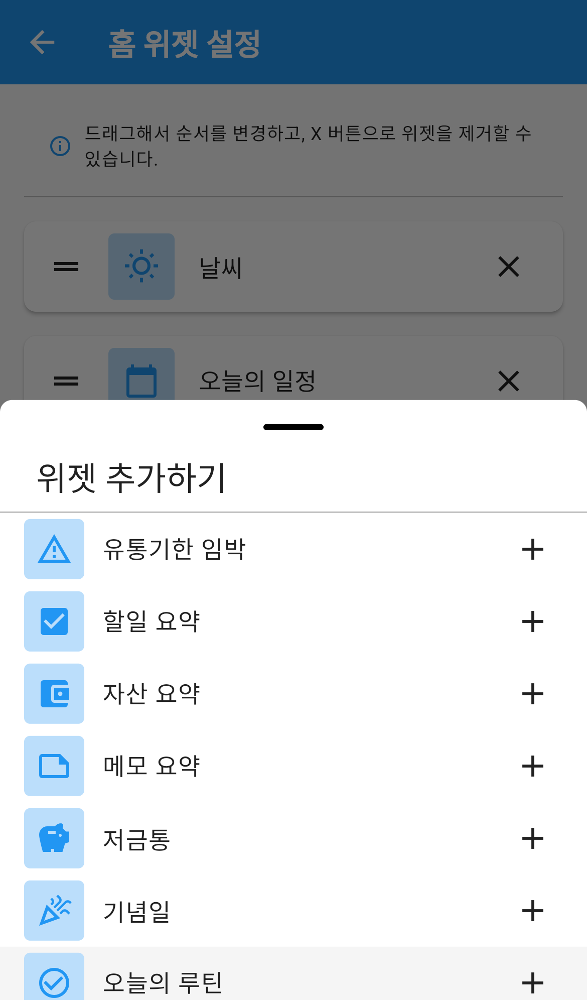
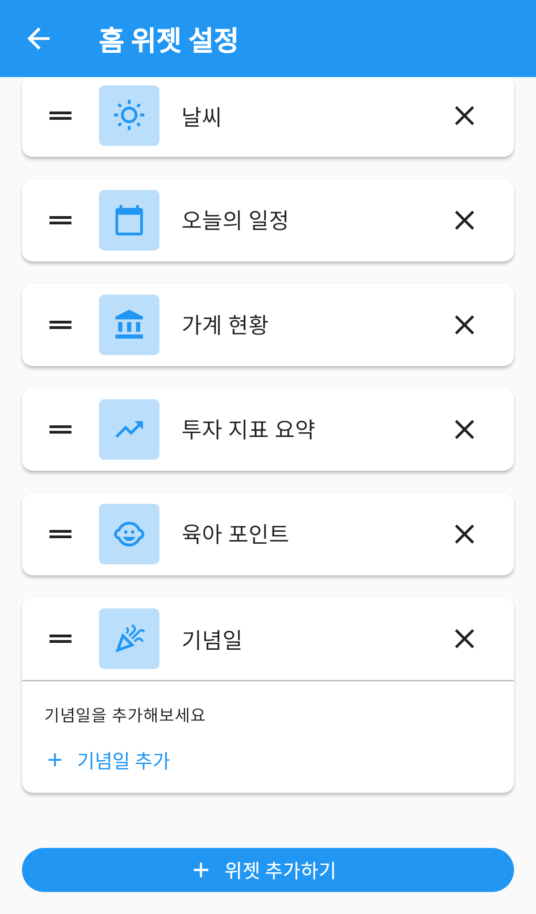
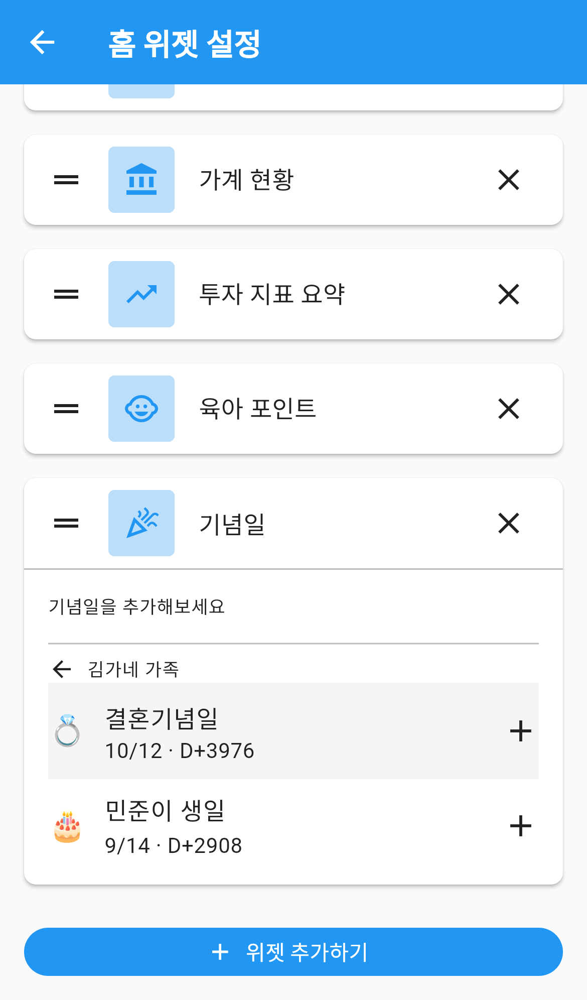
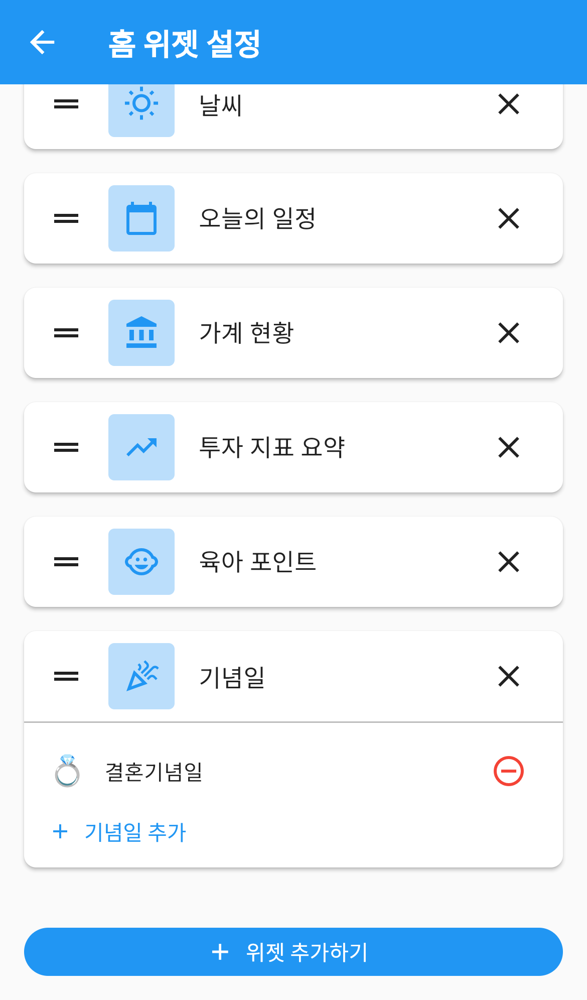

# 대시보드

앱을 켜면 가장 먼저 보이는 홈 화면입니다.
오늘 일정, 이번 달 가계 상황, 아이 포인트처럼 **자주 확인하는 정보만 요약 카드로 모아** 보여줍니다.

어떤 카드를 볼지, 어떤 순서로 볼지는 직접 정할 수 있습니다.
필요 없는 카드는 빼고 자주 보는 카드를 맨 위로 올려두면, 앱을 켤 때마다 원하는 정보가 먼저 보입니다.

---

## 화면 구성

*대시보드 — 인사말과 요약 위젯이 순서대로 표시됩니다*

화면은 위에서부터 다음 순서로 이루어져 있습니다.

| 영역 | 설명 |
|---|---|
| 앱바 | 알림 종 아이콘과 `⋮` 더보기 메뉴 |
| 인사말 | 시간대에 따라 아침·오후·저녁 인사가 바뀝니다 |
| 무료 체험 배너 | 2주 무료 체험 기간에만 표시됩니다 |
| 요약 위젯 | 내가 고른 카드들이 정한 순서대로 표시됩니다 |

### 인사말

시간대에 따라 문구와 아이콘이 자동으로 바뀝니다.

- 오전 (0시~11시): **좋은 아침입니다**
- 오후 (12시~17시): **좋은 오후입니다**
- 저녁 (18시~23시): **좋은 저녁입니다**

### 화면 새로고침

화면을 **아래로 잡아당기면** 알림 개수를 다시 불러옵니다.

---

## 알림 확인하기

*알림 — 종 아이콘을 누르면 읽지 않은 알림이 펼쳐집니다*

앱바 오른쪽 위 **종 아이콘**을 누르면 `읽지 않은 알림` 카드가 펼쳐집니다.
읽지 않은 알림이 있으면 종 아이콘에 **숫자 배지**가 붙습니다.

카드 안에는 두 개의 버튼이 있습니다.

- **전체 읽음**: 읽지 않은 알림을 한 번에 모두 읽음 처리합니다.
- **전체보기**: 받은 알림 전체 목록으로 이동합니다.

읽지 않은 알림이 없으면 `새로운 알림이 없습니다` 라고 표시됩니다.

---

## 더보기 메뉴

앱바 오른쪽 끝 `⋮` 를 누르면 나오는 메뉴입니다.

| 항목 | 하는 일 |
|---|---|
| AI 어시스턴트 | 준비 중인 기능입니다 (자물쇠 아이콘 표시) |
| 튜토리얼 다시 보기 | 앱 소개와 기능 안내를 처음부터 다시 봅니다 |
| 사용 가이드 | 사용 가이드 홈페이지를 브라우저로 엽니다 |

---

## 요약 위젯 살펴보기

*오늘의 일정 위젯 — 종일 일정과 시간 일정이 함께 표시됩니다*

*가계 현황과 투자 지표 — 카드를 누르면 해당 메뉴로 이동합니다*

*육아 포인트 — 자녀별 포인트 잔액이 표시됩니다*

### 위젯의 공통 동작

- **카드를 누르면** 해당 메뉴의 전체 화면으로 이동합니다.
- 카드 오른쪽 위 **전체보기**를 눌러도 같은 화면으로 갑니다.
- 카드 오른쪽 위 **필터 아이콘**이 있는 위젯은 어느 그룹의 정보를 볼지 고를 수 있습니다.
  필터를 걸어두면 아이콘에 작은 점이 표시됩니다.

### 그룹·기간 필터 사용하기

일정·할일 위젯의 필터 아이콘을 누르면 `필터` 시트가 열립니다.

1. 위쪽에서 `오늘` · `금주` · `이번달` 중 하나를 고릅니다.
2. **개인 일정** 스위치로 내 개인 일정을 포함할지 정합니다.
3. 볼 그룹을 체크합니다. `전체 그룹`을 고르면 참여 중인 모든 그룹을 봅니다.
4. **적용**을 누릅니다.

고른 조건은 저장되어 다음에 앱을 켜도 그대로 유지됩니다.

### 고를 수 있는 위젯

| 위젯 | 보여주는 내용 |
|---|---|
| 날씨 | 현재 위치의 날씨, 미세먼지 |
| 오늘의 일정 | 오늘(또는 금주·이번달) 일정 |
| 할일 요약 | 진행 중인 할일 |
| 가계 현황 | 이번 달 입금·지출·잔액과 예산 달성률 |
| 투자 지표 요약 | 즐겨찾기한 지표의 시세와 등락 |
| 자산 요약 | 총 자산과 수익률 |
| 메모 요약 | 최근 작성한 메모 |
| 육아 포인트 | 자녀별 포인트 잔액 |
| 저금통 | 그룹별 적립 목표와 달성 현황 |
| 유통기한 임박 | 냉장고에서 유통기한이 얼마 남지 않은 식품 |
| 기념일 | 다가오는 기념일과 D-day |
| 오늘의 루틴 | 오늘 해야 할 루틴 |

> 처음 앱을 설치하면 **날씨 · 오늘의 일정 · 가계 현황 · 투자 지표 요약 · 육아 포인트** 5개가 표시됩니다.

**날씨 위젯**은 위치 권한이 필요합니다. 권한이 없으면 서울 날씨를 대신 보여주면서
`현재 위치를 가져오지 못해 서울 날씨를 표시하고 있습니다` 라고 알려줍니다.

**투자 지표 요약**은 투자 지표 메뉴에서 즐겨찾기한 지표만 보여줍니다.
즐겨찾기한 것이 없으면 `즐겨찾기한 지표가 없습니다` 라고 표시됩니다.

---

## 대시보드 꾸미기

표시할 위젯과 순서를 바꾸는 화면입니다.
`설정 → 홈 위젯 설정` 으로 들어갑니다.

*홈 위젯 설정 — 드래그로 순서를 바꾸고 X로 제거합니다*

### 순서 바꾸기

카드 왼쪽의 **≡ 손잡이를 잡고 위아래로 끌면** 순서가 바뀝니다.
놓는 즉시 저장되고 `설정이 저장되었습니다` 안내가 뜹니다.

여기서 정한 순서가 대시보드에 그대로 적용됩니다.

### 위젯 빼기

카드 오른쪽의 **X** 를 누르면 대시보드에서 사라집니다.
데이터가 지워지는 것은 아니며, 언제든 다시 추가할 수 있습니다.

### 위젯 추가하기

*위젯 추가하기 — 현재 표시하지 않는 위젯만 목록에 나옵니다*

1. 화면 맨 아래 **위젯 추가하기** 버튼을 누릅니다.
2. 올라온 목록에서 원하는 위젯을 누릅니다.
3. 목록 맨 아래에 추가되므로, 필요하면 손잡이로 끌어 원하는 자리로 옮깁니다.

이미 표시 중인 위젯은 목록에 나오지 않습니다.
12개를 모두 추가했다면 `추가할 수 있는 위젯이 없습니다` 라고 표시됩니다.

### 기념일 위젯 — 볼 기념일 고르기

기념일 위젯은 다른 위젯과 달리 설정 화면에서 **카드가 펼쳐진 형태**로 표시되며,
어떤 기념일을 대시보드에 띄울지 직접 고릅니다.

*기념일 위젯 — 아직 고른 기념일이 없으면 `기념일을 추가해보세요` 라고만 표시됩니다*

1. `＋ 기념일 추가` 를 누릅니다.
2. 그룹을 고릅니다.
3. 그 그룹에 등록된 기념일 중 원하는 것을 누릅니다.

*기념일 고르기 — 그룹을 먼저 고르면 그 그룹의 기념일이 날짜·D-day와 함께 나옵니다*

*고른 기념일 — ⊖ 를 누르면 목록에서 뺍니다*

여러 개를 고를 수 있습니다. 그룹을 잘못 골랐다면 그룹 이름 왼쪽의 **←** 로 돌아갑니다.

### 위젯을 모두 뺐다면

대시보드에 `표시할 위젯이 없습니다` 와 함께 **위젯 설정** 버튼이 나옵니다.
그 버튼을 누르면 바로 홈 위젯 설정으로 이동합니다.

---

## 자주 묻는 질문

**Q. 위젯 순서를 바꿨는데 대시보드에 반영되지 않습니다.**
순서는 놓는 즉시 저장됩니다. 대시보드로 돌아가도 그대로면 화면을 아래로 잡아당겨 새로고침해 보세요.

**Q. 카드에 아무 내용도 없습니다.**
그 메뉴에 등록된 내용이 없을 때 나타납니다. 예를 들어 오늘 일정이 하나도 없으면 `오늘 일정이 없습니다` 라고 표시됩니다. 해당 메뉴에서 내용을 등록하면 대시보드에도 바로 나타납니다.

**Q. 가족 것만 보고 싶은데 개인 일정까지 섞여 나옵니다.**
카드 오른쪽 위 필터 아이콘을 눌러 **개인 일정** 스위치를 끄고 볼 그룹만 체크한 뒤 적용하세요.

**Q. 날씨가 다른 지역으로 나옵니다.**
위치 권한이 꺼져 있으면 서울 날씨를 대신 보여줍니다. `설정 → 알림 설정` 의 **위치 권한** 카드에서 허용해 주세요.

**Q. 중간에 광고가 보입니다.**
무료로 사용할 때는 위젯 사이에 배너 광고가 표시됩니다. 광고 없이 쓰려면 `설정` 맨 위의 구독 카드에서 플랜을 확인하세요.

**Q. 무료 체험 배너는 언제 사라지나요?**
2주 무료 체험 기간에만 표시되며, 체험이 끝나면 자동으로 사라집니다. 배너를 누르면 구독 화면으로 이동합니다.
