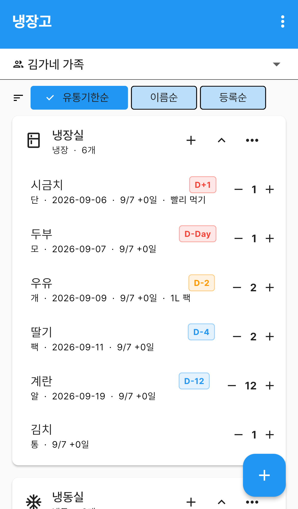
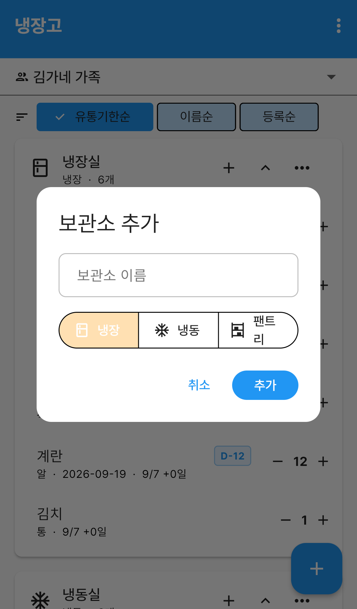
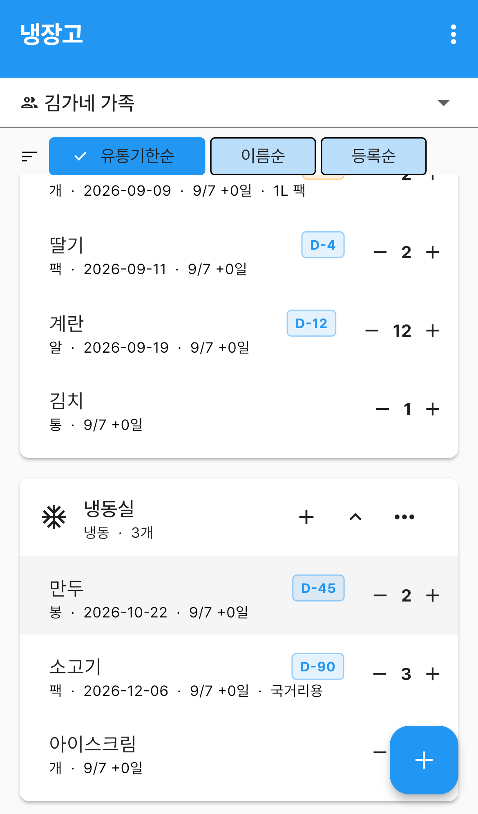
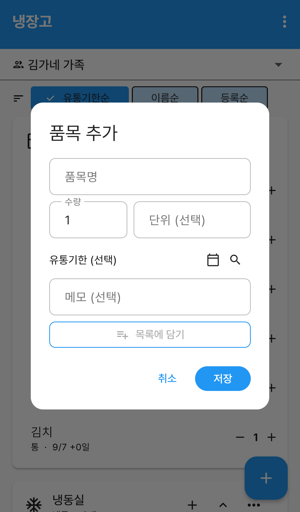
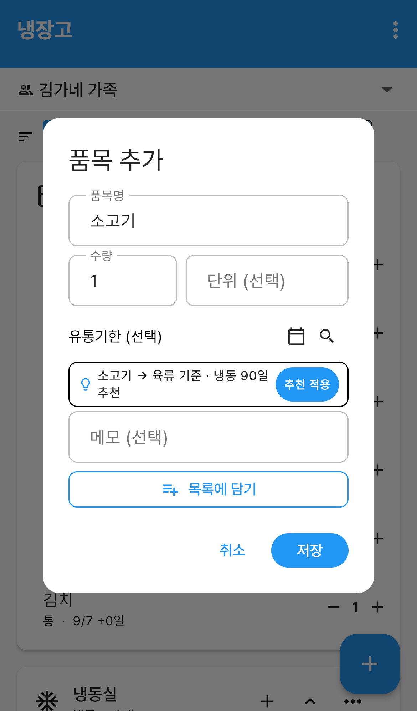
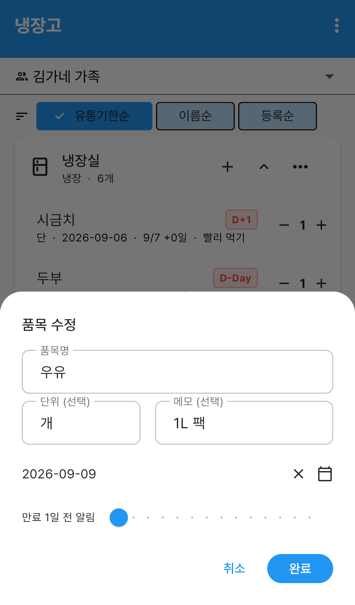
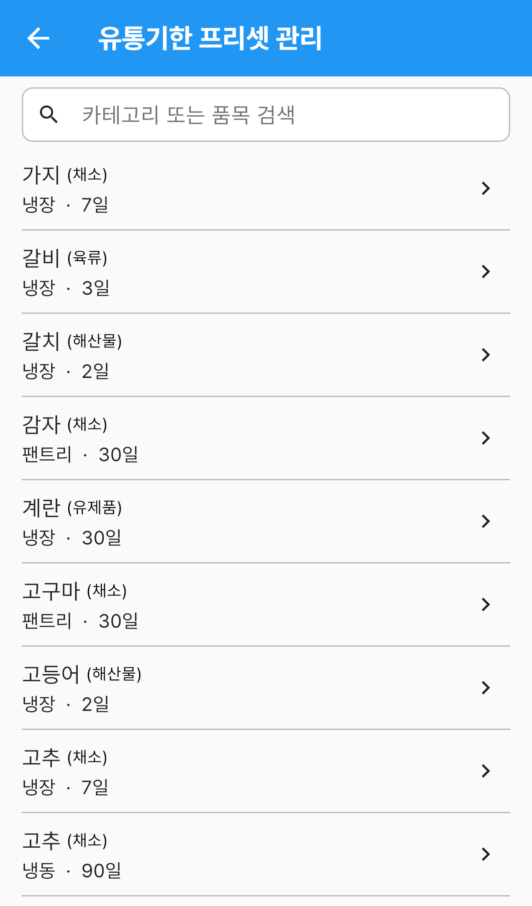

# 냉장고

집에 있는 식재료를 보관 장소별로 적어두고, **유통기한이 얼마나 남았는지** 한눈에 보는 메뉴입니다.

우유가 언제까지인지, 냉동실에 소고기가 남았는지 냉장고 문을 열지 않아도 확인할 수 있습니다.
가족이 같은 그룹을 보고 있으면 누가 무엇을 넣고 뺐는지도 함께 반영됩니다.

`더보기` 탭 → **냉장고** 로 들어갑니다.

---

## 화면 구성

*냉장고 — 보관소별 품목과 유통기한 뱃지*

| 영역 | 설명 |
|---|---|
| 그룹 선택 | 어느 가족의 냉장고를 볼지 고릅니다. `개인`을 고르면 나만 보는 냉장고입니다 |
| 정렬 바 | `유통기한순` · `이름순` · `등록순` 중에서 고릅니다 |
| 보관소 카드 | 냉장실·냉동실 같은 보관 장소마다 카드가 하나씩 생깁니다 |
| 품목 줄 | 품목 이름, 남은 날짜 뱃지, 수량 조절 버튼이 한 줄에 표시됩니다 |
| ＋ 버튼(오른쪽 아래) | 보관소를 추가합니다 |

보관소 카드 오른쪽에는 버튼이 세 개 있습니다.

- **＋** — 이 보관소에 품목을 추가합니다
- **∨ / ∧** — 카드를 접거나 펼칩니다
- **⋮** — `보관소 수정` · `보관소 삭제`

처음 들어오면 보관소가 하나도 없어 `보관소가 없습니다. 추가해보세요.` 만 보입니다.
가운데 **보관소 추가** 버튼으로 시작하세요.

---

## 보관소 만들기

보관소는 **음식을 넣어두는 장소**입니다. 냉장실·냉동실·팬트리(실온 보관장)처럼
나눠두면 목록이 훨씬 보기 쉬워집니다.

1. 오른쪽 아래 **＋** 버튼을 누릅니다.
2. **보관소 이름** 을 적습니다. (예: `우리집 냉장고`)
3. 보관 방법을 `냉장` · `냉동` · `팬트리` 중에서 고릅니다.
4. **추가** 를 누릅니다.

*보관소 추가 — 이름과 보관 방법을 고릅니다*

보관 방법은 두 가지로 쓰입니다.

- 카드 왼쪽 **아이콘과 분류 이름**이 달라져 목록에서 바로 구분됩니다
- 품목을 넣을 때 **유통기한 추천 일수의 기준**이 됩니다 (냉동은 냉장보다 훨씬 깁니다)

*보관 방법이 다른 보관소는 아이콘으로 구분됩니다*

이름이나 보관 방법을 바꾸려면 카드 오른쪽 **⋮ → 보관소 수정** 을 누르세요.

> **보관소를 지우면 안에 든 품목도 함께 사라집니다.**
> 삭제를 누르면 `보관소를 삭제하면 안에 있는 모든 품목도 함께 삭제됩니다. 계속하시겠습니까?`
> 라고 한 번 더 물어봅니다.

---

## 품목 추가하기

보관소 카드 오른쪽 **＋** 를 누르면 품목 추가 창이 열립니다.

*품목 추가 — 여러 개를 목록에 담아 한 번에 저장합니다*

| 입력 항목 | 필수 | 설명 |
|---|---|---|
| 품목명 | 필수 | 예: `우유`, `삼겹살` |
| 수량 | 필수 | 숫자로 적습니다 |
| 단위 (선택) | 선택 | `개`, `팩`, `모`처럼 세는 단위 |
| 유통기한 (선택) | 선택 | 날짜를 고르면 남은 날짜 뱃지가 생깁니다 |
| 만료 N일 전 알림 | 선택 | 유통기한을 넣었을 때만 나옵니다. 1~14일 사이에서 조절합니다 |
| 메모 (선택) | 선택 | `1L 팩`, `국거리용`처럼 짧게 |

장을 보고 와서 여러 개를 한꺼번에 넣을 때는 **목록에 담기** 를 쓰세요.

1. 품목 하나를 입력하고 **목록에 담기** 를 누릅니다.
2. 창 아래에 이름표(칩)로 쌓입니다. 입력칸은 비워져 다음 품목을 바로 적을 수 있습니다.
3. 쌓인 이름표를 누르면 유통기한과 알림일을 다시 손볼 수 있고, ✕ 를 누르면 뺍니다.
4. 다 담았으면 **저장** 을 누릅니다. 담아둔 품목이 한 번에 등록됩니다.

마지막 하나를 이름표로 담지 않고 **저장** 을 눌러도 함께 등록되니, 한 개만 넣을 때는
입력하고 바로 저장하면 됩니다.

---

## 유통기한 자동 추천

품목명을 적으면 잠시 뒤 **추천 칩**이 나타납니다. 유통기한을 매번 직접 찾아보지 않아도 됩니다.

*품목명을 입력하면 유통기한을 자동으로 추천합니다*

`소고기 → 육류 기준 · 냉동 90일 추천` 처럼, **무엇을 기준으로 며칠을 잡았는지** 함께 보여줍니다.
적은 이름과 기준이 되는 분류가 다르면 화살표로 이어 보여줍니다.

오른쪽 **추천 적용** 을 누르면 추천한 날짜가 유통기한에 들어갑니다.
추천이 마음에 들지 않으면 그냥 두고 날짜를 직접 골라도 됩니다.

추천 일수는 **보관 방법에 따라 달라집니다.** 같은 소고기라도 냉장은 3일, 냉동은 90일입니다.

보관 방법이 **빨간 글씨**로 보이면, 지금 넣으려는 보관소와 추천 기준의 보관 방법이 다르다는 뜻입니다.
(냉동실에 넣는데 냉장 기준 일수밖에 없을 때 그렇습니다.) 그대로 적용해도 되지만,
날짜가 실제보다 짧게 잡힐 수 있으니 한 번 확인하세요.

추천 칩은 **유통기한을 아직 고르지 않았을 때만** 나옵니다. 날짜를 넣으면 사라집니다.

### 날짜를 직접 고르기

유통기한 줄 오른쪽에는 아이콘이 두 개 있습니다.

- **달력** — 날짜를 직접 고릅니다 (줄을 눌러도 달력이 열립니다)
- **돋보기** — `유통기한 기준 품목 선택` 창을 엽니다

적은 이름과 다른 품목이 기준으로 잡혔다면(예: `유기농 우유` 를 적었는데 `유제품` 기준)
**돋보기**를 눌러 기준을 직접 고르세요. 창에서 품목을 검색해 고르면 그 품목의 일수로
날짜를 다시 계산합니다.

---

## 품목 수정하기

품목 줄을 **탭하면** 수정 창이 아래에서 올라옵니다.

*품목 수정 — 이름·단위·메모·유통기한·알림일*

이름, 단위, 메모, 유통기한, 알림일을 고치고 **완료** 를 누릅니다.
유통기한 오른쪽 **✕** 를 누르면 날짜를 지워 "유통기한 없음" 상태로 되돌립니다.

### 수량 늘리고 줄이기

품목 줄 오른쪽의 **－ / ＋** 로 수량을 바꿉니다.
**수량을 0까지 줄이면 그 품목은 삭제 표시가 됩니다.** 잘못 눌렀다면 오른쪽에 나타나는
**되돌리기** 버튼을 누르세요.

### 삭제하기

품목 줄을 **왼쪽으로 밀면** 삭제 표시가 됩니다. 글씨에 줄이 그어지고 흐려집니다.
이때도 **되돌리기** 로 취소할 수 있습니다.

### 저장해야 반영됩니다

수량·이름·삭제 표시는 **바로 반영되지 않습니다.** 바꾼 것이 하나라도 있으면 카드 아래에
`저장되지 않은 변경사항이 있습니다` 줄이 생깁니다.

- **저장** — 바꾼 내용과 삭제 표시를 한꺼번에 반영합니다
- **취소** — 바꾸기 전 상태로 되돌립니다

여러 품목을 정리한 뒤 마지막에 한 번만 저장하면 되도록 만든 방식입니다.

---

## 남은 날짜 뱃지 읽는 법

유통기한을 넣은 품목에는 이름 옆에 남은 날짜가 붙습니다. **색으로 급한 정도**를 알립니다.

| 표시 | 색 | 뜻 |
|---|---|---|
| `D-12` | 파랑 | 아직 여유 있습니다 |
| `D-2` | 주황 | 3일 이내로 임박했습니다 |
| `D-Day` | 빨강 | 오늘까지입니다 |
| `D+1` | 빨강 | 유통기한이 지났습니다 |

유통기한을 넣지 않은 품목에는 뱃지가 붙지 않습니다.

품목 줄 아래 작은 글씨는 `단위 · 유통기한 · 등록일 +경과일 · 메모` 순서로 표시됩니다.
`9/1 +6일` 은 9월 1일에 넣어 6일 지났다는 뜻입니다.

설정한 **알림일**이 되면 푸시 알림으로도 알려줍니다.

---

## 정렬 바꾸기

목록 위 정렬 바에서 보기 순서를 바꿉니다.

- **유통기한순** — 급한 것부터 위로 (유통기한 없는 품목은 맨 아래)
- **이름순** — 가나다순
- **등록순** — 최근에 넣은 것부터

정렬은 모든 보관소에 함께 적용됩니다.

---

## 유통기한 프리셋 관리

추천 일수가 우리 집 사정과 맞지 않으면 직접 바꿀 수 있습니다.
앱바 오른쪽 **⋮ → 유통기한 프리셋 관리** 로 들어갑니다.

*유통기한 프리셋 관리 — 품목별 기준 일수를 직접 바꿉니다*

- 위쪽 검색창에 **카테고리 또는 품목**을 적어 찾습니다
- 한 줄은 `품목 (카테고리)` 와 `보관 방법 · N일` 로 되어 있습니다
- 줄을 탭하면 `유통기한 수정` 창이 열립니다. 일수를 고치고 **저장** 하세요
- 직접 고친 항목에는 **커스텀** 표가 붙습니다
- 커스텀 표가 붙은 줄의 **휴지통** 을 누르면 기본값으로 되돌아갑니다

프리셋은 이미 들어 있는 목록의 일수를 **고치는 곳**입니다. 목록에 없는 품목을 새로
만들 수는 없고, 비슷한 품목을 기준으로 삼아 쓰면 됩니다.

바꾼 일수는 **그룹 단위로 저장**되어, 같은 그룹을 쓰는 가족 모두에게 같은 추천이 나갑니다.

---

## 자주 묻는 질문

**Q. 유통기한을 꼭 넣어야 하나요?**
아닙니다. 이름과 수량만으로도 등록됩니다. 다만 유통기한이 없으면 남은 날짜 뱃지와
만료 알림이 동작하지 않습니다.

**Q. 수량을 0으로 만들었는데 목록에 그대로 있어요.**
삭제 표시만 된 상태입니다. 카드 아래 **저장** 을 눌러야 실제로 지워집니다.

**Q. 냉장고 목록이 비어 보입니다.**
위쪽 그룹 선택이 다른 그룹으로 되어 있는지 확인하세요. 냉장고는 그룹마다 따로 관리됩니다.

**Q. 품목을 다 쓰면 장보기 목록에 자동으로 들어가나요?**
됩니다. 다만 순서가 있습니다.

1. `장보기` 의 **자주 사는 것** 에 그 품목을 등록하고 **소진 시 자동 장바구니** 를 켭니다.
2. 그 **다음에** 냉장고에 같은 이름으로 넣은 품목이 자동 등록 대상이 됩니다.
3. 수량을 0으로 줄이거나 왼쪽으로 밀어 삭제 표시한 뒤 **저장** 하면, 그 품목이 장바구니에 담깁니다.

이미 냉장고에 들어 있던 품목은 자주 사는 것에 나중에 등록해도 바로 연결되지 않습니다.
그 품목을 한 번 **수정해서 저장** 하면 이름으로 다시 연결됩니다.

이름이 정확히 같아야 하고, 장바구니에 같은 이름이 이미 있으면 중복해서 담지 않습니다.
자세한 내용은 **장보기** 매뉴얼을 참고하세요.

**Q. 다른 가족이 넣은 품목도 제가 고칠 수 있나요?**
같은 그룹이라면 누구나 추가·수정·삭제할 수 있습니다.
