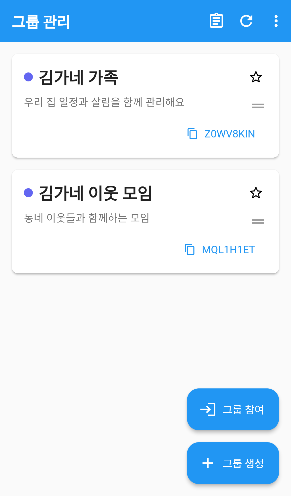
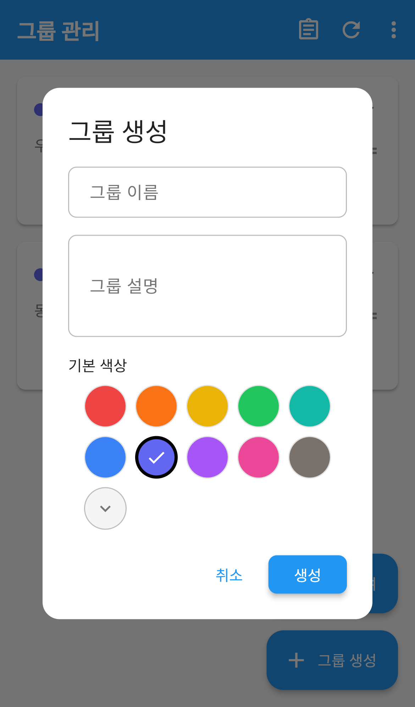
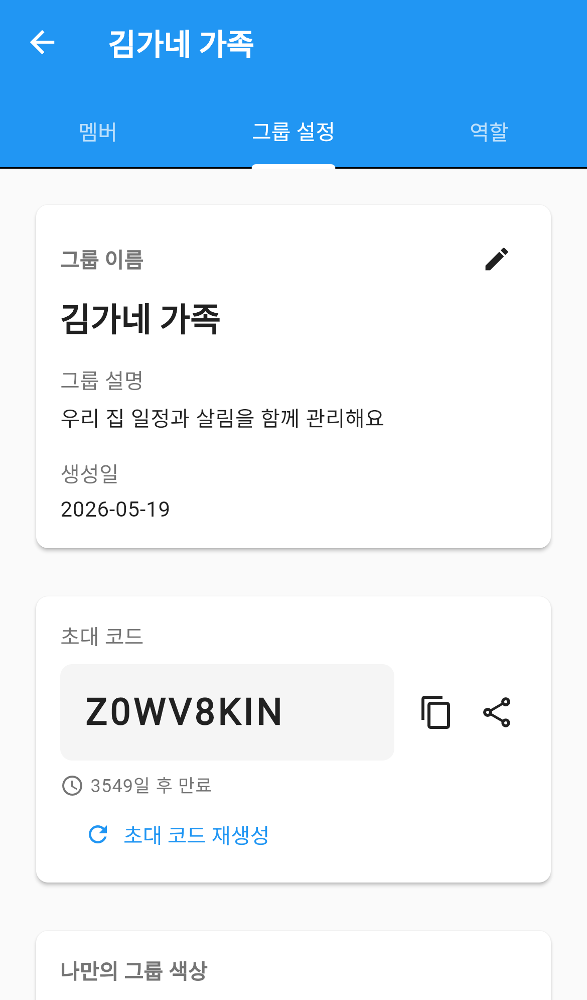
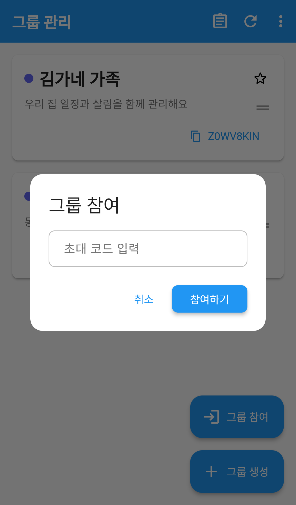
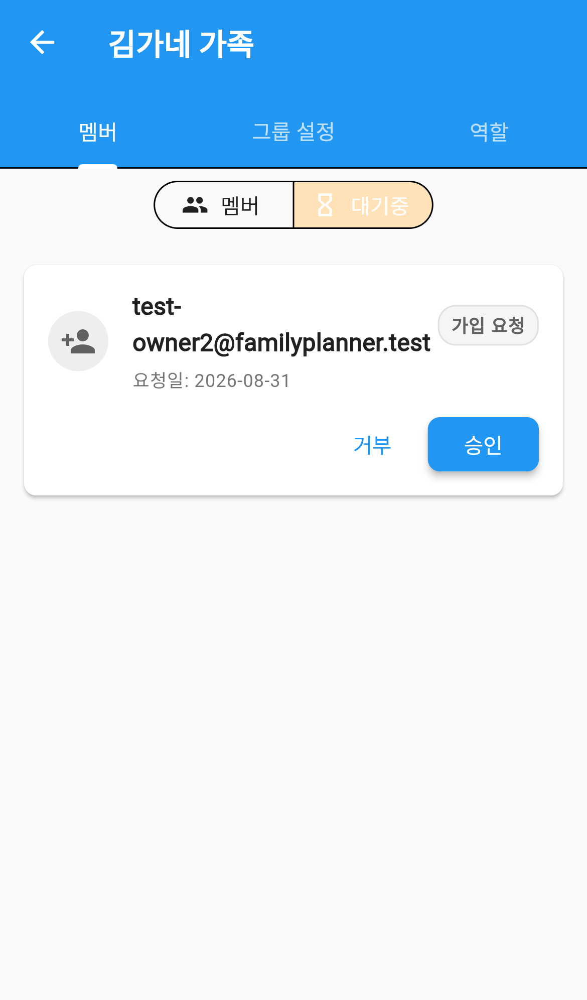
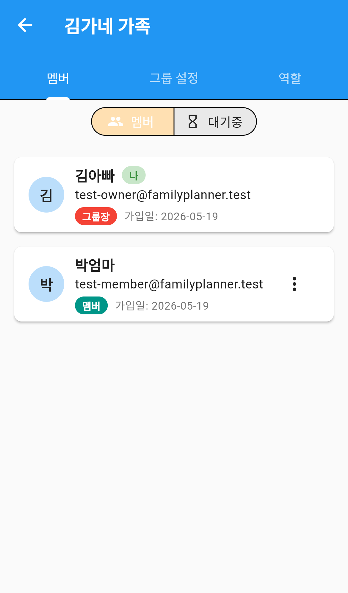
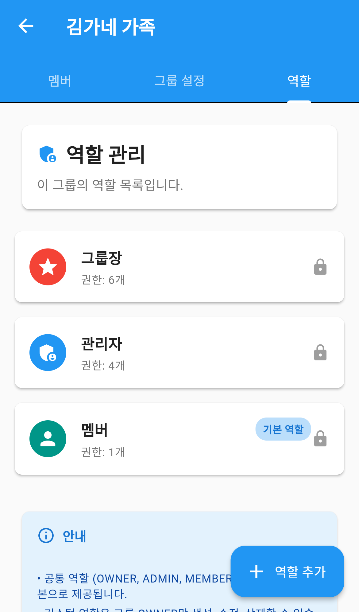

# 그룹 관리

가족이나 친구와 함께 쓰려면 먼저 **그룹**을 만들어야 합니다.
그룹을 만들면 일정, 할일, 가계부, 장보기 목록을 구성원 모두가 같이 보고 함께 관리할 수 있습니다.

이 문서는 Family Planner를 처음 시작할 때 가장 먼저 읽어야 할 안내입니다.
그룹을 만들고 가족을 초대하는 과정을 순서대로 설명합니다.

---

## 시작하기 전에

그룹에는 두 가지 참여 방법이 있습니다.

| 상황 | 할 일 |
|---|---|
| 내가 처음 시작한다 | **그룹 생성** — 새 그룹을 만들고 가족을 초대합니다 |
| 가족이 이미 만들었다 | **그룹 참여** — 전달받은 초대 코드를 입력합니다 |

그룹은 여러 개 만들 수 있습니다. 가족용, 친구 모임용으로 나눠서 쓸 수 있습니다.

*그룹 관리 — 참여 중인 그룹이 카드로 표시되고, 각 카드에 초대 코드가 함께 보입니다*

---

## 1. 그룹 만들기

가족 중 한 명이 대표로 그룹을 만들면 됩니다. 만든 사람이 **그룹장**이 됩니다.

*그룹 생성 — 이름만 넣어도 만들 수 있습니다*

1. 그룹 관리 화면에서 오른쪽 아래 **＋ 그룹 생성** 을 누릅니다.
2. **그룹 이름** 을 입력합니다. (필수) 예: `김가네 가족`
3. **그룹 설명** 을 입력합니다. (선택) 예: `우리 집 일정과 살림을 함께 관리해요`
4. **기본 색상** 을 고릅니다. 이 색은 일정과 목록에서 그룹을 구분하는 데 쓰입니다.
5. **생성** 을 누릅니다.

> **그룹 이름은 반드시 입력해야 합니다.** 비워두면 만들어지지 않습니다.
> 이름과 설명은 나중에 언제든지 바꿀 수 있습니다.

---

## 2. 가족 초대하기

그룹을 만들었다면 이제 가족을 불러올 차례입니다.
초대는 **초대 코드**로 이루어집니다.

*그룹 설정 — 초대 코드를 복사하거나 바로 공유할 수 있습니다*

1. 그룹 관리 화면에서 초대할 그룹 카드를 누릅니다.
2. 위쪽 **그룹 설정** 탭을 누릅니다.
3. **초대 코드** 에서 원하는 방법을 고릅니다.
   - **복사 아이콘**: 코드를 복사해 카카오톡 등으로 직접 보냅니다.
   - **공유 아이콘**: 휴대폰 공유 기능으로 바로 전달합니다.

그룹 관리 화면의 카드에서도 초대 코드를 바로 복사할 수 있습니다.

### 초대 코드가 걱정될 때

코드를 아는 사람은 누구나 가입을 신청할 수 있습니다.
코드가 외부에 새어나갔다면 **초대 코드 재생성** 을 누르세요.
새 코드가 만들어지고 **이전 코드는 더 이상 쓸 수 없게 됩니다.**

> 이미 가입한 멤버는 코드를 다시 만들어도 그대로 남아 있습니다.

---

## 3. 그룹에 참여하기

가족에게서 초대 코드를 받았다면 이렇게 참여합니다.

*그룹 참여 — 받은 초대 코드를 입력합니다*

1. 그룹 관리 화면에서 **→ 그룹 참여** 를 누릅니다.
2. 전달받은 **초대 코드** 를 입력합니다.
3. **참여하기** 를 누릅니다.

참여하면 바로 들어가는 것이 아니라 **그룹장의 승인을 기다립니다.**
`그룹 가입 요청이 전송되었습니다. 관리자 승인을 기다려주세요.` 라는 안내가 나옵니다.

### 내 신청이 어떻게 되었는지 확인하기

*내 가입 신청 목록 — 신청한 그룹의 승인 상태를 확인합니다*

그룹 관리 화면 오른쪽 위 **목록 아이콘**을 누르면 내가 신청한 그룹과 그 상태를 볼 수 있습니다.

---

## 4. 가입 신청 승인하기

그룹장은 들어오려는 사람을 확인하고 승인해야 합니다.

*대기중 — 신청한 사람을 확인하고 승인하거나 거절합니다*

1. 그룹 카드를 눌러 상세 화면으로 들어갑니다.
2. **멤버** 탭에서 **대기중** 을 누릅니다.
3. 신청자의 이메일과 요청일을 확인합니다.
4. **승인** 또는 **거부** 를 누릅니다.

승인하면 그 사람은 바로 멤버가 되어 그룹의 일정과 가계부를 함께 볼 수 있습니다.

> 모르는 사람의 신청이라면 **거부**하세요. 초대 코드가 유출되었을 수 있으니
> 이런 경우 **초대 코드 재생성**도 함께 하는 것이 안전합니다.
> 대기 중인 신청이 없으면 `대기 중인 가입 요청이 없습니다` 라고 표시됩니다.

---

## 5. 멤버 확인하기

*멤버 — 참여 중인 구성원과 각자의 역할*

**멤버** 탭에서 그룹에 참여한 사람을 모두 볼 수 있습니다.
각 멤버마다 이름, 이메일, 역할, 가입일이 표시되고, 본인에게는 **나** 표시가 붙습니다.

### 역할이란

*역할 — 구성원마다 할 수 있는 일을 정합니다*

**역할** 탭에는 기본 역할 세 가지가 준비되어 있습니다.

| 역할 | 할 수 있는 일 |
|---|---|
| **그룹장** | 그룹 정보 수정, 초대 코드 관리, 가입 승인, 멤버 내보내기, 그룹 삭제 |
| **관리자** | 그룹장이 정해준 범위 안에서 그룹을 관리 |
| **멤버** | 일정·할일·가계부 등 그룹 기능을 함께 사용 (새로 들어온 사람의 기본 역할) |

기본 역할 세 가지는 **자물쇠 표시**가 되어 있어 지우거나 이름을 바꿀 수 없습니다.
가족에게 딱 맞는 역할이 필요하면 **＋ 역할 추가** 로 직접 만들 수 있습니다.

멤버 오른쪽 **⋮** 를 누르면 역할을 바꾸거나 그룹에서 내보낼 수 있습니다. (그룹장만 가능)

---

## 그룹 관리하기

### 대표 그룹 정하기

그룹이 여러 개라면 카드의 **별 아이콘**을 눌러 대표 그룹을 정할 수 있습니다.
대표 그룹은 앱을 열었을 때 기본으로 선택됩니다.

### 순서 바꾸기

카드 오른쪽 **≡** 를 길게 눌러 위아래로 끌면 그룹 순서를 바꿀 수 있습니다.

### 나만의 그룹 색상

그룹 설정에서 **나만의 그룹 색상**을 정하면, 그룹 기본 색상 대신
내 화면에서만 보이는 색으로 표시됩니다.

### 그룹 나가기

그룹 설정 아래쪽 **그룹 나가기** 를 누르면 `정말로 이 그룹을 나가시겠습니까?` 확인창이 뜹니다.

> 그룹을 나가면 그 그룹의 일정·가계부를 더 이상 볼 수 없습니다.
> 다시 들어오려면 초대 코드로 새로 신청해야 합니다.

---

## 자주 묻는 질문

**Q. 그룹을 꼭 만들어야 하나요?**
아니요. 혼자서도 대부분의 기능을 쓸 수 있습니다. 다만 가족과 일정이나 가계부를 함께 보려면 그룹이 필요합니다.

**Q. 그룹을 여러 개 만들 수 있나요?**
네. 가족용, 친구 모임용처럼 목적에 따라 나눠 만들 수 있습니다.

**Q. 초대 코드를 입력했는데 바로 들어가지지 않아요.**
정상입니다. 그룹장이 승인해야 참여가 완료됩니다. `내 가입 신청 목록`에서 상태를 확인하세요.

**Q. 초대 코드는 언제까지 쓸 수 있나요?**
그룹 설정에서 만료까지 남은 기간을 확인할 수 있습니다. 만료되었거나 유출이 걱정되면 **초대 코드 재생성**을 누르세요.

**Q. 그룹장을 다른 사람에게 넘길 수 있나요?**
네. 그룹장은 다른 멤버에게 그룹장 권한을 넘길 수 있습니다.

**Q. 실수로 그룹을 나갔어요.**
초대 코드로 다시 가입 신청하면 됩니다. 다만 그룹장의 승인이 다시 필요합니다.
