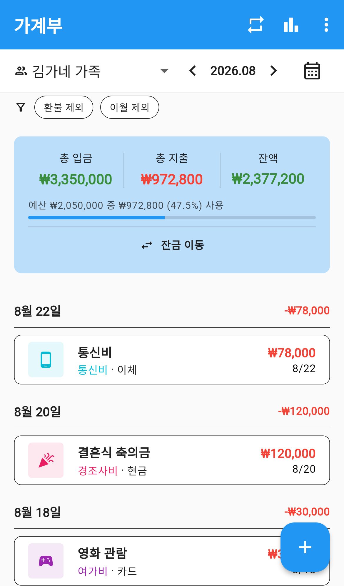
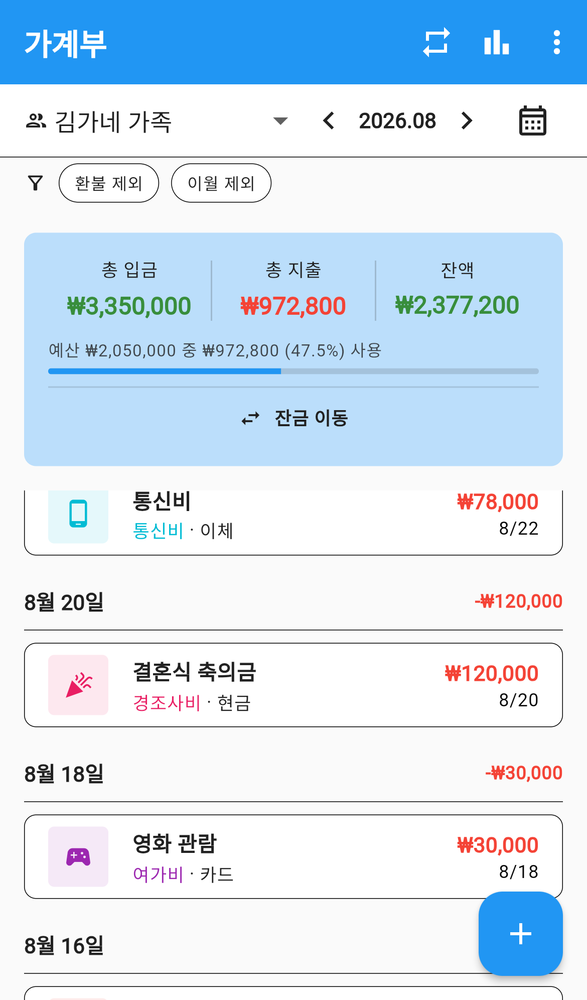
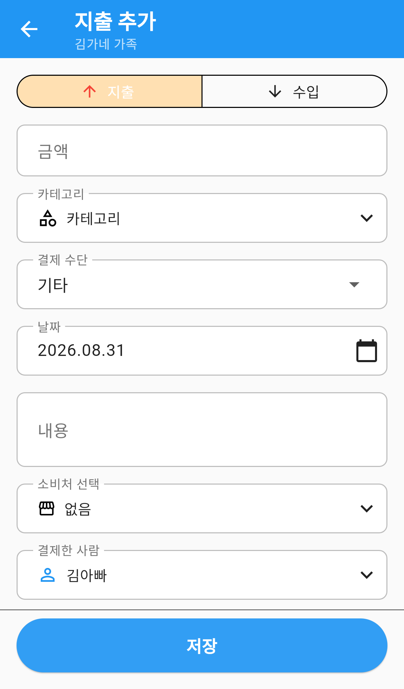
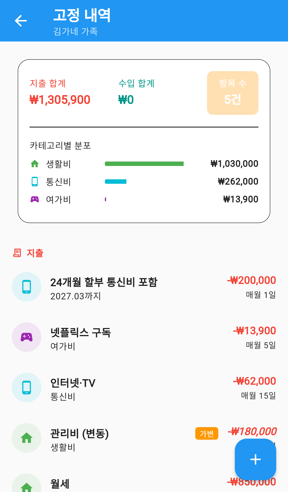
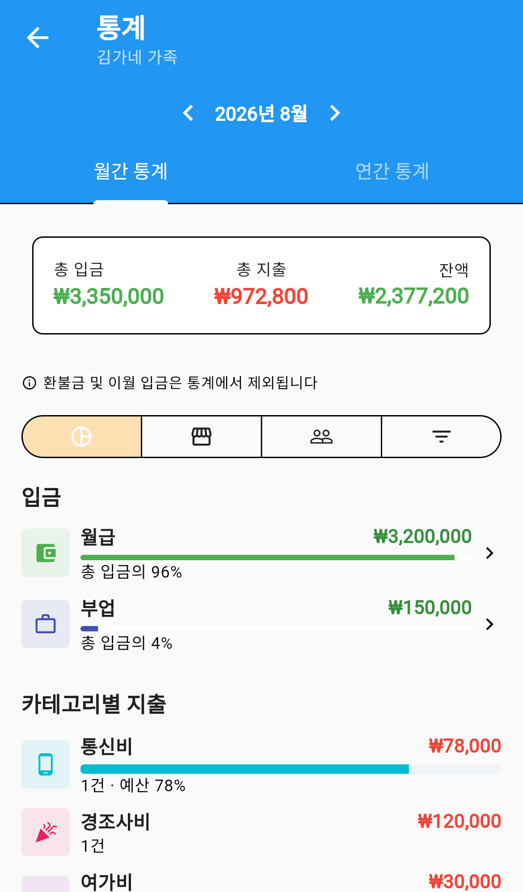
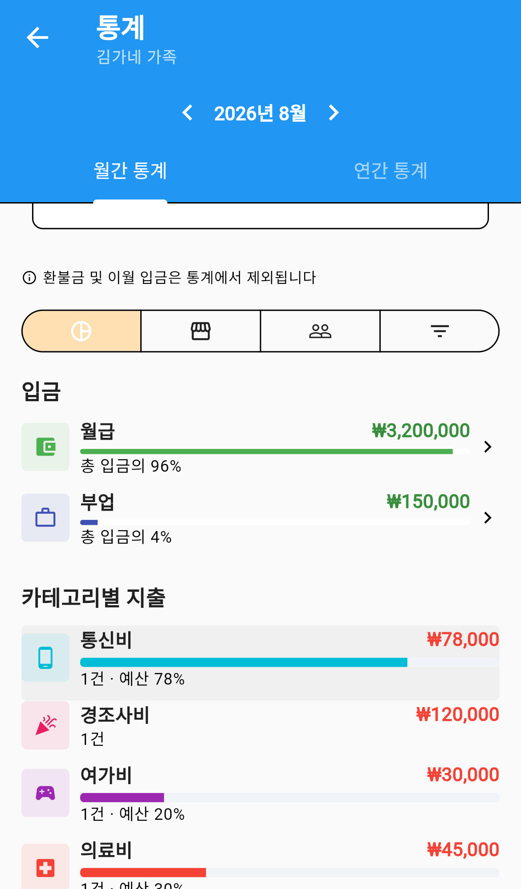
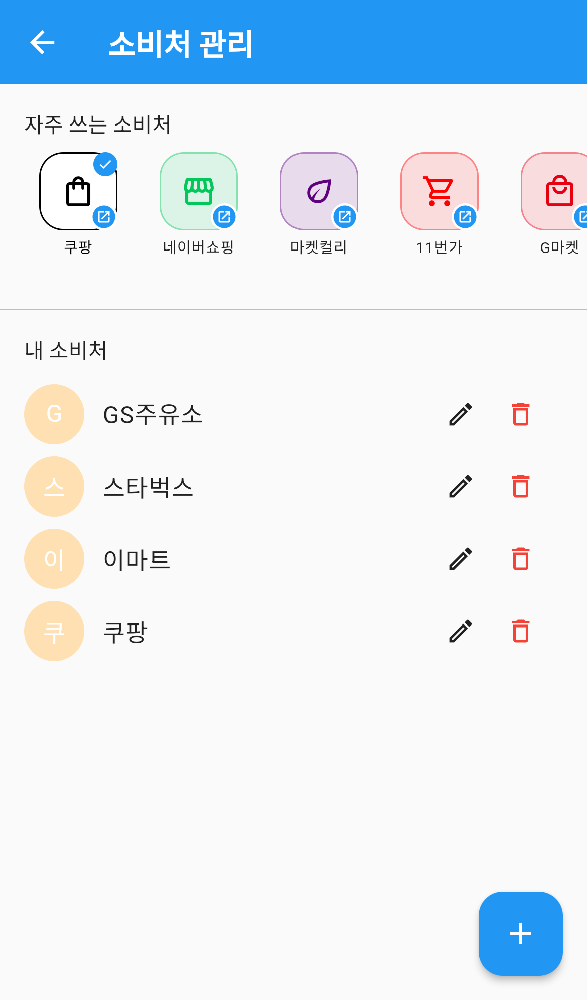
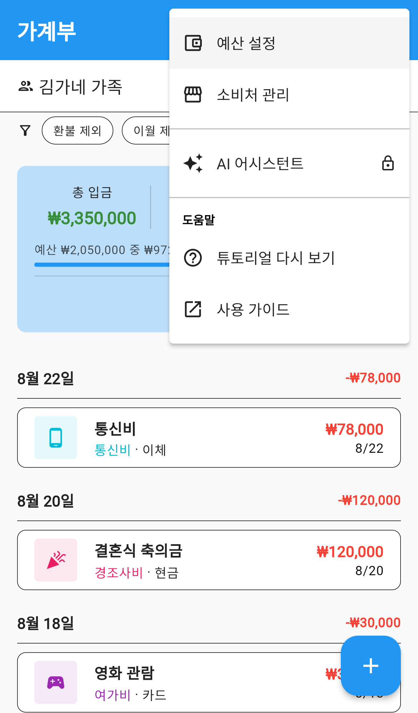

# 가계부

우리 가족의 수입과 지출을 한곳에 모아 관리하는 메뉴입니다.
매달 얼마를 벌고 썼는지, 예산을 얼마나 지켰는지 한눈에 볼 수 있고,
월세·통신비처럼 매달 반복되는 지출은 한 번만 등록해두면 자동으로 기록됩니다.

가족 그룹으로 함께 쓰면 구성원이 등록한 내역이 모두 모이고, 혼자만의 가계부로도 쓸 수 있습니다.

---

## 화면 구성

*가계부 메인 — 이번 달 요약과 지출 목록*

화면은 위에서부터 다음 순서로 이루어져 있습니다.

| 영역 | 설명 |
|---|---|
| 그룹·월 선택 | 어느 가족의 가계부인지, 어느 달을 볼지 고릅니다 |
| 필터 | `환불 제외` · `이월 제외` 로 특정 내역을 잠시 숨깁니다 |
| 월간 요약 | 총 입금, 총 지출, 잔액과 예산 사용률 |
| 내역 목록 | 날짜별로 묶인 수입·지출 목록 |

### 그룹과 월 바꾸기

- **그룹 변경**: 왼쪽 위 그룹 이름을 누르면 다른 가족을 고르거나 `개인` 가계부로 전환합니다.
- **월 이동**: 가운데 연·월 양옆의 `<` `>` 로 지난달과 다음 달을 오갑니다.
- **달력 보기**: 오른쪽 달력 아이콘을 누르면 목록 대신 달력 형태로 볼 수 있습니다. 다시 누르면 목록으로 돌아옵니다.

*날짜별 지출 목록 — 카테고리와 결제 수단이 함께 표시됩니다*

목록은 날짜별로 묶여 있고, 각 날짜의 합계가 오른쪽에 표시됩니다.
항목마다 카테고리 아이콘·이름, 결제 수단, 금액을 한 줄로 볼 수 있습니다.

### 필터 사용하기

- `환불 제외`: 환불받은 금액을 계산에서 빼고 봅니다.
- `이월 제외`: 지난달에서 넘어온 잔금을 빼고 이번 달 실제 수입만 봅니다.

두 필터는 **보기 방식만 바꿀 뿐 실제 내역을 지우지 않습니다.**

---

## 지출·수입 등록하기

*지출 등록 — 금액과 카테고리만 넣어도 저장됩니다*

1. 오른쪽 아래 **＋** 버튼을 누릅니다.
2. 맨 위에서 **지출** 또는 **수입** 을 고릅니다.
3. **금액** 을 입력합니다. (필수)
4. **카테고리** 를 고릅니다. 식비, 교통비, 생활비, 교육비, 의료비, 여가비, 경조사비, 통신비, 육아비 등에서 선택합니다.
5. 필요하면 아래 항목을 채웁니다.
   - **결제 수단**: 현금 · 카드 · 계좌이체
   - **날짜**: 기본값은 오늘이며, 달력 아이콘으로 바꿉니다
   - **내용**: 어디에 썼는지 메모
   - **소비처 선택**: 이마트, 스타벅스처럼 자주 가는 곳
   - **결제한 사람**: 가족 중 누가 결제했는지
6. 맨 아래 **저장** 을 누릅니다.

> **금액은 반드시 입력해야 합니다.** 비워두면 저장되지 않습니다.
> 수입을 고르면 카테고리가 월급·용돈·상여금·이자 수익 등 **수입용 항목**으로 바뀝니다.

### 내역 수정·삭제하기

목록에서 항목을 누르면 상세 화면이 열립니다.

- **수정**: 등록할 때와 같은 화면에서 내용을 고치고 저장합니다.
- **삭제**: `지출을 삭제하시겠습니까?` 확인창이 뜨고, 확인하면 삭제됩니다. **삭제한 내역은 되돌릴 수 없습니다.**

### 환불 처리하기

물건을 반품해 돈을 돌려받았다면 지출을 지우지 말고 **환불로 등록**하세요.
원래 지출과 환불이 연결되어 기록이 남습니다.

- 원래 지출에는 **환불됨** 배지가 붙습니다.
- 환불 내역에는 **환불** 배지가 붙습니다.

---

## 고정 지출 관리

*고정 내역 — 매달 반복되는 지출을 모아서 관리합니다*

월세, 통신비, 구독료처럼 **매달 같은 날 나가는 돈**을 한 번만 등록해두는 기능입니다.
상단 **반복 아이콘**(↻)을 누르면 열립니다.

화면 위쪽에서 지출 합계·수입 합계·항목 수와 카테고리별 분포를 볼 수 있습니다.

### 고정 지출 등록하기

1. 고정 내역 화면에서 오른쪽 아래 **＋** 를 누릅니다.
2. 금액, 카테고리, 내용을 입력합니다.
3. **매달 며칠에 나갈지** 를 정합니다. (1~31일)
4. 필요하면 아래를 설정합니다.
   - **시작 월**: 과거 달로 지정하면 그때부터 오늘까지 내역이 한꺼번에 만들어집니다
   - **총 반복 개월 수**: 24개월 할부처럼 끝이 정해진 경우 입력합니다. 비워두면 무기한 반복됩니다

### 금액이 매달 다를 때

관리비처럼 **매달 금액이 바뀌는 지출**은 `가변` 으로 등록합니다.

가변으로 등록하면 자동 생성된 내역에 **미확인** 배지가 붙습니다.
실제 금액이 나오면 그 내역을 열어 금액을 고쳐 확정하세요.

---

## 예산 세우고 확인하기

카테고리마다 이번 달 쓸 수 있는 한도를 정해두는 기능입니다.

1. 오른쪽 위 **⋮** 를 누릅니다.
2. **예산 설정** 을 고릅니다.
3. 전체 예산과 카테고리별 예산을 입력하고 저장합니다.

예산을 정하면 메인 화면 요약 카드에 `예산 ₩2,500,000 중 ₩1,870,000 (74.8%) 사용` 처럼
사용률이 막대그래프와 함께 표시됩니다.

---

## 통계 보기

*통계 — 수입과 카테고리별 지출 비중*

상단 **막대그래프 아이콘**(⊞)을 누르면 열립니다. **월간 통계** 와 **연간 통계** 를 오갈 수 있습니다.

*카테고리별 지출 — 건수와 예산 소진율까지 표시됩니다*

네 가지 방식으로 나눠 볼 수 있습니다.

| 보기 | 내용 |
|---|---|
| 카테고리별 | 식비·교통비 등 어디에 많이 썼는지 |
| 소비처별 | 어느 가게에서 많이 썼는지 |
| 멤버별 | 가족 중 누가 얼마나 썼는지 (그룹 가계부에서만 표시) |
| 직접 필터링 | 조건을 직접 지정해서 보기 |

각 항목에는 금액과 함께 **전체 대비 비율**, **건수**, 예산을 정했다면 **예산 소진율**이 표시됩니다.
항목을 누르면 그 카테고리의 개별 내역만 모아서 볼 수 있습니다.

> 환불금과 이월 입금은 실제 수입·지출이 아니므로 **통계에서 제외됩니다.**

---

## 소비처 관리

*소비처 관리 — 자주 쓰는 곳을 등록해두면 입력이 빨라집니다*

자주 가는 가게를 등록해두면 지출을 적을 때 골라 쓸 수 있고, 통계에서 가게별 지출도 볼 수 있습니다.

1. 오른쪽 위 **⋮** → **소비처 관리** 를 누릅니다.
2. **자주 쓰는 소비처** 에는 쿠팡, 네이버쇼핑, 마켓컬리, 배달의민족 등이 미리 준비되어 있어 누르면 바로 추가됩니다.
3. 직접 등록하려면 **＋** 를 눌러 이름을 입력합니다.

*더보기 메뉴 — 예산 설정과 소비처 관리가 들어 있습니다*

---

## 잔금 이월하기

이번 달 쓰고 남은 돈을 다음 달로 넘기거나 다른 곳에 옮기는 기능입니다.
메인 화면 요약 카드 아래 **잔금 이동** 을 누르면 열립니다.

세 가지 중에서 고를 수 있습니다.

- **다음 달 이월**: 이번 달 말일에 `잔금 이월` 지출이, 다음 달 1일에 `전월 이월` 입금이 등록됩니다.
- **자산 계좌**: 등록해둔 계좌로 옮깁니다.
- **저금통**: 저금통으로 옮깁니다.

> 남은 잔금이 없으면 `이월할 잔금이 없습니다` 라고 표시됩니다.
> 이월 금액은 **잔금을 넘을 수 없습니다.**

---

## 자주 묻는 질문

**Q. 가족과 따로 나만의 가계부를 쓸 수 있나요?**
네. 그룹 선택에서 `개인` 을 고르면 나만 보는 가계부가 됩니다.

**Q. 지난달 내역은 어디서 보나요?**
상단 연·월 옆의 `<` 를 눌러 이동하세요.

**Q. 삭제한 내역을 되살릴 수 있나요?**
아니요. 삭제하면 되돌릴 수 없습니다. 반품·환불이라면 삭제 대신 **환불 등록**을 사용하세요.

**Q. 고정 지출은 자동으로 등록되나요?**
네. 지정한 날짜가 되면 자동으로 내역이 만들어집니다.
`가변` 으로 등록한 항목은 **미확인** 상태로 생성되므로 실제 금액으로 고쳐주세요.

**Q. 통계 금액이 메인 화면과 다릅니다.**
통계에서는 환불금과 이월 입금이 빠지기 때문입니다. 실제로 번 돈과 쓴 돈만 계산합니다.

**Q. 장보기에서 넘어온 지출도 가계부에 표시되나요?**
네. 장보기를 완료하면 지출이 자동으로 등록되며, 상세 화면에서 원래 장보기 내역을 확인할 수 있습니다.
