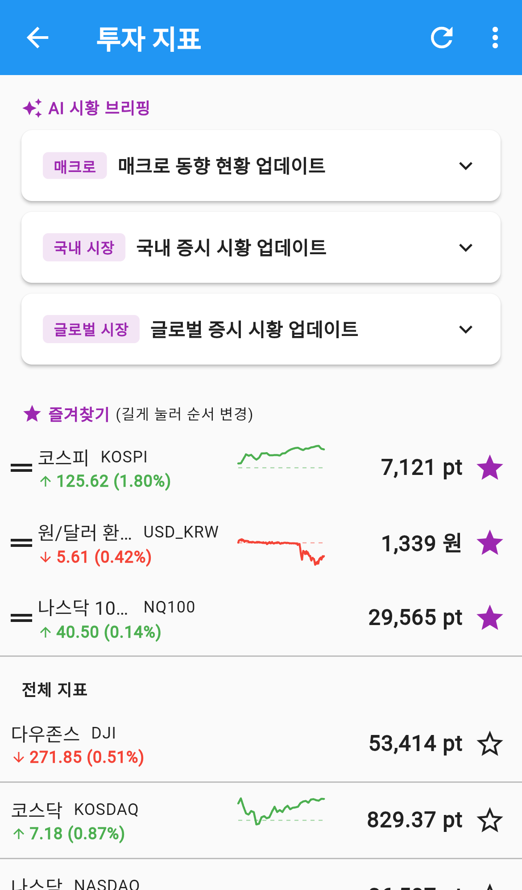
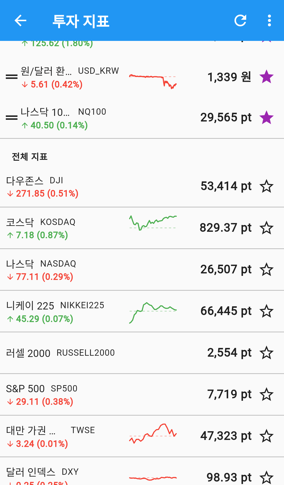
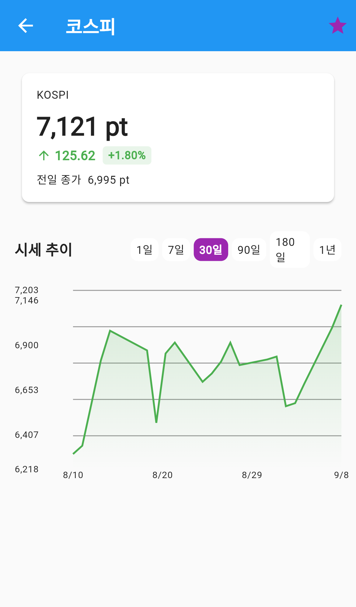
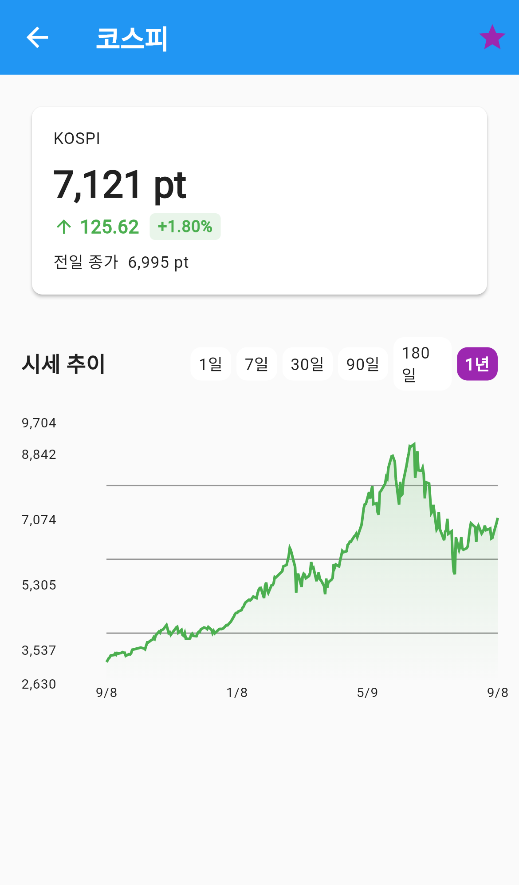
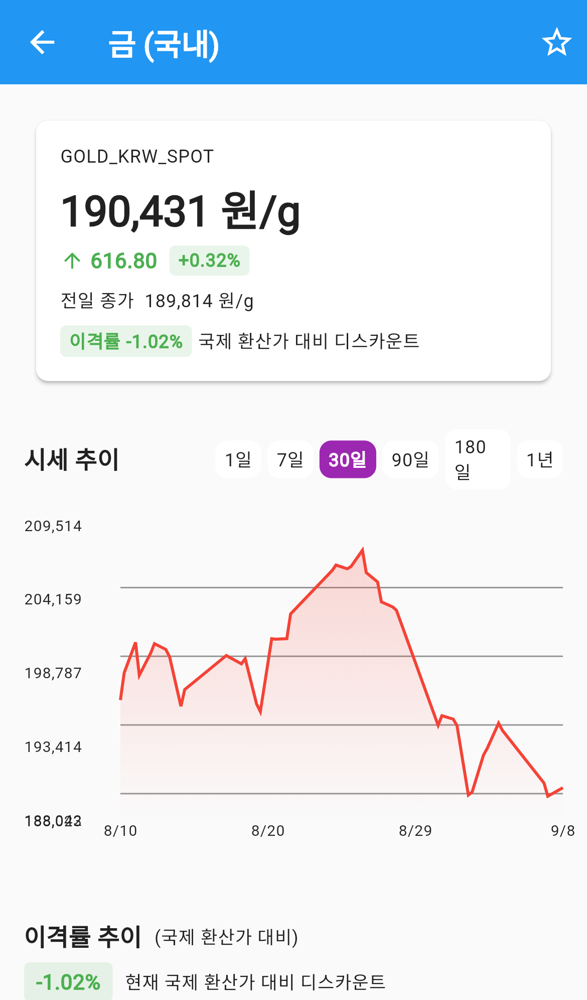
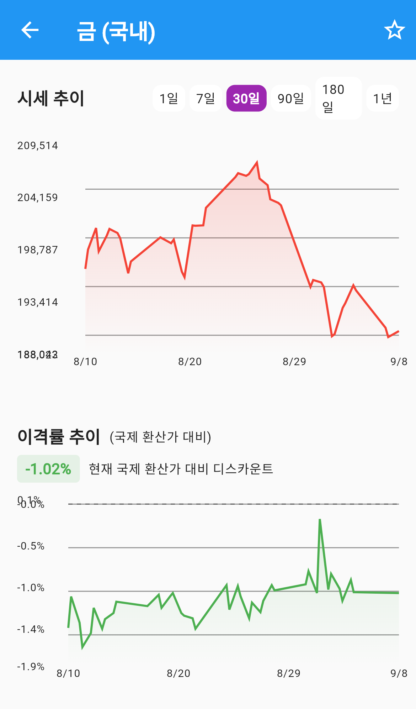

# 투자 지표

코스피, 환율, 금값처럼 **자주 확인하는 시세를 한 화면에 모아 보는** 메뉴입니다.

앱을 여러 개 오가지 않고, 늘 보는 것만 즐겨찾기에 올려두고 한눈에 확인하라고 만든 곳입니다.
지표를 누르면 기간별 시세 차트도 볼 수 있습니다.

`더보기` 탭 → **투자 지표** 로 들어갑니다. 즐겨찾기는 그룹이 아니라 **내 계정에 저장**되므로
가족과 공유되지 않습니다.

---

## 화면 구성

*투자 지표 — 즐겨찾기와 전체 지표*

목록은 두 부분으로 나뉩니다.

| 영역 | 설명 |
|---|---|
| **✨ AI 시황 브리핑** | 그날 시장 요약 카드 (아래에서 자세히) |
| **⭐ 즐겨찾기** | 별을 채운 지표가 맨 위에 모입니다. 길게 눌러 순서를 바꿉니다 |
| **전체 지표** | 나머지 지표가 정해진 순서로 나옵니다 |

즐겨찾기가 하나도 없으면 즐겨찾기 구역은 아예 나오지 않습니다.

### 한 줄 읽는 법

한 줄에 네 가지가 들어 있습니다.

- **이름과 심볼** — `코스피 KOSPI` 처럼 한글 이름 옆에 원래 기호가 붙습니다
- **등락** — 전일 종가 대비 변화입니다. **오르면 초록 ↑**, **내리면 빨강 ↓** 로 표시하고
  괄호 안은 변동률입니다
- **미니 그래프** — 최근 흐름을 아주 작게 그린 선입니다. 점선은 전일 종가 위치입니다
- **현재가와 단위** — `7,188 pt`, `1,507 원`, `4,519 USD/oz` 처럼 지표마다 단위가 다릅니다

### 앱바 버튼

- **↻ 새로고침** — 지금 시세를 다시 받아옵니다
- **⋮ 더보기** — 튜토리얼 다시 보기, 사용 가이드

목록을 **아래로 당겨도** 새로고침됩니다.

---

## AI 시황 브리핑

목록 맨 위에 **AI 시황 브리핑** 카드가 나옵니다(위 화면 참고). 그날 시장을 세 갈래로 요약해 줍니다.

| 딱지 | 내용 |
|---|---|
| **매크로** | 금리·물가처럼 시장 전체에 영향을 주는 흐름 |
| **국내 시장** | 코스피·코스닥 등 국내 증시 |
| **글로벌 시장** | 나스닥·S&P 500 등 해외 증시 |

카드에는 한 줄 제목만 보입니다. **카드를 누르면 펼쳐져** 자세한 내용과
`업데이트: 9/8 07:30` 같은 갱신 시각이 나옵니다. 다시 누르면 접힙니다.

브리핑이 아직 만들어지지 않았으면 이 구역은 **아예 표시되지 않습니다.**

---

## 어떤 지표를 볼 수 있나요

주가지수뿐 아니라 환율·원자재·채권·암호화폐까지 함께 봅니다.

*전체 지표 — 지수·환율·원자재·채권·암호화폐*

| 분류 | 예 |
|---|---|
| 주가지수 | 코스피, 코스닥, 나스닥, 다우존스, S&P 500, 니케이 225, 러셀 2000, 대만 가권 지수 |
| 환율 | 원/달러 환율, 달러 인덱스 |
| 원자재 | 금 (국내), 금 (국제), 은, 구리, 국제 유가(WTI), 천연가스, 밀 |
| 채권 | 한국채 3년물, 미국채 10년물 |
| 암호화폐 | 비트코인 |
| 그 밖 | VIX 지수, 버핏 지수(미국), 공포탐욕지수 |

---

## 즐겨찾기 관리

- 줄 오른쪽 **별**을 누르면 즐겨찾기에 넣거나 뺍니다. 채워진 별이 즐겨찾기입니다
- 지표 상세 화면 오른쪽 위 **별**로도 똑같이 바꿀 수 있습니다
- 즐겨찾기 줄을 **길게 눌러 끌면** 순서가 바뀝니다. 왼쪽 손잡이 모양을 잡으면 편합니다

즐겨찾기에 올린 지표는 **홈 화면의 투자 지표 위젯**에도 같은 순서로 나옵니다.
위젯에 보고 싶은 것을 여기서 정한다고 생각하면 됩니다.

---

## 지표 자세히 보기

목록에서 지표를 누릅니다.

*지표 상세 — 현재가와 시세 추이*

위쪽 카드에 **현재가**, **전일 대비 등락**, **전일 종가**가 있습니다.

### 기간 바꾸기

`시세 추이` 옆의 칩으로 차트 기간을 고릅니다. **1일 · 7일 · 30일 · 90일 · 180일 · 1년** 중에서
고를 수 있고, 처음에는 30일이 선택돼 있습니다.

*기간 칩으로 차트 범위를 바꿉니다 — 1년*

차트를 **손가락으로 훑으면** 그 구간의 시작·끝 값과 등락률이 위에 나타납니다.
"한 달 전부터 지금까지 얼마나 올랐나"를 바로 볼 때 씁니다.

고른 기간에 쌓인 데이터가 없으면 `데이터가 없습니다` 라고만 나옵니다.
그럴 때는 더 긴 기간을 눌러보세요.

### 휴장 중 표시

주말이나 장이 열리지 않는 날에는 차트 위에 `🕐 휴장 중 · 마지막 거래일: 05/20` 처럼 표시됩니다.
값이 안 움직이는 게 고장이 아니라 **장이 쉬는 중**이라는 뜻입니다.

---

## 금 (국내)의 이격률

`금 (국내)` 에는 다른 지표에 없는 줄이 하나 더 붙습니다.

*금 (국내) — 국제 환산가 대비 이격률*

**이격률**은 국내 금 시세가 **국제 금값을 원화로 바꾼 값과 얼마나 벌어져 있는지**를 백분율로 보여줍니다.

- `이격률 +1.2% · 국제 환산가 대비 프리미엄` — 국내가 국제 환산가보다 **비쌉니다**
- `이격률 -1.02% · 국제 환산가 대비 디스카운트` — 국내가 국제 환산가보다 **쌉니다**

국내 금을 사고팔 때 지금이 상대적으로 비싼 때인지 가늠하는 데 씁니다.

### 이격률 추이

차트를 아래로 내리면 **이격률 추이** 차트가 하나 더 있습니다.

*이격률 추이 — 0% 기준선 위아래로 프리미엄·디스카운트*

- **0% 선 위**로 올라가 있으면 그 시점에 국내가 더 비쌌다는 뜻(프리미엄)
- **0% 선 아래**면 국내가 더 쌌다는 뜻(디스카운트)
- 왼쪽 위 초록 딱지는 **지금** 값입니다 (`-1.02% 현재 국제 환산가 대비 디스카운트`)
- 그래프의 한 지점을 짚으면 `2026.08.21 -1.21%` 처럼 그날 값이 말풍선으로 뜹니다

시세 추이 차트와 **같은 기간**을 따라갑니다. 위에서 `1년`을 고르면 이격률도 1년치를 보여줍니다.

평소 얼마나 벌어져 있는지 알아두면, 지금 값이 유난히 벌어진 때인지 판단하기 쉬워집니다.

---

## 자주 묻는 질문

**Q. 즐겨찾기가 가족에게도 보이나요?**
아닙니다. 즐겨찾기는 **내 계정에만** 저장됩니다. 같은 그룹이어도 서로 다르게 담아둘 수 있습니다.

**Q. 30일을 눌렀는데 `데이터가 없습니다` 가 나옵니다.**
그 지표의 최근 시세가 아직 쌓이지 않은 경우입니다. `180일` 이나 `1년` 을 눌러보세요.

**Q. 이격률 추이 차트가 안 보입니다.**
이 차트는 `금 (국내)` 에만 있습니다. 고른 기간에 이격률을 계산할 자료가 없으면
그 구역은 나오지 않습니다. 기간을 길게 잡아보세요.

**Q. 값이 며칠째 그대로입니다.**
차트 위에 `휴장 중` 표시가 있는지 보세요. 장이 열리지 않으면 마지막 거래일 값이 계속 보입니다.

**Q. 오른 걸 왜 초록으로 표시하나요?**
이 앱은 **오름 초록 / 내림 빨강** 으로 통일해 표시합니다. 화살표 방향(↑ ↓)도 함께 보세요.

**Q. 홈 화면 위젯에 나오는 지표를 바꾸고 싶어요.**
여기서 즐겨찾기를 바꾸면 위젯에도 그대로 반영됩니다. 순서도 즐겨찾기 순서를 따릅니다.
