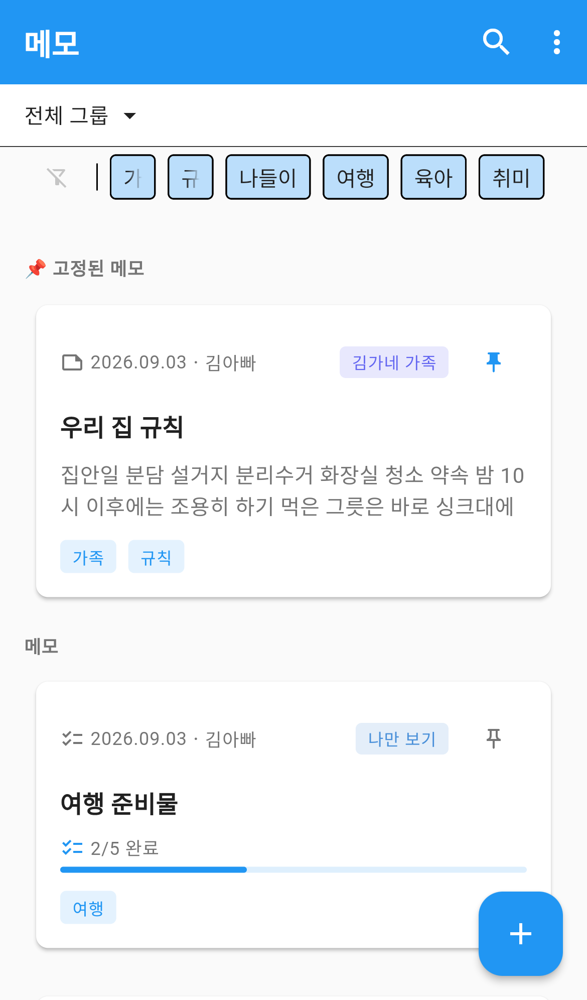
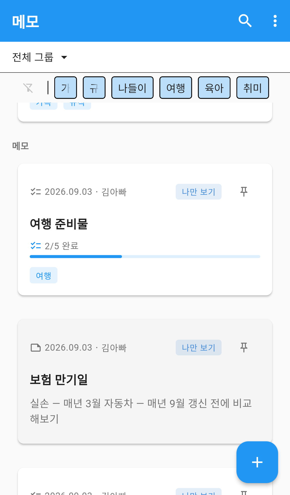
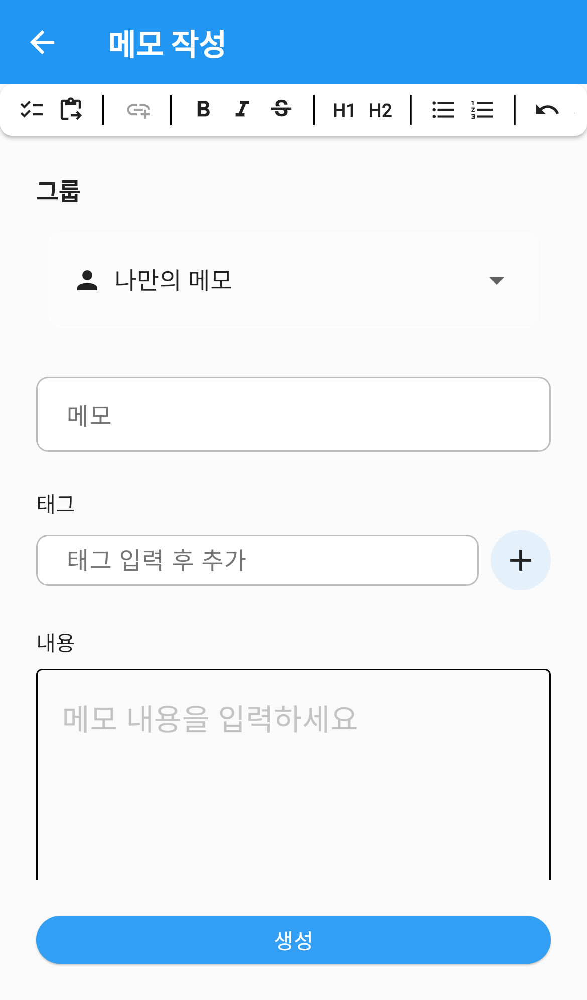
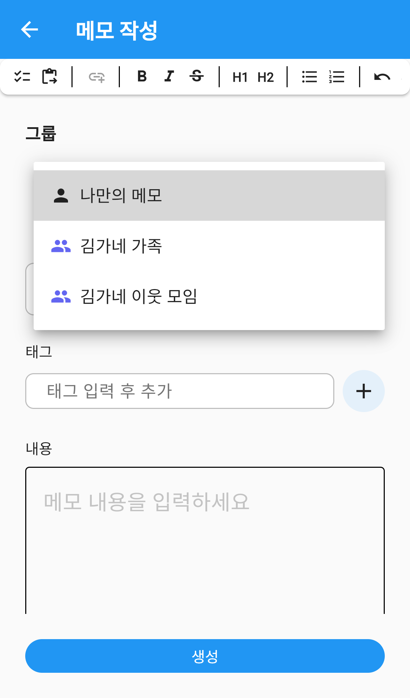
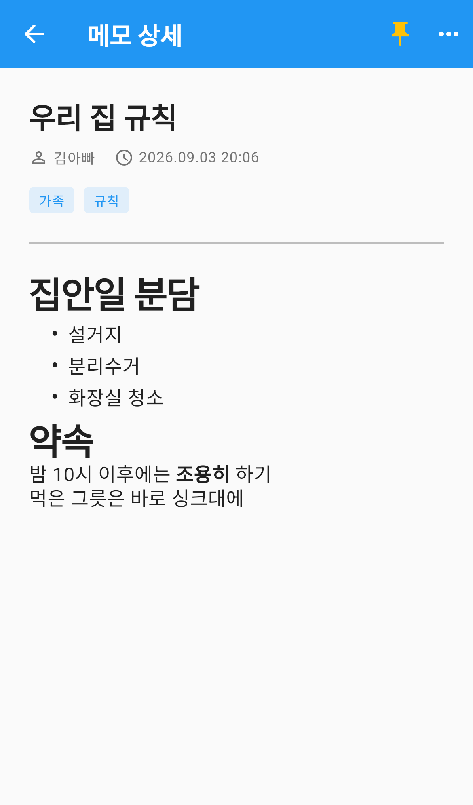
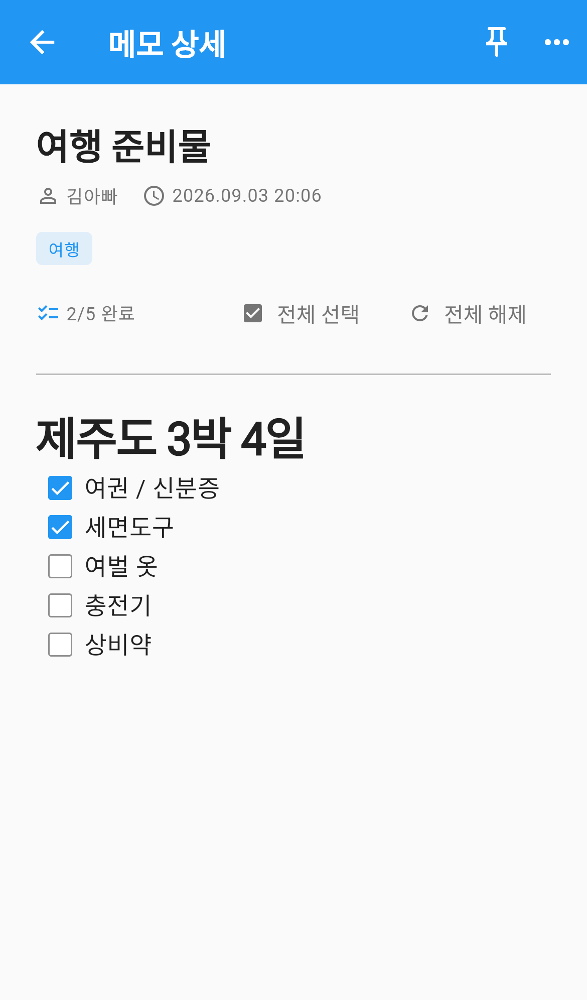

# 메모

떠오른 생각이나 챙길 것을 적어두는 곳입니다.
굵게·제목·목록 같은 서식을 넣을 수 있고, 체크리스트를 만들어 하나씩 지워갈 수도 있습니다.
나만 보거나 특정 그룹에만 보이도록 정할 수 있고, 자주 보는 메모는 맨 위에 고정해 둡니다.

## 화면 구성

위에서부터 그룹 필터 · 태그 필터 · 메모 목록 순으로 이어집니다.

1. **그룹 필터** — **전체 그룹**을 누르면 어느 범위의 메모를 볼지 고릅니다.
   나만 보는 메모만 보거나, 특정 그룹의 메모만 볼 수 있습니다.
2. **태그 필터** — 지금까지 쓴 태그가 한 줄로 나열됩니다. 태그를 누르면 그 태그가 붙은 메모만 남습니다.
   맨 왼쪽 아이콘을 누르면 태그 선택이 풀립니다.
3. **📌 고정된 메모** — 고정해 둔 메모가 맨 위에 따로 모입니다.
   고정한 메모가 4개를 넘으면 3개까지만 보이고 **펼치기**로 나머지를 봅니다.
4. **메모** — 나머지 메모가 최근에 쓴 순서로 이어집니다. 아래로 내리면 계속 불러옵니다.

앱바 오른쪽의 🔍 를 누르면 검색창이 열립니다. **제목과 내용**에서 찾습니다.

## 메모 카드 읽는 법

카드 한 장에 그 메모의 상태가 모두 들어 있습니다.

| 위치 | 표시 | 뜻 |
|---|---|---|
| 왼쪽 위 | 문서 아이콘 | 일반 메모입니다 |
| 왼쪽 위 | 체크 아이콘 | 체크리스트가 들어 있는 메모입니다 |
| 왼쪽 위 | 날짜 · 이름 | 마지막으로 고친 날짜와 쓴 사람 |
| 오른쪽 위 | **나만 보기** | 나 말고는 볼 수 없습니다 |
| 오른쪽 위 | **그룹 이름** | 그 그룹 사람들이 볼 수 있습니다 |
| 오른쪽 끝 | 📌 | 눌러서 고정하거나 고정을 풉니다 |
| 가운데 | 제목과 내용 미리보기 | 서식은 빼고 글자만 두 줄까지 |
| 가운데 | **2/5 완료** + 막대 | 체크리스트 메모는 미리보기 대신 진행률이 나옵니다 |
| 아래 | 태그 | 이 메모에 붙은 태그 |

카드를 길게 누르면 **수정 · 삭제**를 바로 고를 수 있습니다.

## 메모 쓰기

오른쪽 아래 ＋ 버튼을 누릅니다.

| 항목 | 필수 | 설명 |
|---|---|---|
| 그룹 | | 이 메모를 누가 볼 수 있는지 정합니다. 기본은 **나만의 메모** 입니다 |
| 제목 | ✅ | 두 글자 이상 입력해야 합니다 |
| 태그 | | 태그를 적고 ＋ 를 눌러 추가합니다. 여러 개를 붙일 수 있습니다 |
| 내용 | ✅ | 위쪽 도구 모음으로 서식을 넣습니다 |

다 적었으면 맨 아래 **생성**을 누릅니다.

### 공개 범위 정하기

**그룹**을 누르면 목록이 열립니다.

- **나만의 메모** — 나 말고는 아무도 볼 수 없습니다.
- **그룹 이름** — 그 그룹에 속한 사람들이 볼 수 있습니다.

### 서식 넣기

내용 칸 위의 도구 모음으로 글을 꾸밉니다. 왼쪽부터 순서대로입니다.

| 도구 | 하는 일 |
|---|---|
| 체크리스트 | 지금 줄을 체크 항목으로 바꿉니다 |
| 서식 유지 붙여넣기 | 복사해 온 글을 서식까지 그대로 붙여넣습니다 |
| 하이퍼링크 | **글자를 먼저 선택한 뒤** 눌러 주소를 답니다 |
| **B** | 굵게 |
| *I* | 기울임 |
| ~~S~~ | 취소선 |
| H1 · H2 | 제목 크기 |
| 글머리 기호 | · 로 시작하는 목록 |
| 번호 목록 | 1. 2. 3. 으로 이어지는 목록 |
| ↩︎ ↪︎ | 실행 취소 · 다시 실행 |

주소를 그대로 붙여넣으면 **링크 카드**가 자동으로 만들어집니다.

## 메모 보기

목록에서 메모를 누르면 상세 화면이 열립니다. 넣어둔 서식이 그대로 보입니다.

오른쪽 위 아이콘은 다음과 같습니다.

- **📌** — 누르면 목록 맨 위에 고정되고 **대시보드에도 함께 올라갑니다.** 다시 누르면 풀립니다.
- **⋯** — **수정 · 복사 · 삭제**를 고릅니다.
  - **복사**를 고르면 제목 뒤에 `(복사본)`이 붙은 새 메모 작성 화면이 열립니다. 내용과 태그도 그대로 옮겨집니다.
  - **삭제한 메모는 되돌릴 수 없습니다.**

## 체크리스트 쓰기

작성 화면에서 도구 모음 맨 왼쪽의 체크리스트 버튼을 누르면 그 줄이 체크 항목이 됩니다.
줄바꿈을 하면 다음 항목이 이어서 만들어집니다.

체크리스트가 들어 있는 메모는 상세 화면에서 **바로 체크할 수 있습니다.**
따로 저장을 누르지 않아도 잠시 뒤 자동으로 저장됩니다.

- **전체 선택** — 모든 항목을 체크합니다.
- **전체 해제** — 모든 체크를 풉니다.

목록으로 돌아가면 카드의 진행률(`2/5 완료`)도 함께 바뀝니다.

## 자주 묻는 질문

**메모를 지웠는데 되살릴 수 있나요?**
삭제한 메모는 복구할 수 없습니다. 지우기 전에 한 번 더 확인해 주세요.

**가족에게 보여주고 싶지 않은 메모가 있어요.**
그룹을 **나만의 메모**로 두면 됩니다. 이미 그룹에 올린 메모도 수정 화면에서 바꿀 수 있습니다.

**대시보드에 메모를 띄우고 싶어요.**
그 메모를 열고 오른쪽 위 📌 를 누르세요. 목록 맨 위로 올라가면서 대시보드에도 함께 표시됩니다.

**같은 메모를 다른 사람이 동시에 고치면 어떻게 되나요?**
한 번에 한 사람만 고칠 수 있습니다. 다른 사람이 편집 중이면 "다른 사용자가 편집 중입니다" 라고 알려줍니다.

**비슷한 메모를 여러 개 만들고 싶어요.**
원본을 열고 **⋯ → 복사**를 고르세요. 내용과 태그가 그대로 채워진 새 메모가 열립니다.

**태그를 지우려면 어떻게 하나요?**
메모 수정 화면에서 태그 옆의 ✕ 를 누르면 됩니다. 그 태그를 쓰는 메모가 하나도 없어지면 태그 필터 줄에서도 사라집니다.
