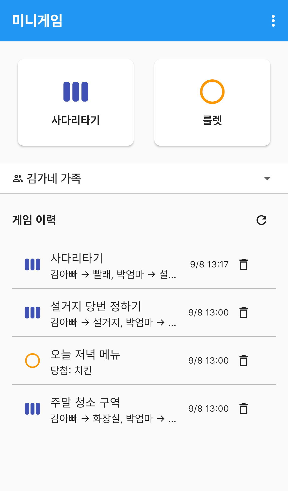
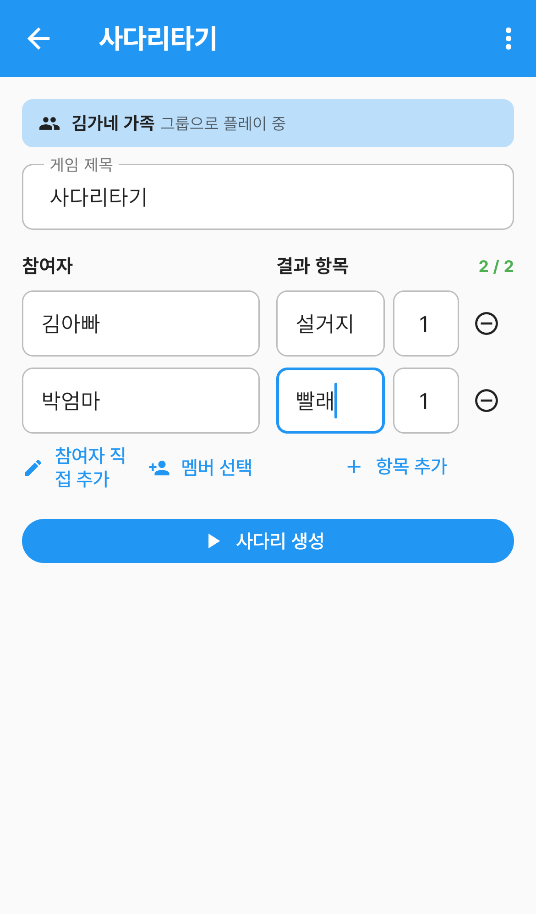
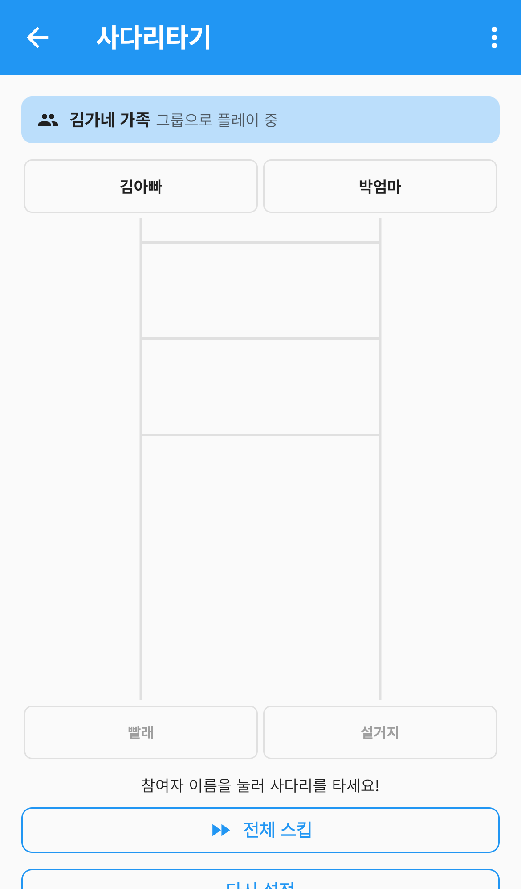
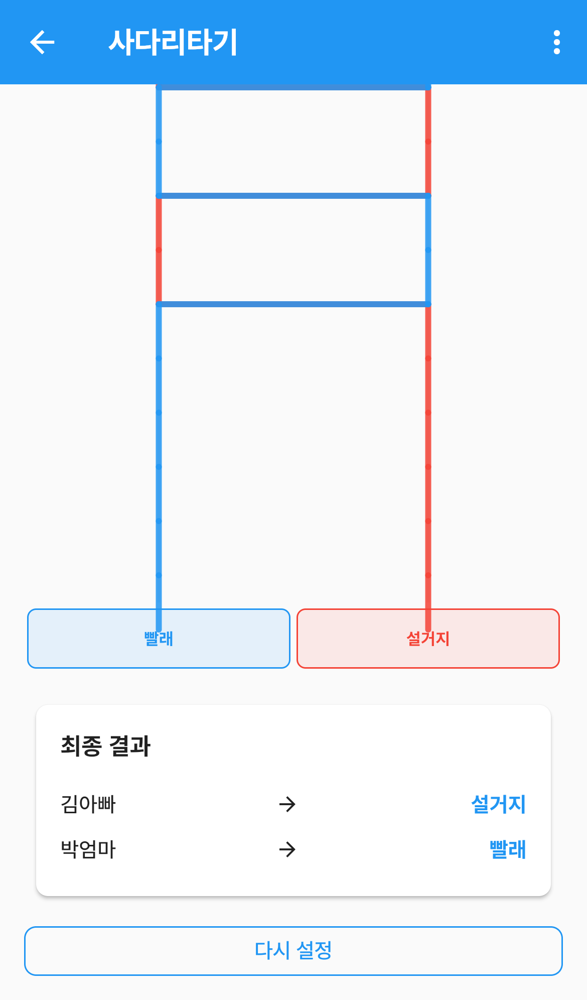
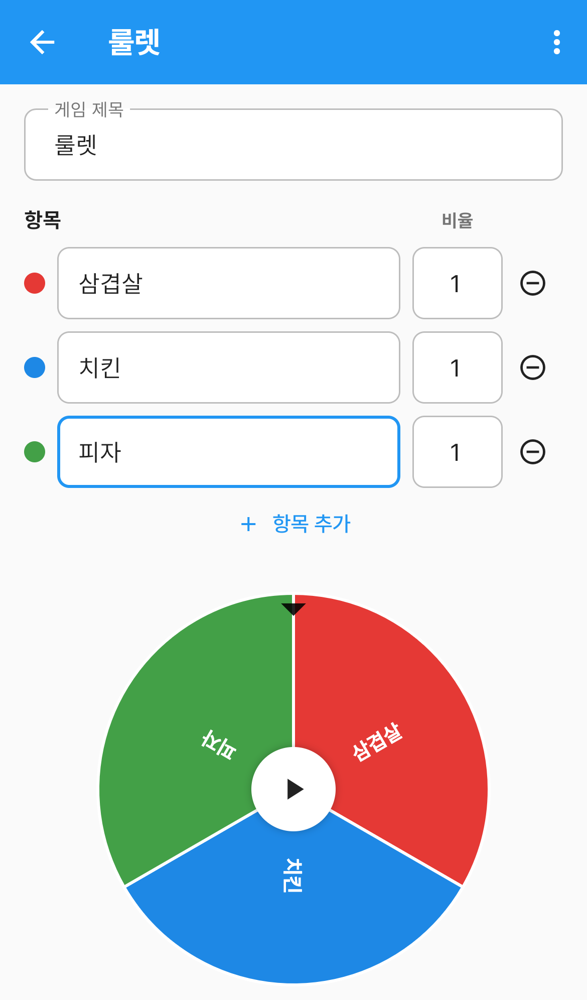
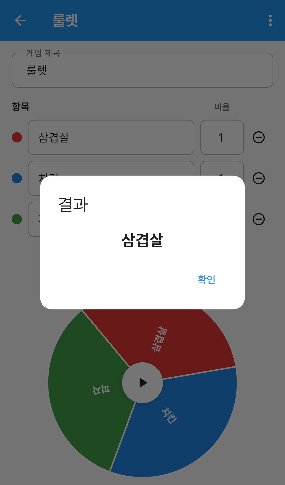

# 미니게임

"누가 설거지할래?", "오늘 저녁 뭐 먹지?" 처럼 **정하기 애매한 것을 공정하게 뽑는** 메뉴입니다.

**사다리타기**와 **룰렛** 두 가지가 있습니다. 그룹을 골라두면 결과가 자동으로 저장돼서,
나중에 "그때 누가 걸렸더라?" 하고 다툴 일이 없습니다.

`더보기` 탭 → **미니게임** 으로 들어갑니다.

---

## 화면 구성

*미니게임 — 게임 선택과 지난 이력*

| 영역 | 설명 |
|---|---|
| 게임 카드 | **사다리타기** · **룰렛** 중에 고릅니다 |
| 그룹 선택 | 결과를 어느 가족 이력에 남길지 정합니다 |
| 게임 이력 | 지금까지 한 게임이 최근 순으로 쌓입니다 |

### 그룹을 먼저 고르세요

처음 들어오면 **`그룹 없음 (이력 저장 안 함)`** 으로 되어 있습니다. 이 상태로도 게임은 되지만
결과가 남지 않고, 이력 자리에는 `그룹을 선택하면 게임 이력이 자동 저장됩니다` 만 보입니다.

그룹을 고르면 두 가지가 달라집니다.

- 게임이 끝나면 **결과가 자동으로 저장**됩니다. 따로 저장 버튼을 누르지 않아도 됩니다
- 참여자를 넣을 때 **그룹 멤버를 목록에서 골라** 넣을 수 있습니다

이력은 그룹 구성원 누구나 볼 수 있습니다.

### 게임 이력 읽기

한 줄에 게임 종류(왼쪽 아이콘), 제목, 결과 요약, 시각이 나옵니다.

- **사다리타기**(파란 막대 아이콘) — `김아빠 → 설거지, 박엄마 → 빨래` 처럼 누가 무엇을 맡았는지
- **룰렛**(주황 동그라미 아이콘) — `당첨: 치킨` 처럼 뽑힌 항목

오른쪽 **휴지통**으로 한 줄씩 지웁니다. 지우기 전에 한 번 더 물어봅니다.

---

## 사다리타기

**사람 수와 항목 수를 맞춰서** 누가 무엇을 맡을지 정할 때 씁니다.

### 1. 참여자와 항목 넣기

*사다리타기 설정 — 참여자와 결과 항목*

- **게임 제목** — 나중에 이력에서 알아보기 쉽게 적습니다. 비워두면 `사다리타기` 로 저장됩니다
- **참여자** — **멤버 선택** 으로 그룹 멤버를 고르거나, **참여자 직접 추가** 로 이름을 적습니다
- **결과 항목** — 사다리 아래에 놓일 것들입니다. 오른쪽 작은 칸은 **개수**입니다

오른쪽 위 `2 / 2` 는 **항목 개수 합계 / 참여자 수** 입니다. 이 둘이 **같아야** 사다리를 만들 수 있고,
다르면 `수량 합계(N)가 참여자 수(M)와 같아야 합니다` 라고 알려줍니다.

> 항목 개수를 쓰면 같은 항목을 여러 명에게 줄 수 있습니다.
> 3명이 하는데 `당첨 1`, `꽝 2` 로 적으면 한 명만 당첨됩니다.

다 넣었으면 **사다리 생성** 을 누릅니다.

### 2. 사다리 타기

*이름을 눌러 사다리를 탑니다*

**참여자 이름을 누르면** 그 사람의 줄이 색깔을 그리며 내려갑니다. 한 명씩 눌러 결과를 확인하세요.
한 번에 다 보고 싶으면 아래 **전체 스킵** 을 누릅니다.

### 3. 결과 확인

*사다리타기 결과 — 누가 무엇을 맡았는지*

모두 내려오면 아래에 **최종 결과** 카드가 나옵니다. 그룹을 골라뒀다면 이 시점에 자동 저장됩니다.

다시 하려면 **다시 설정** 을 눌러 참여자와 항목을 고치는 화면으로 돌아갑니다.

---

## 룰렛

**여럿 중 하나만** 뽑을 때 씁니다. 저녁 메뉴 고르기처럼요.

*룰렛 설정 — 항목과 비율*

- **항목** — 뽑을 후보를 적습니다. 색깔 점이 원판의 색과 같습니다
- **비율** — 그 항목이 차지할 몫입니다. 클수록 원판에서 넓어져 잘 걸립니다
- **항목 추가** 로 칸을 늘리고, 오른쪽 **⊖** 로 뺍니다

적는 대로 아래 원판이 바로 바뀝니다. **항목이 2개 이상**이어야 돌릴 수 있습니다.

가운데 **▶** 또는 **돌리기** 를 누르면 원판이 돌아갑니다.

*룰렛 결과*

멈추면 뽑힌 항목이 **결과** 창으로 뜹니다. **확인** 을 누르면 닫히고,
그룹을 골라뒀다면 이력에 저장됩니다.

---

## 자주 묻는 질문

**Q. 결과가 이력에 안 남습니다.**
위쪽 그룹 선택이 `그룹 없음 (이력 저장 안 함)` 인지 확인하세요. 그룹을 골라야 저장됩니다.

**Q. 그룹에 없는 사람도 참여자로 넣을 수 있나요?**
됩니다. **참여자 직접 추가** 로 이름을 적으면 됩니다. 아이 친구 이름처럼 그룹에 없는 사람도 넣을 수 있습니다.

**Q. `수량 합계가 참여자 수와 같아야 합니다` 가 사라지지 않습니다.**
결과 항목 오른쪽의 **개수** 칸을 확인하세요. 항목 이름만 적고 개수가 비어 있으면 합계에 안 잡힙니다.

**Q. 룰렛에서 특정 항목이 더 잘 나오게 하고 싶어요.**
그 항목의 **비율** 을 올리세요. `치킨 3`, `피자 1` 이면 치킨이 세 배 넓어집니다.

**Q. 이력을 지우면 게임을 다시 해야 하나요?**
이력은 기록일 뿐입니다. 지워도 게임 화면에는 영향이 없습니다.
