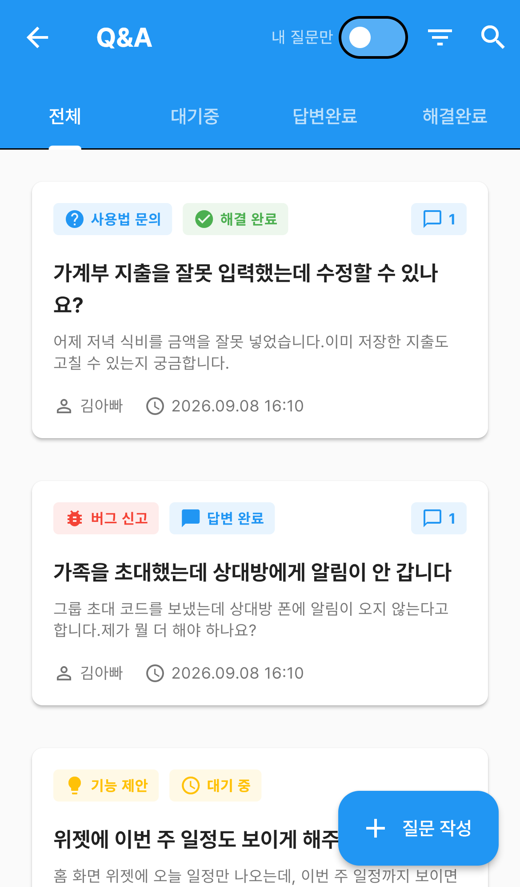
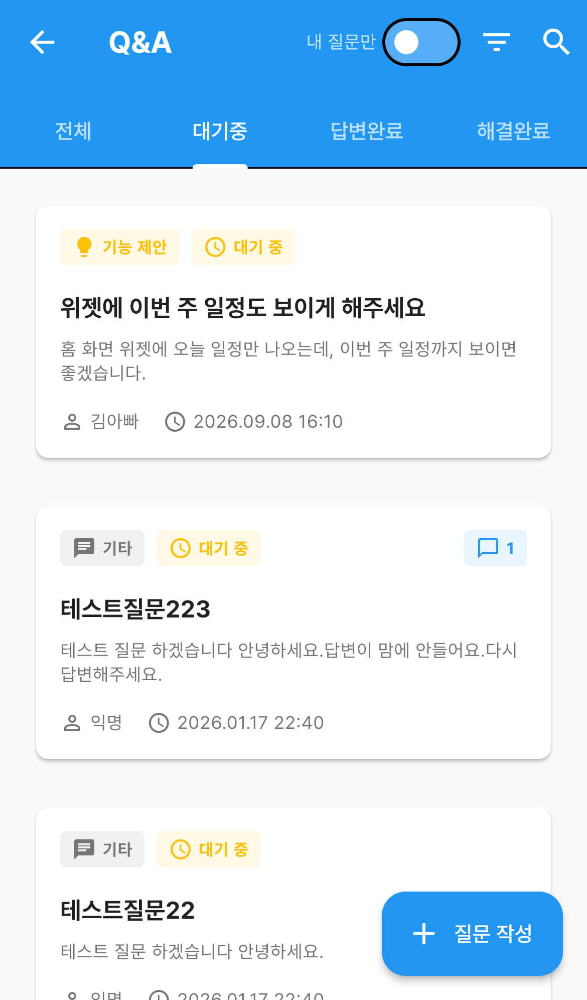
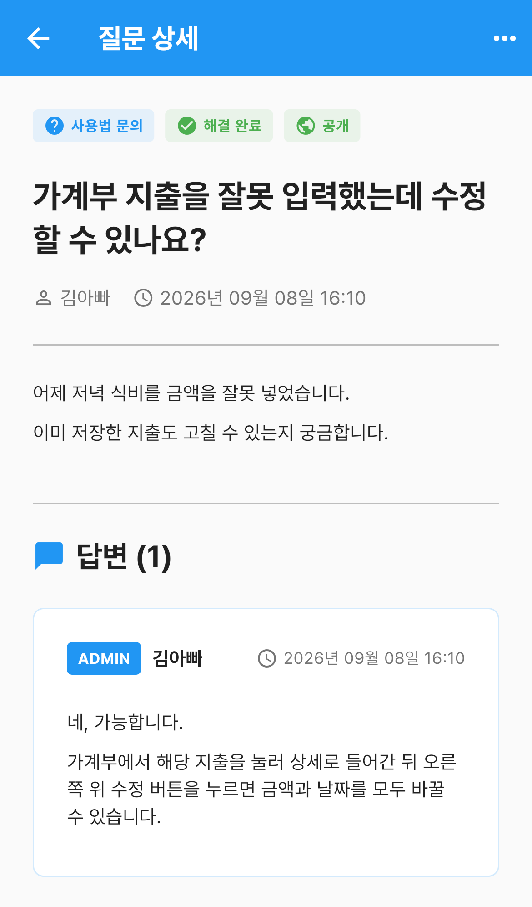
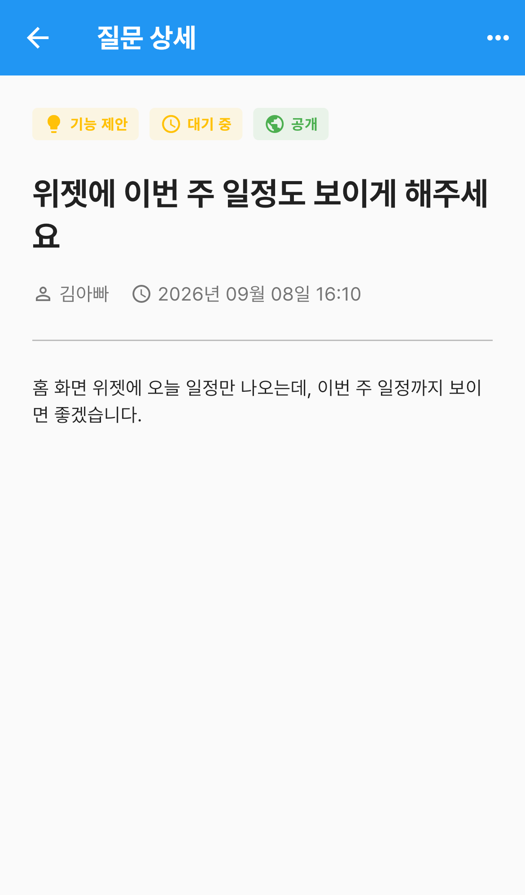
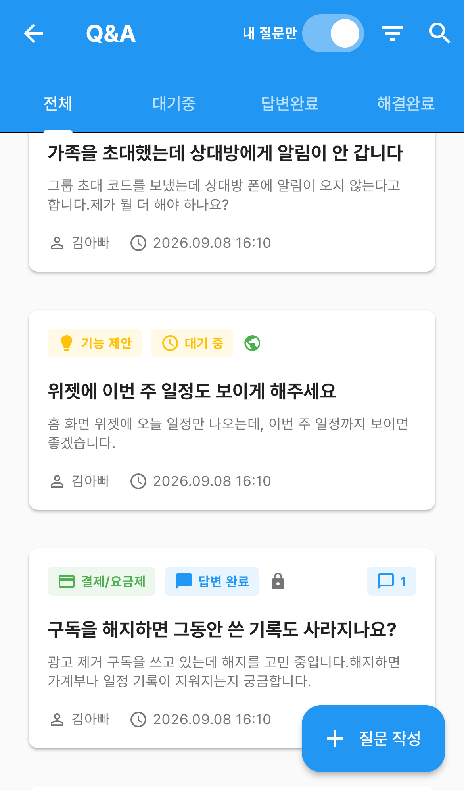
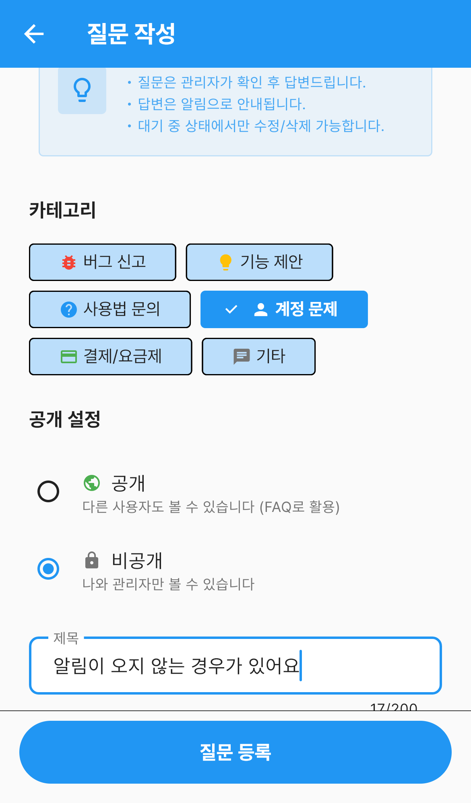
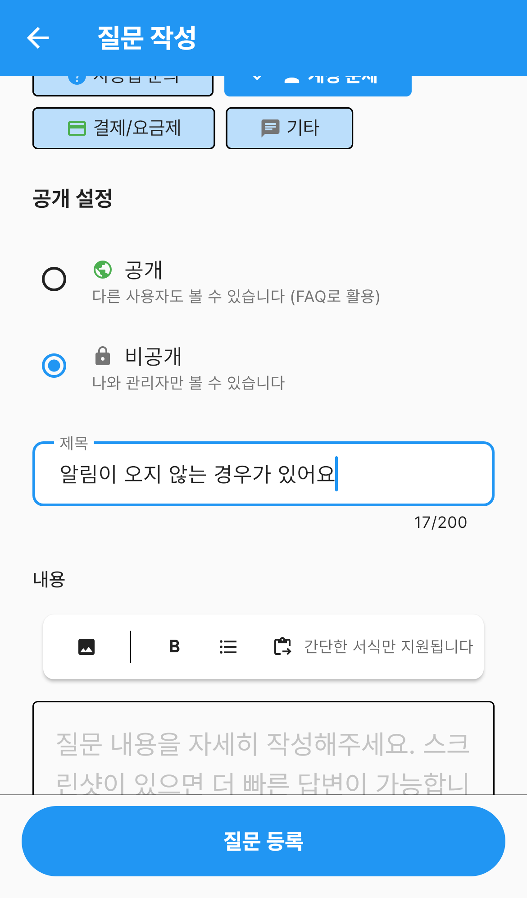

# Q&A

앱을 쓰다 막히는 것을 **운영자에게 직접 물어보는** 곳입니다.

다른 사람이 이미 물어본 질문과 답변도 함께 볼 수 있어서, 질문하기 전에 훑어보면
답을 바로 찾는 경우가 많습니다.

`더보기` 탭 → **Q&A** 로 들어갑니다.

---

## 화면 구성

*Q&A 목록 — 상태 탭과 질문 카드*

| 영역 | 설명 |
|---|---|
| 상태 탭 | `전체` · `대기중` · `답변완료` · `해결완료` |
| **내 질문만** | 켜면 내가 쓴 질문만 봅니다 |
| 필터 아이콘 | 카테고리로 거릅니다 |
| 돋보기 | 제목·내용으로 검색합니다 |
| **질문 작성** | 새 질문을 씁니다 |

### 카드 읽는 법

카드 위쪽에 딱지가 두 개 붙습니다.

- **카테고리** — `버그 신고` · `기능 제안` · `사용법 문의` · `계정 문제` · `결제/요금제` · `기타`
- **상태** — `대기 중`(노랑) · `답변 완료`(파랑) · `해결 완료`(초록)

오른쪽 말풍선 숫자는 **달린 답변 수**입니다. 아래에는 작성자와 작성 시각이 나옵니다.

### 상태 탭

*상태 탭으로 답변 대기 중인 질문만 봅니다*

- **대기중** — 아직 답변이 달리지 않은 질문
- **답변완료** — 운영자가 답변한 질문
- **해결완료** — 질문한 사람이 "해결됐다"고 표시한 질문

---

## 질문 보기

카드를 누르면 상세가 열립니다.

*답변이 달린 질문 — 해결완료로 표시된 상태*

위에 카테고리·상태·공개 범위 딱지가 나오고, 질문 내용 아래에 **답변 (N)** 이 이어집니다.
답변에는 **ADMIN** 표가 붙어 운영자가 쓴 것임을 알 수 있습니다.

*아직 답변을 기다리는 질문*

답변이 아직 없으면 `아직 답변이 없습니다` 라고만 나옵니다.

### 오른쪽 위 ⋯ 메뉴

내가 쓴 질문에서는 이런 것들을 할 수 있습니다.

| 항목 | 설명 |
|---|---|
| 수정 | **해결완료로 표시하기 전까지** 고칠 수 있습니다 |
| **해결완료** | 답변으로 해결됐으면 눌러서 표시합니다 |
| 삭제 | 질문을 지웁니다. 지운 질문은 되돌릴 수 없습니다 |

> **답변이 달린 뒤에 수정하면 다시 `대기 중`으로 돌아갑니다.** 재질문으로 처리돼
> 운영자가 다시 확인합니다. 답변 내용에 더 물어볼 게 있을 때 쓰세요.

---

## 내 질문만 보기

앱바의 **내 질문만** 을 켜면 내가 쓴 질문만 남습니다.

*내 질문만 — 비공개 질문도 함께 보입니다*

이때 카드에 **공개 범위 아이콘**이 하나 더 붙습니다.

- 🌐 **지구본** — 공개 질문
- 🔒 **자물쇠** — 비공개 질문

비공개로 쓴 질문은 공개 목록에는 안 나오고, **여기서만** 확인할 수 있습니다.

---

## 질문 작성하기

오른쪽 아래 **질문 작성** 을 누릅니다.

*질문 작성 — 카테고리와 공개 범위를 고릅니다*

맨 위 안내에 이렇게 적혀 있습니다.

> - 질문은 관리자가 확인 후 답변드립니다.
> - 답변은 알림으로 안내됩니다.
> - 대기 중 상태에서만 수정/삭제 가능합니다.

(실제로는 **해결완료로 표시하기 전까지** 수정할 수 있고, 삭제는 언제든 됩니다.)

1. **카테고리** 를 하나 고릅니다
2. **공개 설정** 을 정합니다
   - **공개** — 다른 사용자도 볼 수 있습니다 (FAQ로 활용)
   - **비공개** — 나와 관리자만 볼 수 있습니다
3. **제목** 을 적습니다 (200자까지)

*제목과 내용 — 굵게·글머리 기호 같은 간단한 서식을 쓸 수 있습니다*

내용은 서식을 넣을 수 있습니다. 위쪽 도구로 **굵게**, **글머리 기호** 를 쓰고
**이미지 첨부** 로 스크린샷을 넣을 수 있습니다.

> 화면이 이상하게 보이는 문제라면 **스크린샷을 함께 올려주세요.** 훨씬 빨리 해결됩니다.

다 됐으면 아래 **질문 등록** 을 누릅니다.

---

## 자주 묻는 질문

**Q. 답변이 오면 어떻게 알 수 있나요?**
답변이 달리면 **알림으로 안내**됩니다. Q&A 목록에서 상태가 `답변 완료` 로 바뀌어 있기도 합니다.

**Q. 질문을 수정하려는데 안 됩니다.**
**해결완료** 로 표시한 질문은 수정할 수 없습니다. 그 밖의 상태에서는 수정됩니다.
답변이 달린 질문을 수정하면 다시 `대기 중` 으로 돌아가 재질문이 됩니다.

**Q. 공개와 비공개 중 뭘 골라야 하나요?**
계정이나 결제처럼 **내 정보가 들어가는 질문은 비공개**로 쓰세요.
사용법처럼 다른 사람에게도 도움이 될 내용은 공개로 두면 FAQ처럼 쓰입니다.

**Q. 나중에 공개/비공개를 바꿀 수 있나요?**
질문을 수정하면서 바꿀 수 있습니다. 해결완료로 표시한 뒤에는 바꿀 수 없습니다.

**Q. 해결완료는 꼭 눌러야 하나요?**
필수는 아닙니다. 다만 눌러두면 나중에 `해결완료` 탭에서 답을 찾은 질문만 모아 볼 수 있습니다.

**Q. 다른 사람의 비공개 질문도 보이나요?**
아닙니다. 비공개 질문은 **쓴 사람과 관리자에게만** 보입니다.
