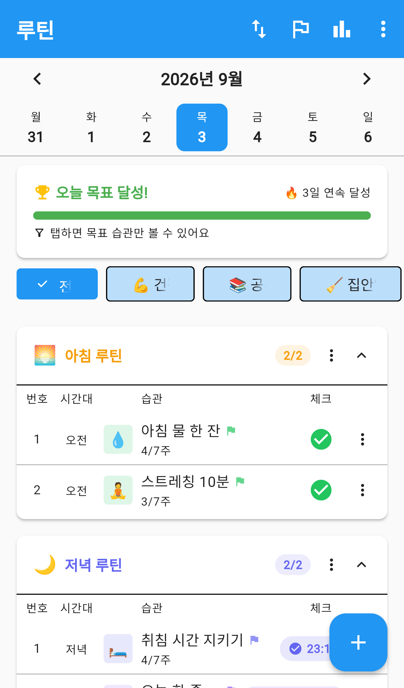
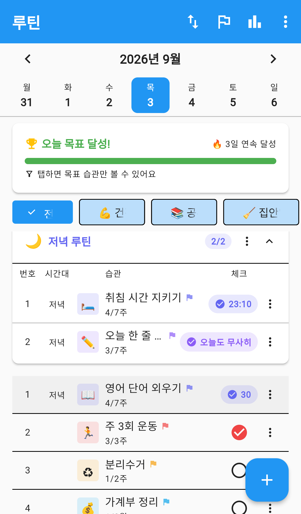
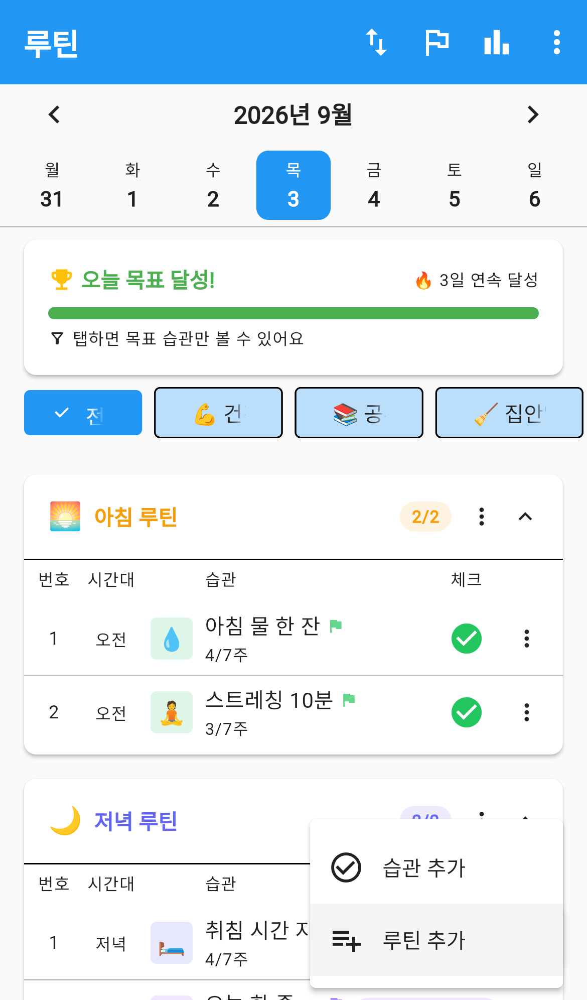
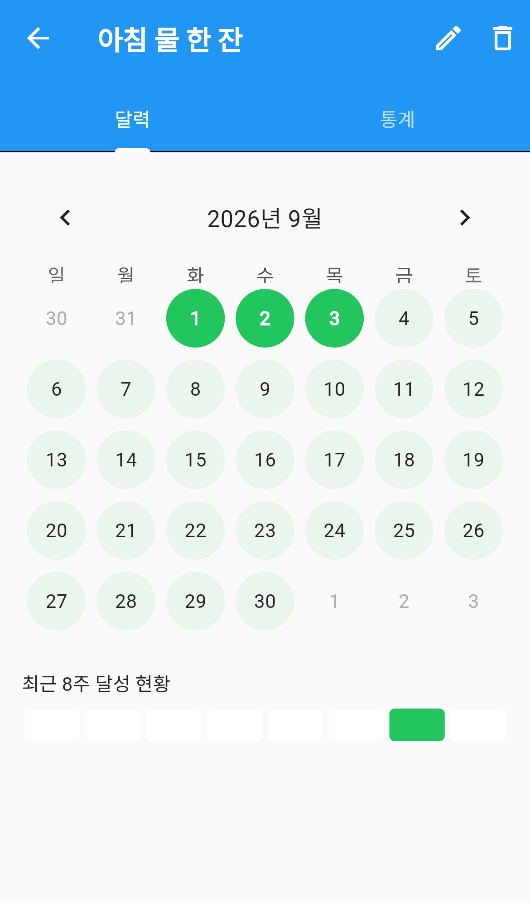
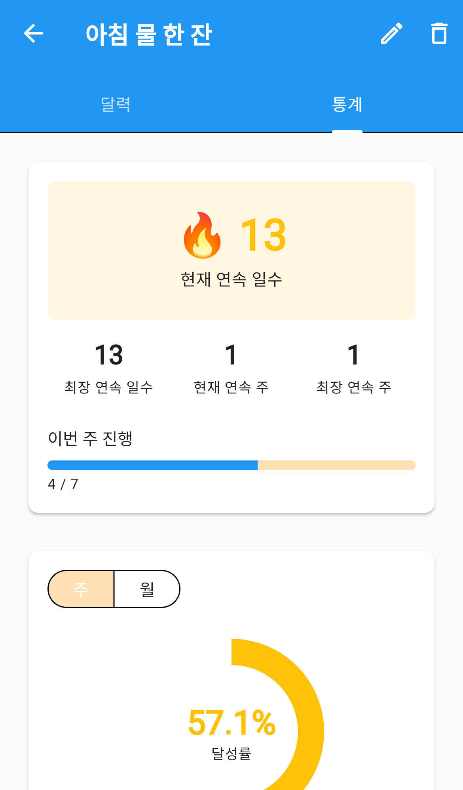
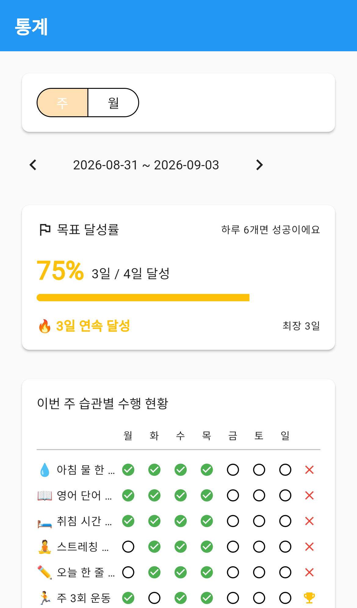
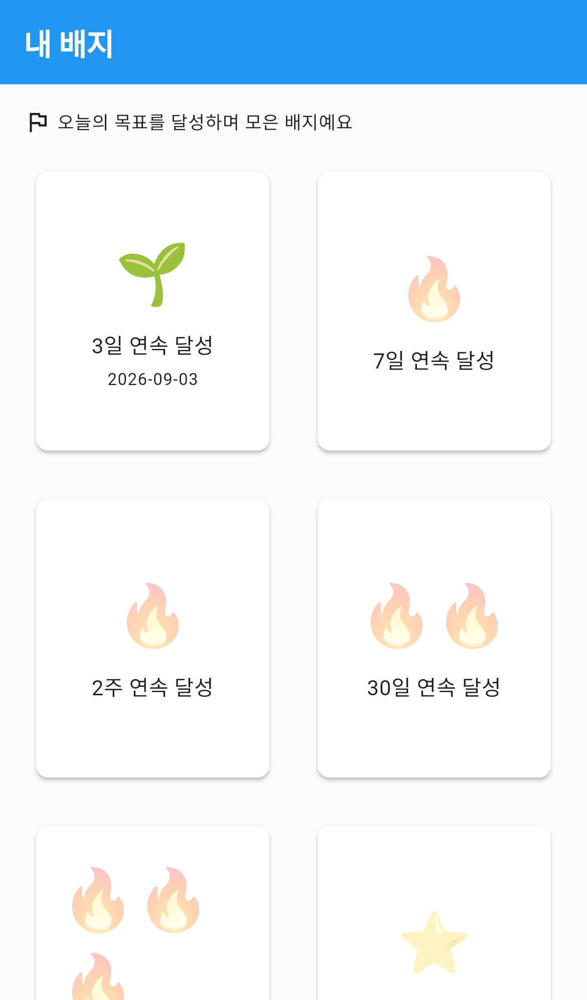

# 루틴

매일 반복하고 싶은 일을 **습관**으로 등록하고, 하루하루 체크하며 기록을 쌓는 메뉴입니다.
며칠 연속으로 해냈는지(스트릭), 이번 주에 몇 번 했는지가 자동으로 계산되고,
꾸준히 하면 배지도 받습니다. 그룹을 정해두면 가족과 서로의 현황을 보거나 함께 챌린지를 할 수도 있습니다.

## 화면 구성

맨 위에 날짜 띠가 있고, 그 아래로 오늘의 목표 · 카테고리 · 습관 목록이 이어집니다.

1. **날짜 띠** — 이번 주 월요일부터 일요일까지가 보입니다. 날짜를 누르면 그날의 체크 상태로 바뀌고,
   좌우 화살표로 달을 옮길 수 있습니다. 미래 날짜는 체크할 수 없습니다.
2. **오늘의 목표 막대** — 오늘 몇 개를 체크했는지 보여줍니다. 목표를 채우면
   "오늘 목표 달성!"으로 바뀌고 옆에 연속 달성 일수가 표시됩니다.
   막대를 누르면 목표에 포함된 습관만 골라볼 수 있습니다.
3. **카테고리 칩** — "전체"와 카테고리들이 나열됩니다. 누르면 그 카테고리 습관만 남습니다.
4. **습관 목록** — 루틴(묶음)별 섹션이 먼저 나오고, 어디에도 속하지 않은 습관은 아래쪽에 모입니다.

앱바 아이콘은 왼쪽부터 다음과 같습니다.

| 아이콘 | 이름 | 하는 일 |
|---|---|---|
| ⇅ | 순서변경 | 습관과 루틴의 순서를 끌어서 바꿉니다 |
| 🏳 | 오늘의 목표 설정 | 하루에 몇 개를 채우면 성공으로 볼지 정합니다 |
| 📊 | 통계 | 전체 습관의 달성 현황을 봅니다 |
| ⋮ | 더보기 | **함께하기**(그룹원 현황·랭킹·챌린지)로 이동하거나 안내를 다시 봅니다 |

## 습관 체크하기

목록 오른쪽의 동그라미를 누르면 그날 완료로 표시됩니다. 다시 누르면 체크가 취소됩니다.

기록 방식에 따라 누른 뒤 **기록 입력** 창이 뜹니다.

- **단순 체크** — 바로 완료 표시가 됩니다.
- **수치** — 숫자를 입력합니다. 목록에는 `30`처럼 값이 표시됩니다.
- **시각** — 시간을 고릅니다. 목록에는 `23:10`처럼 표시됩니다.
- **텍스트** — 짧은 메모를 남깁니다. 목록에 그 내용이 그대로 보입니다.

습관 이름 아래의 `4/7주`는 이번 주 진행 상황입니다. 월 단위 습관은 `1/2월`처럼 표시됩니다.
이름 옆 깃발은 그 습관이 **오늘의 목표에 포함**되어 있다는 뜻이고, 색은 중요도를 나타냅니다.

각 줄 오른쪽 ⋮ 를 누르면 나오는 메뉴입니다.

- **습관 수정** — 이름, 반복 주기, 카테고리 등을 바꿉니다.
- **일시정지** — 잠시 쉽니다. 일시정지 중에는 체크할 수 없고 목록에서 흐리게 보입니다.
- **재개** — 일시정지한 습관을 다시 시작합니다.
- **종료** — 더 이상 하지 않는 습관을 목록에서 내립니다. **지금까지의 체크 기록은 그대로 남습니다.**

## 습관 만들기

오른쪽 아래 ＋ 버튼을 누르고 **습관 추가**를 고릅니다.

입력 항목은 다음과 같습니다.

| 항목 | 필수 | 설명 |
|---|---|---|
| 제목 | ✅ | 100자까지 입력할 수 있습니다 |
| 이모지 · 색상 | | 목록에서 한눈에 알아보기 쉽게 해줍니다 |
| 반복 주기 | ✅ | 일간 · 주간 · 월간 중에서 고릅니다 |
| 메모 | | 이 습관에 대한 설명을 남깁니다 |
| 비공개 | | 켜면 공유 그룹의 다른 사람에게 이 습관이 보이지 않습니다 |
| 중요도 | | 낮음 · 보통 · 높음. 이름 옆 깃발 색으로 표시됩니다 |
| 시간대 | | 오전 · 오후 · 저녁. 목록에서 시간대별로 구분해 보여줍니다 |
| 기록 방식 | ✅ | 단순 체크 · 텍스트 · 시각 · 수치 |
| 시작일 | ✅ | 기본값은 오늘입니다 |
| 종료일 | | 비워두면 무기한입니다 |
| 소속 루틴 | | 묶어둘 루틴을 고릅니다. 고르지 않으면 독립 습관이 됩니다 |
| 카테고리 | | 여러 개를 고를 수 있습니다 |

> **기록 방식은 만든 뒤에 바꿀 수 없습니다.** 수치로 남길지 단순 체크로 할지 처음에 정해주세요.

### 반복 주기 정하기

- **일간** — 매일 하는 습관입니다. 한 주에 7번이 목표가 됩니다.
- **주간** — 두 가지 방식이 있습니다.
  - **주 N회**: 요일과 상관없이 한 주에 몇 번만 채우면 됩니다. 목표 횟수를 고릅니다.
  - **요일 지정**: 화요일·금요일처럼 정해진 요일에만 합니다. 반복할 요일을 1개 이상 고릅니다.
- **월간** — 한 달에 몇 번 할지 목표 횟수를 고릅니다.

## 루틴(습관 묶음) 만들기

"아침 루틴", "저녁 루틴"처럼 여러 습관을 하나로 묶어두면 목록에서 섹션으로 모여 보입니다.
섹션 제목 옆의 `1/2`는 그 묶음에서 오늘 몇 개를 했는지입니다.

＋ 버튼에서 **루틴 추가**를 고르고 이름·이모지·색상을 정하면 됩니다.
섹션 제목 옆 ⋮ 로 수정·삭제할 수 있고, **▲/▼** 를 눌러 접었다 펼 수 있습니다.

> 루틴을 삭제해도 **안에 있던 습관은 지워지지 않습니다.** 독립 습관으로 남습니다.

## 카테고리로 분류하기

"건강", "공부", "집안일"처럼 성격이 비슷한 습관을 묶는 이름표입니다.
한 습관에 여러 카테고리를 붙일 수 있습니다.

습관 만들기·수정 화면의 **카테고리** 항목을 누르면 선택 창이 열립니다.
이 창의 **편집**을 누르면 카테고리를 추가·수정·삭제하고 순서도 바꿀 수 있습니다.

목록 위쪽 칩에서 카테고리를 누르면 그 카테고리 습관만 남고, **전체**를 누르면 다시 모두 보입니다.

> 카테고리를 삭제해도 **소속 습관은 지워지지 않습니다.** 미분류로 남습니다.

## 오늘의 목표

습관을 전부 채우지 못해도 괜찮도록, **하루에 몇 개만 채우면 성공**으로 볼지 정하는 기능입니다.
앱바의 🏳 아이콘으로 들어갑니다.

- 목표 개수를 정하면 목록 위 막대가 `오늘 4 / 6` 처럼 바뀝니다.
- 목표를 넘기면 **보너스 +1** 처럼 초과분이 표시됩니다.
- 어떤 습관을 목표 집계에 넣을지 아래 목록에서 켜고 끌 수 있습니다.
  매일 하는 습관은 기본으로 켜져 있고, 주 3회·월 2회처럼 주기적으로 하는 습관은 기본으로 꺼져 있습니다.
- 등록된 습관보다 목표가 크면 "지금 등록된 습관보다 목표가 많아요" 안내가 나옵니다.

최근 2주 기록을 보고 앱이 먼저 제안하기도 합니다.
목표를 자주 넘겼으면 **"목표를 올려볼까요?"**, 요즘 뜸했으면 **"목표를 잠시 낮춰볼까요?"** 라고 묻습니다.
그대로 두고 싶으면 **지금이 좋아요**를 누르면 됩니다.

## 기록 살펴보기

습관 이름을 누르면 상세 화면이 열립니다. **달력**과 **통계** 두 개의 탭이 있습니다.

### 달력 탭

체크한 날이 진한 색으로 칠해집니다. 위쪽 화살표로 달을 넘길 수 있습니다.

아래 **최근 8주 달성 현황**은 최근 8주를 한 칸씩 놓고, 그 주의 목표를 채운 주만 색칠합니다.
(매일 하는 습관은 7일을 모두 채운 주, 주 3회 습관은 3번을 채운 주가 색칠됩니다.)

### 통계 탭

- **현재 연속 일수 / 최장 연속 일수** — 며칠을 연달아 해냈는지입니다.
- **현재 연속 주 / 최장 연속 주** — 주 목표를 몇 주 연달아 채웠는지입니다. 월 단위 습관은 "연속 달"로 표시됩니다.
- **이번 주 진행** — 이번 주에 몇 번 했는지를 막대로 보여줍니다.
- **달성률** — **주 / 월 / 기간 지정** 중에서 골라 원 그래프로 봅니다.

오른쪽 위 ✏️ 는 **습관 수정**, 🗑️ 는 **습관 삭제**입니다.

> 🗑️ 삭제는 습관과 함께 **지금까지의 체크 기록도 사라집니다.**
> 기록을 남겨두고 목록에서만 내리고 싶다면 목록의 ⋮ → **종료**를 쓰세요.

## 전체 현황 보기

앱바의 📊 아이콘을 누르면 습관 하나가 아니라 **전체**를 봅니다.

- **주 / 월** 을 골라 기간을 바꾸고, 화살표로 이전·다음 기간으로 넘깁니다.
- **목표 달성률** — 이 기간에 며칠이나 오늘의 목표를 채웠는지와 연속 달성 일수입니다.
- **이번 주 습관별 수행 현황** — 습관을 세로로, 요일을 가로로 놓은 표입니다.
  체크한 날은 ✅, 안 한 날은 ○ 로 표시되고, 맨 오른쪽에 그 주의 목표 달성 여부(🏆 / ✕)가 붙습니다.

## 배지

**오늘의 목표**를 꾸준히 달성하면 배지를 받습니다. 습관 하나의 기록이 아니라 하루 목표 기준입니다.

- **연속 달성** — 3일 · 7일 · 2주 · 30일 · 100일
- **누적 달성** — 10일 · 50일 · 100일 · 365일
- **완벽한 주** — 1주 · 4주 · 12주

받은 배지는 또렷하게 획득 날짜와 함께 보이고, 아직 못 받은 배지는 흐리게 보입니다.
새 배지를 받으면 축하 창이 뜹니다.

## 가족과 함께하기

앱바 ⋮ → **함께하기** 로 들어갑니다. 세 개의 탭이 있습니다.

- **현황** — 그룹원들이 오늘 어떤 습관을 했는지 봅니다. 이름을 누르면 그 사람의 기록을 자세히 볼 수 있습니다.
- **랭킹** — **목표 달성률** 또는 **연속 달성** 기준으로 순위를 매깁니다.
- **챌린지** — 기간과 목표 횟수를 정해 함께 도전합니다.

그룹에 두 개 이상 참여하고 있으면 앱바 아래 드롭다운에서 볼 그룹을 고릅니다.

### 공유 설정

공유할 그룹을 고르지 않으면 아무에게도 보이지 않습니다.
함께하기 화면 오른쪽 위 ⚙️ 를 눌러 **공유 그룹 관리**에 들어가고, 그룹을 켜면
그 그룹 구성원이 내 습관과 달성 현황을 볼 수 있습니다.

> 습관을 만들 때 **비공개**로 표시해 둔 것은 공유 그룹에서도 보이지 않습니다.

### 챌린지

**챌린지 만들기**를 눌러 이름 · 설명 · 기간 · 목표 횟수를 정합니다.
**내기 · 벌칙** 칸에 "진 사람이 치킨 쏘기"처럼 적어둘 수도 있습니다.

참가할 때는 **어떤 습관으로 참가할지** 고릅니다. 비공개 습관으로는 참가할 수 없습니다.
참가 후에도 **습관 바꾸기**로 다른 습관으로 바꿀 수 있습니다.

챌린지는 **시작 전 · 진행 중 · 종료** 상태로 구분되고, 진행 중에는 `3 / 10회` 처럼 진행 상황과 남은 날짜가 보입니다.

> 챌린지를 삭제하면 **참가자들의 기록도 함께 사라집니다.**

## 순서 바꾸기

앱바의 ⇅ 를 누르면 순서 변경 모드가 됩니다.
습관을 끌어서 자리를 옮기고, 루틴 사이로 옮겨 소속을 바꿀 수도 있습니다.
✓ 를 눌러 저장하고, ✕ 로 취소합니다.

## 자주 묻는 질문

**습관을 삭제하면 지금까지의 기록도 사라지나요?**
방법에 따라 다릅니다. 상세 화면의 🗑️ **삭제**는 기록까지 함께 지웁니다.
목록의 ⋮ → **종료**는 기록을 남긴 채 목록에서만 내립니다.
잠시 쉬는 것뿐이라면 **일시정지**를 쓰세요.

**어제 깜빡한 걸 지금 체크할 수 있나요?**
날짜 띠에서 그 날짜를 누르고 체크하면 됩니다. 다만 **미래 날짜는 체크할 수 없습니다.**

**기록 방식을 잘못 골랐어요.**
기록 방식은 만든 뒤에 바꿀 수 없습니다. 기존 습관을 **종료**하고 새로 만들어주세요.
종료하면 지금까지의 기록은 그대로 보존됩니다.

**목표를 매일 다 채우기가 부담스러워요.**
**오늘의 목표 설정**에서 개수를 낮추세요. 습관을 지우지 않아도 됩니다.
목표 집계에서 빼고 싶은 습관만 골라 끌 수도 있습니다.

**가족에게 보여주고 싶지 않은 습관이 있어요.**
그 습관을 수정해 **비공개**를 켜두면 공유 그룹에서 보이지 않습니다.

**"최근 8주 달성 현황"이 한 칸도 안 칠해져요.**
그 주의 목표를 다 채운 주만 칠해집니다. 매일 하는 습관은 7일을 모두 체크해야 한 칸이 칠해집니다.
