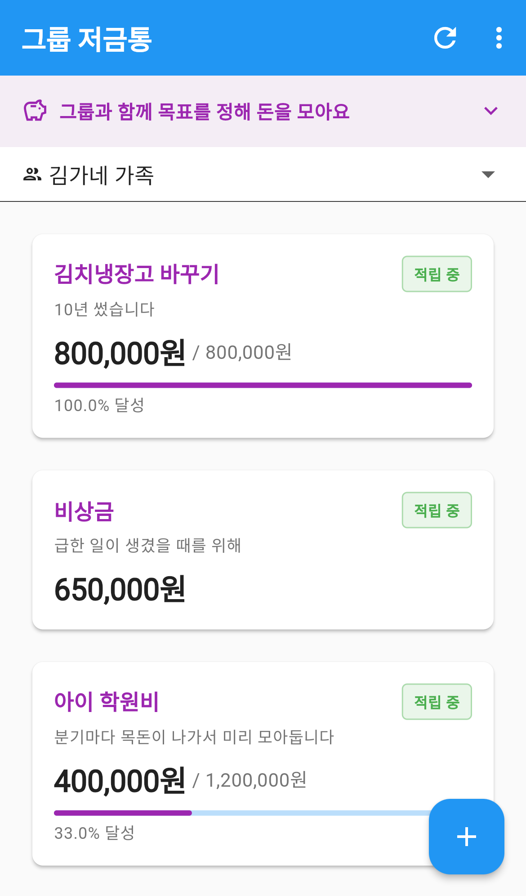
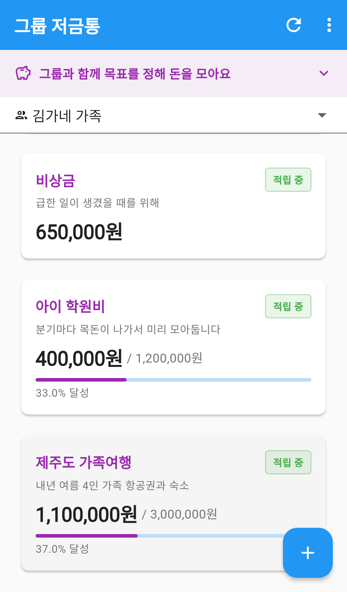
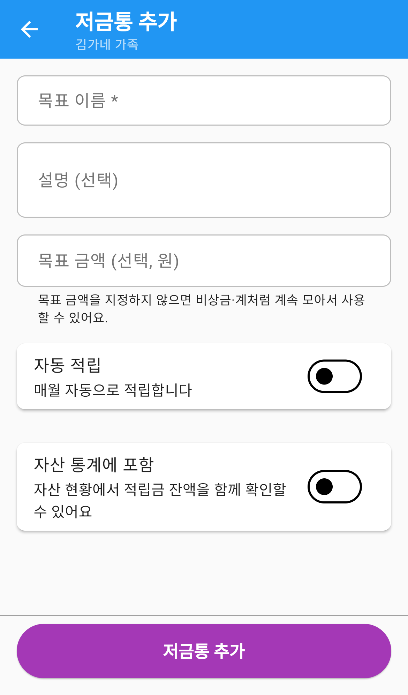
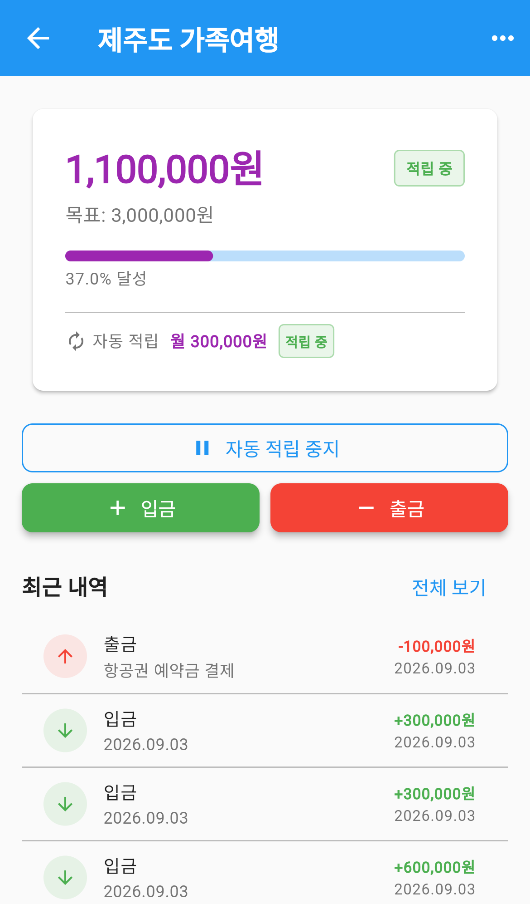
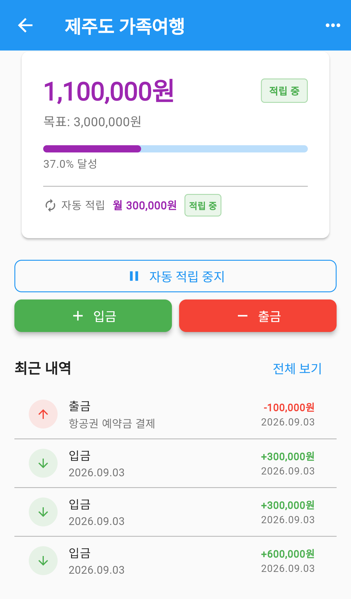

# 그룹 저금통

가족이 함께 목표를 정해 돈을 모으는 메뉴입니다.

"제주도 여행 300만 원", "아이 학원비 120만 원"처럼 **무엇을 위해 얼마를 모을지** 정해두면,
지금 얼마나 모였는지 진행 막대로 한눈에 보입니다. 매달 자동으로 쌓이게 설정할 수도 있습니다.

`더보기` 탭 → **그룹 저금통** 으로 들어갑니다.

---

## 화면 구성

*그룹 저금통 — 목표 목록과 달성률*

| 영역 | 설명 |
|---|---|
| 안내 배너 | `그룹과 함께 목표를 정해 돈을 모아요` — 눌러 접고 펼칩니다 |
| 그룹 선택 | 어느 가족의 저금통을 볼지 고릅니다 |
| 목표 목록 | 등록한 목표가 카드로 표시됩니다 |

오른쪽 위 **새로고침** 으로 최신 금액을 다시 불러옵니다.

---

## 목표 카드 읽는 법

*목표 카드 — 달성률과 자동 적립 표시*

카드마다 다음이 표시됩니다.

| 표시 | 뜻 |
|---|---|
| 목표 이름 | 무엇을 위해 모으는지 |
| `적립 중` 배지 | 지금 상태 |
| 모은 금액 / 목표 금액 | 지금까지 모인 돈과 목표 |
| 진행 막대 | 목표 대비 얼마나 왔는지 |
| `N% 달성` | 달성률 |

**목표 금액을 정하지 않은 저금통**은 진행 막대 없이 모은 금액만 표시됩니다.
얼마를 모을지 정하지 않고 그냥 쌓아두는 비상금 같은 용도입니다.

카드를 누르면 상세 화면으로 들어갑니다.

---

## 저금통 만들기

*저금통 추가 — 이름만 넣어도 만들 수 있습니다*

1. 오른쪽 아래 **＋** 버튼을 누릅니다.
2. **목표 이름**을 입력합니다. (필수)
3. 나머지는 필요한 것만 채우고 저장합니다.

### 채울 수 있는 항목

| 항목 | 설명 |
|---|---|
| 목표 이름 | 필수. 비우면 `목표 이름을 입력해 주세요` 라고 알려줍니다 |
| 설명 | 무엇을 위한 돈인지 메모 |
| 목표 금액 | 선택. 넣지 않으면 기한 없이 모으는 저금통이 됩니다 |
| 자동 적립 | 켜면 매달 정해진 금액이 자동으로 쌓입니다 |
| 월 적립금 | 자동 적립을 켰다면 필수 |
| 매달 적립일 | 1~31일 중에서 고릅니다 |
| 자산 통계에 포함 | 켜면 자산 메뉴에서도 함께 집계됩니다 |

> **매달 적립일**을 31일로 두면, 2월처럼 그 날짜가 없는 달에는 **말일에 자동 처리**됩니다.

### 자산 메뉴와의 연결

**자산 통계에 포함** 을 켜면 그 저금통이 [자산](../assets/index.md) 화면의
계좌 목록 아래에 함께 표시되고, 총 자산에도 합산됩니다.

가족의 전체 재산을 한곳에서 보고 싶다면 켜두고, 저금통은 따로 관리하고 싶다면 꺼두면 됩니다.
나중에 언제든 바꿀 수 있습니다.

---

## 목표 상세 보기

*목표 상세 — 모은 금액과 입출금 버튼*

맨 위 카드에 지금 상태가 모여 있습니다.

- 모은 금액과 목표 금액, 달성률
- **자동 적립** — 월 얼마씩, 지금 켜져 있는지

### 돈 넣고 빼기

| 버튼 | 설명 |
|---|---|
| **＋ 입금** | 금액과 메모(선택)를 넣어 돈을 넣습니다 |
| **− 출금** | 금액과 **사용 목적(필수)** 을 넣어 돈을 뺍니다 |

출금할 때 사용 목적을 반드시 적게 되어 있습니다.
가족이 함께 모으는 돈이라, 왜 뺐는지 기록이 남아야 나중에 서로 확인할 수 있기 때문입니다.

### 자동 적립 멈추기

**자동 적립 중지** 를 누르면 매달 쌓이는 것을 잠시 멈춥니다.
멈춘 뒤에는 같은 자리에 **자동 적립 재개** 가 표시됩니다.

목표를 지우지 않고 잠시 쉬어갈 때 쓰면 됩니다.

### 수정·삭제

오른쪽 위 `⋯` 에서 **수정** 과 **목표 삭제** 를 할 수 있습니다.

---

## 내역 보기

*최근 내역 — 입금과 출금이 함께 표시됩니다*

상세 화면 아래쪽 **최근 내역**에 최근 기록이 보입니다.

- **입금**은 초록색 아래 화살표와 `+금액`
- **출금**은 빨간색 위 화살표와 `−금액`, 그리고 사용 목적

**전체 보기** 를 누르면 전체 내역 화면으로 넘어갑니다.
거기서는 위쪽 칩으로 `전체` · `입금` · `출금` · `자동 적립` 을 걸러 볼 수 있고,
아래로 내리면 이전 기록이 계속 불러와집니다.

---

## 목표를 다 모으면

모은 금액이 목표 금액에 닿으면 카드에 **100.0% 달성** 으로 표시되고,
상세 화면에는 `목표 금액 달성!` 안내가 나타납니다.

돈은 그대로 남아 있으므로, 실제로 쓸 때 **출금** 으로 빼면 됩니다.

---

## 자주 묻는 질문

**Q. 목표 금액을 꼭 정해야 하나요?**
아니요. 비워두면 기한 없이 모으는 저금통이 됩니다. 진행 막대 없이 모은 금액만 표시됩니다.

**Q. 자동 적립을 켜면 실제 통장에서 돈이 빠져나가나요?**
아닙니다. 앱 안에서 기록만 쌓입니다. 실제 이체는 직접 하셔야 합니다.

**Q. 출금할 때 사용 목적을 꼭 적어야 하나요?**
네, 필수입니다. 가족이 함께 모으는 돈이라 왜 뺐는지 기록이 남도록 되어 있습니다.

**Q. 다른 가족이 넣은 돈도 보이나요?**
네. 같은 그룹의 저금통은 구성원 모두가 함께 보고 넣고 뺄 수 있습니다.

**Q. 자산 메뉴에 저금통이 안 보입니다.**
저금통을 만들 때 **자산 통계에 포함** 을 켜야 표시됩니다. 목표를 수정해 언제든 켤 수 있습니다.

**Q. 목표를 지우면 내역도 사라지나요?**
네, 그 목표에 남긴 입출금 기록이 함께 삭제됩니다.
