# 사용자 설정

앱의 모양과 동작을 내게 맞게 바꾸는 곳입니다.
하단 메뉴 구성, 색상과 밝기, 언어처럼 **앱 전체에 적용되는 설정**과
내 프로필·알림·계정 관리를 여기서 다룹니다.

`더보기` 탭 → **설정** 으로 들어갑니다.

---

## 화면 구성

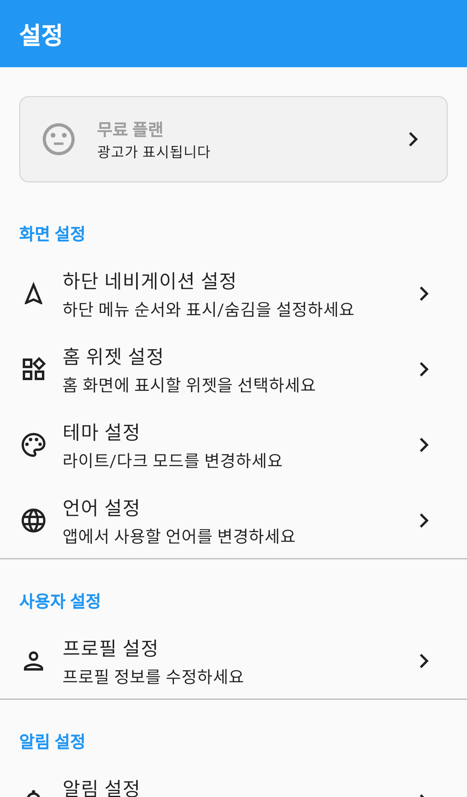
*설정 — 맨 위 구독 상태 카드와 항목별 섹션*

맨 위에 **구독 상태 카드**가 있고, 그 아래로 섹션이 이어집니다.

| 섹션 | 들어 있는 항목 |
|---|---|
| 화면 설정 | 하단 네비게이션, 홈 위젯, 테마, 언어 |
| 사용자 설정 | 프로필 |
| 알림 설정 | 알림 |
| 신고 | 내 신고 내역 |
| 정보 | 앱 정보, 이용약관, 개인정보 처리방침, 도움말 |

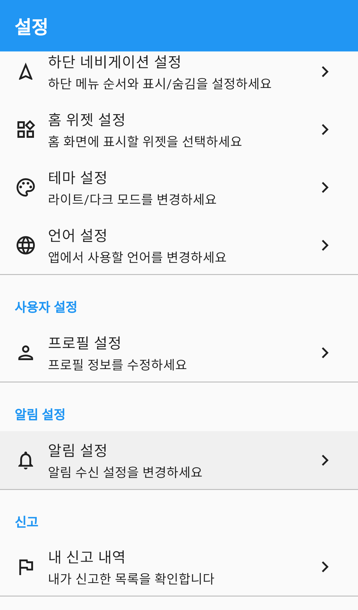
*설정 아래쪽 — 알림·신고·정보 섹션*

> 운영자 계정으로 로그인하면 **운영자 메뉴** 섹션이 추가로 보입니다. 일반 사용자에게는 표시되지 않습니다.

### 구독 상태 카드

지금 어떤 플랜을 쓰고 있는지 한 줄로 보여줍니다.

| 표시 | 뜻 |
|---|---|
| 무료 플랜 · 광고가 표시됩니다 | 무료로 사용 중입니다 |
| 2주 무료 체험 중 | 체험 기간이며 남은 일수가 함께 표시됩니다 |
| 광고 제거 | 광고 없이 사용 중입니다 |
| Premium | 프리미엄 플랜 사용 중입니다 |

카드를 누르면 구독 관리 화면으로 이동합니다.

---

## 하단 네비게이션 바꾸기

화면 맨 아래 메뉴 5칸 중 **가운데 3칸**을 원하는 메뉴로 바꿉니다.

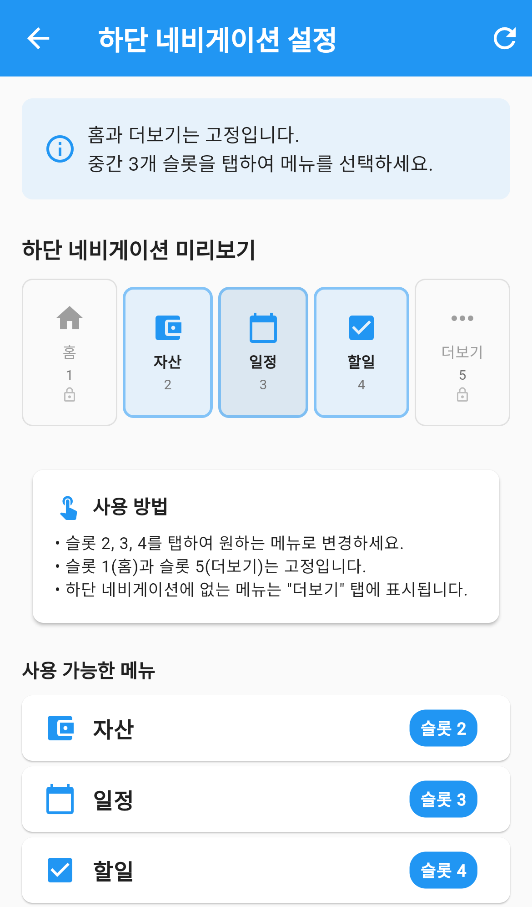
*하단 네비게이션 설정 — 5개 슬롯 중 가운데 3개를 바꿀 수 있습니다*

- **1번 슬롯(홈)** 과 **5번 슬롯(더보기)** 은 고정이라 바꿀 수 없습니다.
- 2·3·4번 슬롯을 눌러 원하는 메뉴로 바꿉니다.
- 하단에 넣지 않은 메뉴는 **더보기** 탭에서 그대로 쓸 수 있습니다.

### 슬롯 메뉴 바꾸기

1. 미리보기에서 바꾸고 싶은 **슬롯(2·3·4번)** 을 누릅니다.
2. 메뉴 목록에서 원하는 메뉴를 누릅니다.
3. 고른 즉시 적용되고 목록이 닫힙니다.

이미 다른 슬롯에 배치된 메뉴에는 `다른 슬롯에서 사용 중 (선택 시 교체)` 라고 표시됩니다.
그 메뉴를 고르면 두 슬롯의 메뉴가 서로 자리를 바꿉니다.

### 고를 수 있는 메뉴

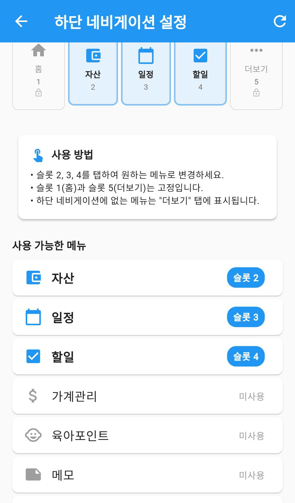
*사용 가능한 메뉴 — 슬롯에 배치된 메뉴에는 슬롯 번호가 붙습니다*

자산 · 일정 · 할일 · 가계관리 · 육아포인트 · 메모 · 미니게임 · 투자 지표 ·
그룹 저금통 · 냉장고 · 장보기 · 루틴 — 모두 12개 중에서 고릅니다.

목록에서 배치된 메뉴에는 `슬롯 2` 처럼 번호가, 배치되지 않은 메뉴에는 `미사용` 이 표시됩니다.

### 기본값으로 되돌리기

오른쪽 위 **새로고침 아이콘**을 누르면 처음 상태(자산 · 일정 · 할일)로 되돌립니다.
확인 창에서 `기본값으로 초기화` 를 누르면 적용됩니다.

---

## 홈 위젯 설정

대시보드에 표시할 요약 카드를 고르고 순서를 바꿉니다.
이 화면의 자세한 사용법은 **[대시보드](../dashboard/index.md)** 매뉴얼의 `대시보드 꾸미기` 를 봐 주세요.

---

## 테마 바꾸기

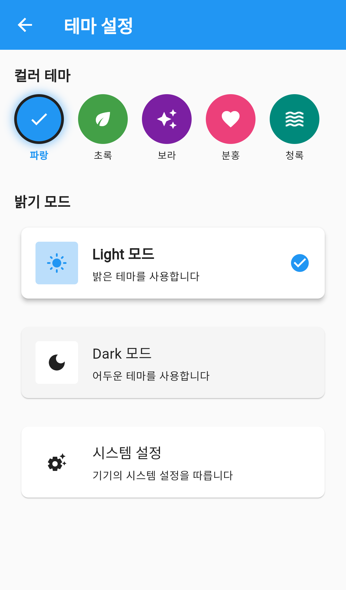
*테마 설정 — 색상 5종과 밝기 3종을 조합합니다*

### 컬러 테마

**파랑 · 초록 · 보라 · 분홍 · 청록** 다섯 가지 중에서 고릅니다.
원을 누르면 즉시 앱 전체 색상이 바뀌고, 고른 색에는 체크 표시가 붙습니다.

### 밝기 모드

| 항목 | 동작 |
|---|---|
| Light 모드 | 항상 밝은 테마를 사용합니다 |
| Dark 모드 | 항상 어두운 테마를 사용합니다 |
| 시스템 설정 | 기기의 시스템 설정을 따릅니다 |

컬러 테마와 밝기 모드는 따로 고르는 값이라 **원하는 대로 조합**할 수 있습니다.
예를 들어 초록 + Dark 모드로 쓸 수 있습니다.

---

## 언어 바꾸기

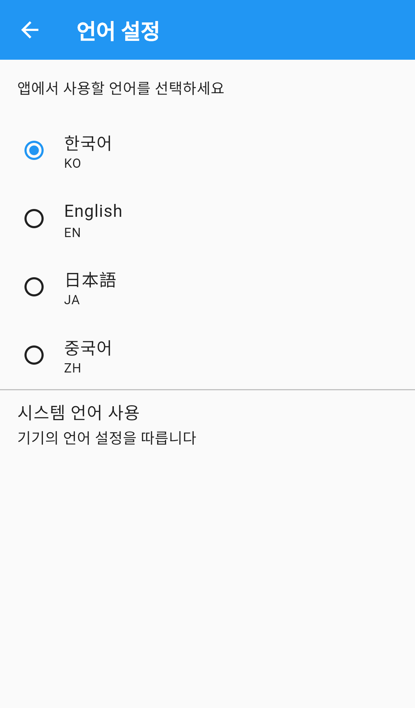
*언어 설정 — 4개 언어 또는 기기 언어 따라가기*

**한국어(KO) · English(EN) · 日本語(JA) · 중국어(ZH)** 중에서 고릅니다.
누르면 즉시 적용됩니다.

맨 아래 **시스템 언어 사용**을 누르면 기기의 언어 설정을 따라갑니다.
이 상태에서는 항목 오른쪽에 초록색 체크가 표시됩니다.

---

## 프로필 관리

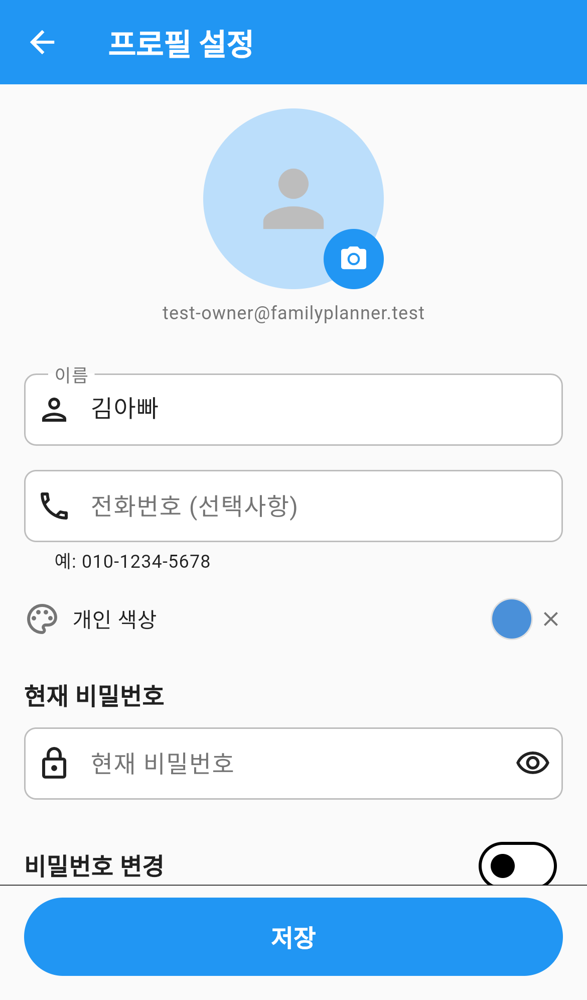
*프로필 설정 — 사진, 이름, 전화번호, 개인 색상*

### 사진 바꾸기

동그란 사진 오른쪽 아래의 **카메라 아이콘**을 누르고 사진을 고릅니다.
업로드하는 동안 사진 위에 진행 표시가 돌고, 끝나면 `프로필 사진이 업로드되었습니다` 라고 알려줍니다.

사진 아래에는 가입한 **이메일 주소**가 표시됩니다. 이메일은 바꿀 수 없습니다.

### 이름·전화번호

| 항목 | 필수 여부 | 비고 |
|---|---|---|
| 이름 | 필수 | 비우면 `이름을 입력해주세요` 라고 표시됩니다 |
| 전화번호 | 선택 | `010-1234-5678` 형태로 자동으로 정리됩니다 |

### 개인 색상

가족이 함께 쓸 때 **나를 나타내는 색깔**입니다.

1. `개인 색상` 오른쪽의 동그란 색 원을 누릅니다.
2. `개인 색상 선택` 창에서 원하는 색을 고릅니다.

색을 지우려면 원 옆에 생긴 **X** 를 누르세요.

> 사진은 고르는 즉시 반영되지만, **이름·전화번호·개인 색상은 맨 아래 `저장` 을 눌러야 반영됩니다.**

### 비밀번호 바꾸기

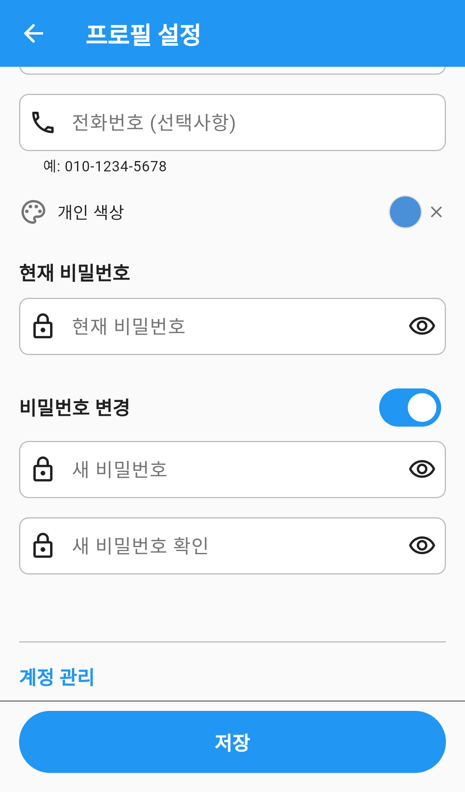
*비밀번호 변경 — 스위치를 켜야 입력란이 나옵니다*

1. **비밀번호 변경** 옆 스위치를 켭니다. `새 비밀번호` 와 `새 비밀번호 확인` 칸이 나타납니다.
2. 두 칸에 같은 비밀번호를 입력합니다.
3. 위쪽 `현재 비밀번호` 도 함께 입력합니다.
4. 맨 아래 **저장** 을 누릅니다.

- 비밀번호는 **6자 이상**이어야 합니다.
- 두 칸이 다르면 `비밀번호가 일치하지 않습니다` 라고 알려줍니다.
- 눈 모양 아이콘을 누르면 입력한 비밀번호를 확인할 수 있습니다.

> 소셜 로그인으로 가입해 비밀번호가 없는 계정이라면, 설정에서 `프로필` 을 누를 때
> 비밀번호를 먼저 만들라는 안내 창이 뜹니다. `나중에` 를 눌러 미룰 수도 있습니다.

### 계정 관리

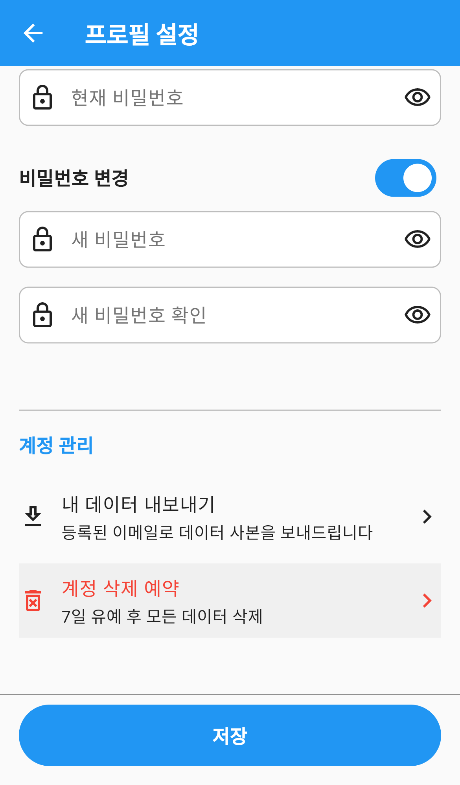
*계정 관리 — 데이터 내보내기와 계정 삭제 예약*

프로필 화면 맨 아래에 있습니다.

| 항목 | 하는 일 |
|---|---|
| 내 데이터 내보내기 | 등록된 이메일로 내 데이터 사본을 보내드립니다 |
| 계정 삭제 예약 | 7일 유예 후 계정과 모든 데이터를 영구 삭제합니다 |
| 계정 삭제 예약 취소 | 예약된 삭제를 취소합니다 (예약 중일 때만 보입니다) |

**계정 삭제 예약**을 누르면 확인 창이 뜨고, 예약하면 삭제 예정일을 알려줍니다.
유예 기간인 7일 동안에는 언제든 취소할 수 있습니다.
취소하면 `계정 삭제 예약이 취소되었습니다` 라고 표시되며, 이때부터는 다시 `계정 삭제 예약` 항목이 보입니다.

---

## 알림 설정

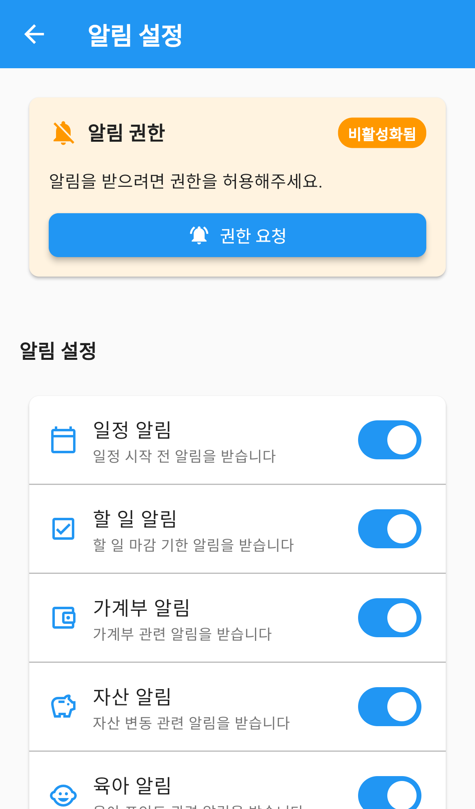
*알림 설정 — 권한 상태 카드와 알림 종류별 스위치*

맨 위에 **알림 권한** 카드가, 그 아래에 날씨 알림용 **위치 권한** 카드가 있습니다.

두 카드 모두 `활성화됨` 또는 `비활성화됨` 배지가 붙습니다.
비활성화 상태라면 카드 안의 **권한 요청** 버튼을 눌러 허용하세요.
전에 권한을 완전히 거부했다면 위치 권한 버튼이 **설정에서 권한 허용** 으로 바뀌며, 기기 설정 화면으로 이동합니다.

위치 권한은 **날씨 알림에만** 쓰입니다. 날씨 알림을 받지 않는다면 허용하지 않아도 됩니다.

### 받을 알림 고르기

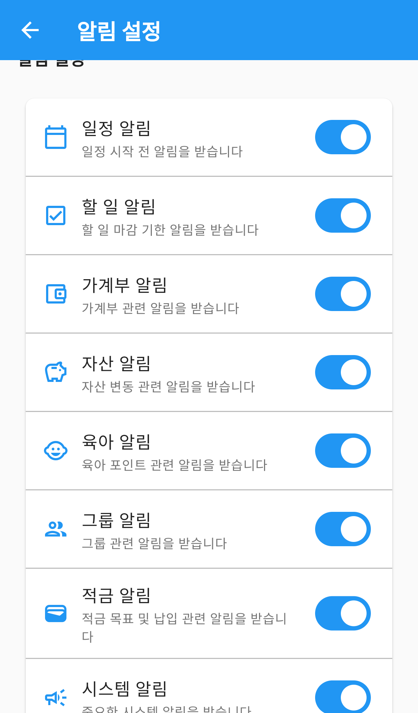
*알림 종류 — 필요한 알림만 켜 둘 수 있습니다*

| 알림 | 언제 옵니다 |
|---|---|
| 일정 알림 | 일정 시작 전 |
| 할 일 알림 | 할 일 마감 기한 |
| 가계부 알림 | 가계부 관련 소식 |
| 자산 알림 | 자산 변동 |
| 육아 알림 | 육아 포인트 관련 |
| 그룹 알림 | 그룹 관련 소식 |
| 적금 알림 | 적금 목표·납입 |
| 시스템 알림 | 중요한 공지 |
| 날씨 알림 | 비·눈 예보 또는 큰 기온 변화 |
| 루틴 알림 | 미체크 루틴 리마인드, 배지 획득, 주간 요약 |

**날씨 알림**과 **루틴 알림**은 켜면 시간을 고르는 항목이 함께 나타납니다.

- 날씨 알림 시간: 앱을 켰을 때 설정 시간이 지났으면 알림을 보냅니다.
- 루틴 리마인드 시간: 그 시간까지 체크하지 않은 오늘의 루틴이 있으면 알립니다.

### 알림 히스토리

받은 알림 전체 목록은 **알림 히스토리**에서 볼 수 있습니다.

---

## 내 신고 내역

내가 신고한 그룹원 목록과 처리 상태를 확인합니다.

---

## 정보

| 항목 | 하는 일 |
|---|---|
| 앱 정보 | 지금 쓰고 있는 앱 버전을 보여줍니다 |
| 이용약관 | 이용약관 전문을 봅니다 |
| 개인정보 처리방침 | 개인정보 처리방침 전문을 봅니다 |
| 도움말 | 앱 소개와 기능 안내를 처음부터 다시 봅니다 |

**도움말**을 누르면 확인 창이 뜨고, `다시 보기` 를 누르면
`다음 앱 실행 시 튜토리얼이 표시됩니다` 라고 알려줍니다. 앱을 다시 켜면 안내가 처음부터 나옵니다.

---

## 자주 묻는 질문

**Q. 하단 메뉴에서 뺀 기능은 어디로 가나요?**
없어지지 않습니다. **더보기** 탭에서 그대로 쓸 수 있습니다.

**Q. 테마를 바꿨는데 일부 화면 색이 그대로입니다.**
색상·밝기는 즉시 전체에 적용됩니다. 그대로라면 화면을 나갔다 다시 들어와 보세요.

**Q. 언어를 바꿨는데 일부 문구가 한국어로 남아 있습니다.**
아직 번역이 준비되지 않은 문구입니다. 사용에는 문제가 없습니다.

**Q. 비밀번호를 바꾸려는데 `현재 비밀번호` 칸이 보이지 않습니다.**
비밀번호가 없는 계정(소셜 로그인)입니다. 이 경우 현재 비밀번호 없이 새 비밀번호만 정하면 됩니다.

**Q. 계정을 지웠다가 되돌릴 수 있나요?**
예약 후 **7일 안**에는 `계정 삭제 예약 취소` 로 되돌릴 수 있습니다. 7일이 지나면 데이터가 영구 삭제되어 복구할 수 없습니다.

**Q. 알림을 켰는데 오지 않습니다.**
알림 설정 맨 위의 **알림 권한** 카드를 확인하세요. 권한이 꺼져 있으면 어떤 알림도 오지 않습니다.
