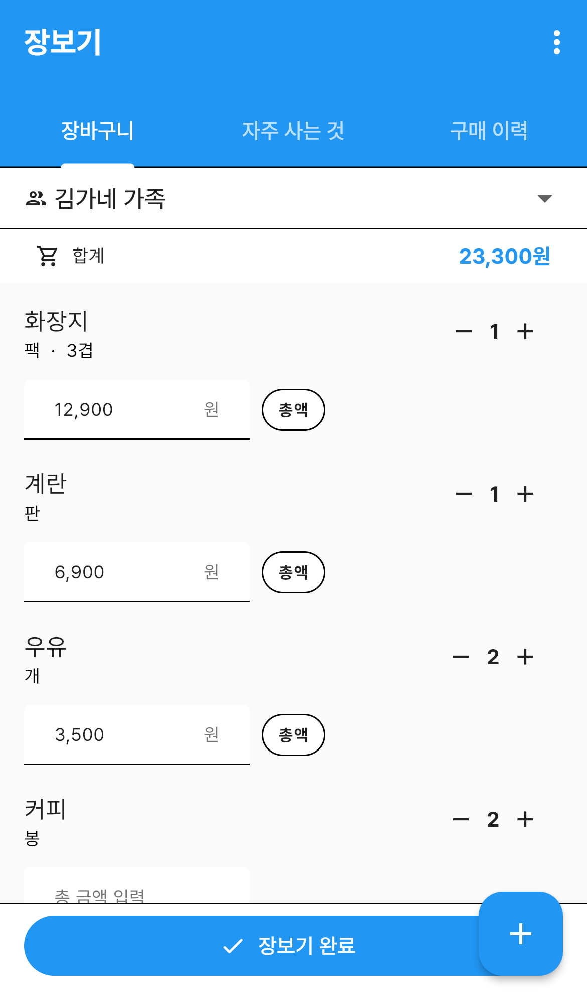
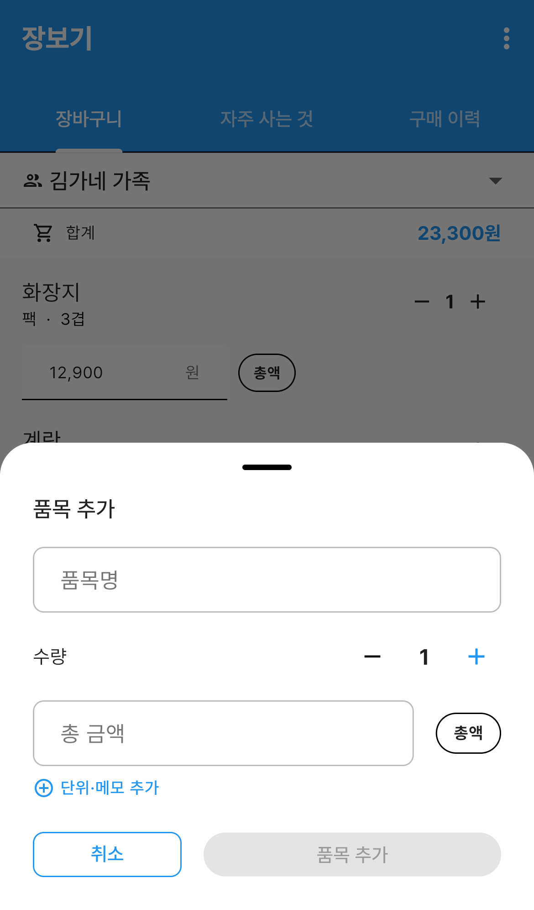
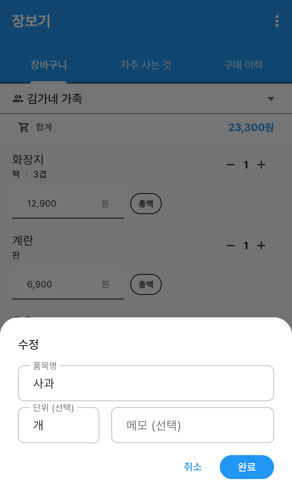
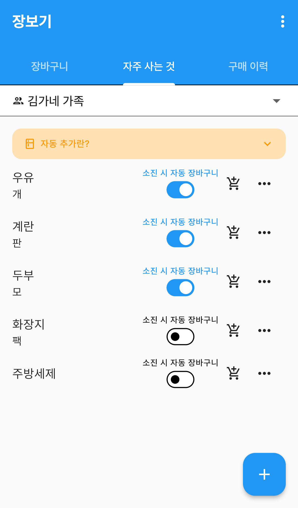
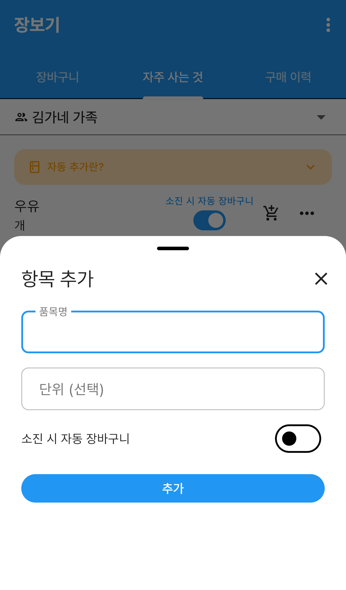
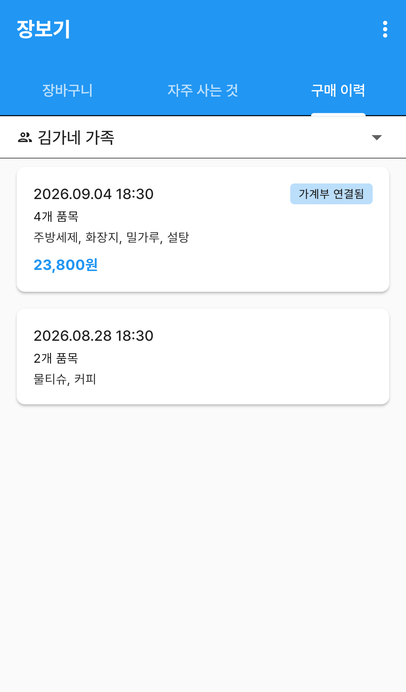
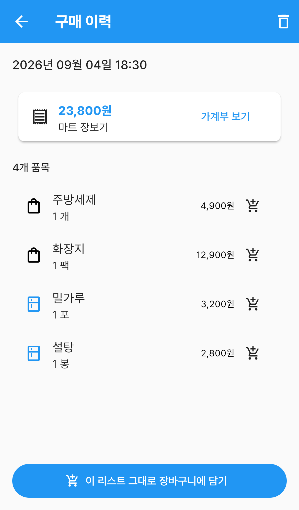
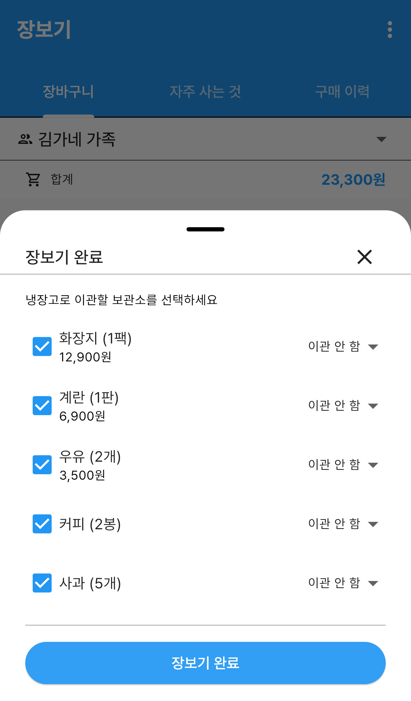
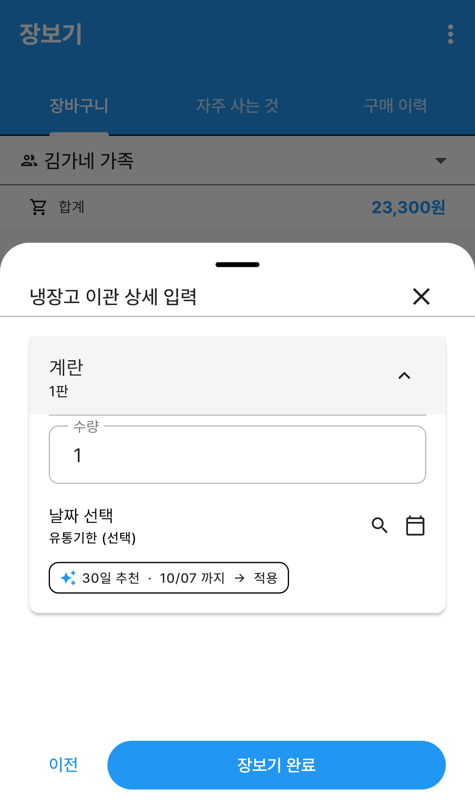

# 장보기

살 것을 미리 적어두고, 마트에서 사고, 사 온 것을 **냉장고와 가계부로 한 번에 넘기는** 메뉴입니다.

장을 다 보고 `장보기 완료` 를 누르면 이 세 가지가 한꺼번에 처리됩니다.

- 산 물건이 **구매 이력**으로 남습니다
- 고른 품목이 **냉장고**의 보관소에 등록됩니다
- 쓴 돈이 **가계부** 지출로 기록됩니다

`더보기` 탭 → **장보기** 로 들어갑니다. 가족이 같은 그룹을 보고 있으면 장바구니도 함께 씁니다.

---

## 화면 구성

화면 위쪽에 탭이 셋 있습니다.

| 탭 | 하는 일 |
|---|---|
| **장바구니** | 지금 사야 할 것을 담아둡니다 |
| **자주 사는 것** | 매번 사는 품목을 등록해 두고 한 번에 담습니다 |
| **구매 이력** | 지난 장보기 기록을 봅니다 |

탭 아래 **그룹 선택**에서 어느 가족의 장바구니를 볼지 고릅니다. 냉장고와 같은 그룹을 씁니다.

---

## 장바구니 — 살 것 적어두기

*장바구니 — 합계와 담은 품목*

| 영역 | 설명 |
|---|---|
| 합계 바 | 금액을 적은 품목들의 **합계**가 실시간으로 더해집니다 |
| 품목 줄 | 이름, 단위·메모, 수량 조절 버튼, 금액 입력칸 |
| 장보기 완료 | 화면 아래 고정 버튼. 장을 다 봤을 때 누릅니다 |
| ＋ 버튼 | 품목을 새로 담습니다 |

담긴 게 하나도 없으면 `장바구니가 비어 있습니다` 만 보입니다.

### 품목 담기

오른쪽 아래 **＋** 를 누릅니다.

*품목 추가 — 이름·수량·금액을 넣습니다*

1. **품목명** 을 적습니다. 전에 등록한 적 있는 이름은 자동완성으로 제안됩니다.
2. **수량** 을 －／＋ 로 맞춥니다.
3. 금액을 알면 적습니다. 몰라도 됩니다 — 마트에서 보고 적어도 됩니다.
4. 단위나 메모가 필요하면 **단위·메모 추가** 를 눌러 펼칩니다.
5. **품목 추가** 를 누릅니다.

품목명을 적기 전에는 `품목 추가` 버튼이 눌리지 않습니다.

### 금액을 총액으로 넣을까, 개당으로 넣을까

금액칸 옆의 **총액 / 개당** 칩을 눌러 바꿉니다.

- **총액** — 적은 금액이 그대로 그 품목의 값입니다
- **개당** — 적은 금액 × 수량이 값이 됩니다. 칸 아래에 `합계 7,000원` 처럼 계산 결과를 보여줍니다

`개당` 으로 두면 수량을 바꿀 때 금액도 같이 따라 바뀝니다.

### 수량 바꾸기와 빼기

- 품목 줄 오른쪽 **－ / ＋** 로 수량을 조절합니다
- **수량을 0까지 줄이면** 그 품목은 삭제 표시가 됩니다
- 품목 줄을 **왼쪽으로 밀어도** 삭제 표시가 됩니다
- 잘못 눌렀으면 오른쪽에 나타나는 **되돌리기** 를 누르세요

### 저장 버튼이 없습니다

장바구니는 **바꾸면 알아서 저장됩니다.** 손을 뗀 뒤 몇 초 지나면 서버로 올라가고,
저장하는 동안에는 합계 바에 표시가 잠깐 뜹니다.

마트에서 품목을 하나씩 지워가며 장을 볼 때 저장 버튼을 누를 필요가 없도록 만든 방식입니다.

### 이름·단위·메모 고치기

품목 줄을 **탭하면** 수정 창이 올라옵니다.

*품목 수정 — 이름·단위·메모*

수량과 금액은 목록에서 바로 고치고, 이 창에서는 이름·단위·메모를 고칩니다.

---

## 자주 사는 것

우유, 계란처럼 **매번 사는 품목**을 등록해 두는 곳입니다.

*자주 사는 것 — 소진 시 자동 장바구니 스위치*

| 영역 | 설명 |
|---|---|
| `자동 추가란?` 배너 | 눌러서 펼치면 자동 추가가 무엇인지 설명이 나옵니다 |
| 품목 줄 | 이름과 기본 단위 |
| **소진 시 자동 장바구니** | 냉장고에서 다 쓴 품목을 장바구니에 자동으로 담습니다 |
| 장바구니 아이콘 | 이 품목을 지금 바로 장바구니에 담습니다 |
| **⋮** | `수정` · `삭제` |

### 항목 등록하기

오른쪽 아래 **＋** 를 누릅니다.

*자주 사는 항목 추가*

품목명과 기본 단위를 적고, 필요하면 **소진 시 자동 장바구니** 를 켠 뒤 **추가** 를 누릅니다.
기본 단위는 장바구니에 담을 때 자동으로 따라옵니다.

### 소진 시 자동 장바구니

스위치를 켜두면 **냉장고에서 그 품목을 다 썼을 때** 장바구니에 저절로 담깁니다.
장 볼 때 "우유 사야 하는데" 하고 떠올리지 않아도 됩니다.

작동하려면 순서가 필요합니다.

1. 여기 **자주 사는 것에 먼저 등록**하고 스위치를 켭니다.
2. 그 **다음에** 냉장고에 같은 이름으로 넣은 품목이 연결됩니다.
3. 냉장고에서 그 품목을 지우면(수량 0 또는 스와이프 후 저장) 장바구니에 담깁니다.

이미 냉장고에 들어 있던 품목은 나중에 등록해도 바로 연결되지 않습니다.
그 품목을 냉장고에서 한 번 **수정해서 저장**하면 이름으로 다시 연결됩니다.

이름이 정확히 같아야 하고, 장바구니에 같은 이름이 이미 있으면 중복해서 담지 않습니다.

---

## 구매 이력

지난 장보기가 최근 것부터 쌓입니다.

*구매 이력 — 날짜별 장보기 기록*

카드 한 장이 장보기 한 번입니다. 날짜와 시각, 품목 수, 산 것들의 이름, 총액이 보입니다.
가계부에 등록한 장보기에는 **가계부 연결됨** 표가 붙습니다.

목록이 길면 맨 아래 **더보기** 로 이어서 봅니다.

### 이력 자세히 보기

카드를 누르면 그날 산 것이 전부 나옵니다.

*구매 이력 상세 — 품목별 금액과 냉장고 이관 여부*

- 위쪽 **영수증 카드** — 총액과 메모. **가계부 보기** 로 그 지출로 바로 넘어갑니다
- 품목 왼쪽 **아이콘** — 냉장고 모양이면 그때 냉장고로 넘긴 품목, 가방 모양이면 넘기지 않은 품목입니다
- 금액을 안 적은 품목은 `가격 미입력` 로 표시됩니다
- 품목 오른쪽 **장바구니 아이콘** — 그 품목 하나만 다시 담습니다
- 아래 **이 리스트 그대로 장바구니에 담기** — 그날 산 것을 통째로 다시 담습니다

지난달에 산 것을 그대로 또 사야 할 때 하나씩 적지 않아도 됩니다.

### 이력 지우기

오른쪽 위 **휴지통** 을 누릅니다.

> 이력만 지워집니다. **가계부 지출과 냉장고에 넣어둔 품목은 그대로 남습니다.**
> 삭제 창에도 같은 안내가 나옵니다.

---

## 장보기 완료하기

장을 다 봤으면 장바구니 탭 아래 **장보기 완료** 를 누릅니다.

### 1단계 — 무엇을 어디로 보낼지 고르기

*장보기 완료 1단계 — 냉장고 이관과 가계부 등록*

| 항목 | 설명 |
|---|---|
| 품목 왼쪽 **체크박스** | 체크를 풀면 이번 장보기에서 빠집니다. 장바구니에 그대로 남습니다 |
| 오른쪽 **이관 안 함 ▾** | 이 품목을 넣어둘 냉장고 보관소를 고릅니다 |
| **장보기 날짜** | 오늘이 아니면 바꿉니다. 어제 산 것을 지금 정리해도 됩니다 |
| **가계부에 등록** | 켜면 총액·메모·소비처·결제 수단을 적는 칸이 나옵니다 |

가계부 총액은 품목마다 적어둔 금액을 더해 자동으로 채워집니다. 직접 고쳐도 됩니다.

보관소를 하나도 고르지 않았다면 버튼이 바로 **장보기 완료** 입니다.
하나라도 골랐다면 **다음** 이 되어 2단계로 넘어갑니다.

### 2단계 — 냉장고에 넣을 품목 다듬기

*장보기 완료 2단계 — 이관 품목의 수량과 유통기한*

냉장고로 보내기로 한 품목만 하나씩 접힌 채로 나옵니다. 눌러 펼치면 고칠 수 있습니다.

- **수량** — 산 것 중 일부만 넣을 때 줄입니다
- **유통기한** — 달력에서 고르거나, `✨ 30일 추천 · 10/07 까지 → 적용` 칩을 눌러 추천 날짜를 그대로 씁니다
- 돋보기를 누르면 다른 품목을 기준으로 유통기한을 잡을 수 있습니다

다 됐으면 **장보기 완료** 를 누릅니다. 잘못 왔으면 **이전** 으로 돌아갑니다.

### 완료하면 이렇게 됩니다

- 장바구니가 비워집니다. **체크를 푼 품목은 그대로 남습니다**
- 구매 이력에 오늘 기록이 생깁니다
- 보관소를 고른 품목이 냉장고에 등록됩니다
- 가계부에 등록을 켰다면 지출이 하나 만들어집니다

---

## 자주 묻는 질문

**Q. 금액을 안 적으면 안 되나요?**
됩니다. 합계에 안 잡히고, 구매 이력에 `가격 미입력` 로 남을 뿐입니다.

**Q. 장바구니에서 지운 품목을 되살릴 수 있나요?**
삭제 표시 직후라면 **되돌리기** 로 살립니다. 저장된 뒤라면 구매 이력이나 자주 사는 것에서 다시 담으세요.

**Q. 냉장고로 안 보내고 가계부에만 올릴 수 있나요?**
됩니다. 1단계에서 보관소를 `이관 안 함` 으로 두고 **가계부에 등록** 만 켜면 됩니다.

**Q. 일부만 사고 나머지는 다음에 사고 싶어요.**
1단계에서 못 산 품목의 **체크를 푸세요.** 그 품목은 이력에 들어가지 않고 장바구니에 남습니다.

**Q. 장바구니를 저장하지 않고 나가면 어떻게 되나요?**
바꾼 내용은 몇 초 뒤 자동으로 저장됩니다. 바꾸자마자 화면을 닫으면 마지막 변경이 빠질 수 있으니
잠깐 기다렸다가 나가세요.

**Q. 가족이 동시에 장바구니를 고치면요?**
같은 그룹이면 같은 장바구니를 씁니다. 화면을 다시 열면 상대가 담은 것도 함께 보입니다.
