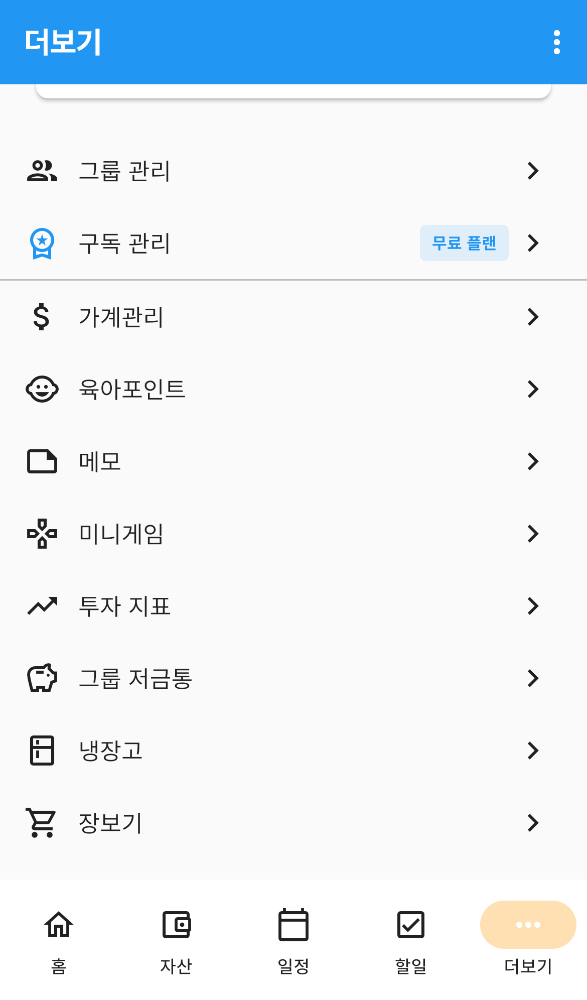
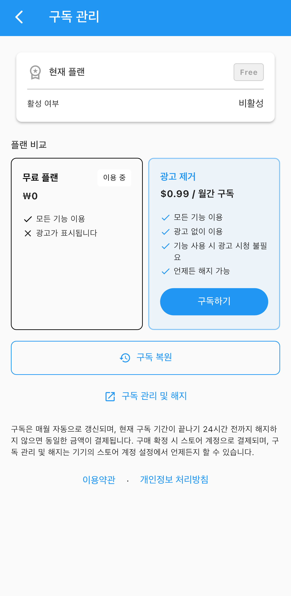

# 구독

앱은 **모든 기능을 무료로** 쓸 수 있습니다. 대신 화면 곳곳에 광고가 나오고,
일부 기능은 쓸 때 광고를 한 번 봐야 합니다.

**광고 제거** 구독을 하면 그 광고가 전부 사라집니다. 기능이 늘어나는 게 아니라
**광고만 없어지는** 구독입니다.

---

## 들어가는 곳

`더보기` 탭 → **구독 관리**

*더보기 탭의 구독 관리 — 오른쪽에 지금 쓰는 플랜이 표시됩니다*

오른쪽 딱지로 지금 상태를 바로 알 수 있습니다. `무료 플랜` · `광고 제거` · `무료 체험` 중 하나입니다.

---

## 구독 화면

*구독 관리 — 현재 플랜과 플랜 비교*

| 영역 | 설명 |
|---|---|
| **현재 플랜** | 지금 쓰는 플랜과 활성 여부 |
| **플랜 비교** | 무료 플랜과 광고 제거를 나란히 놓고 비교합니다 |
| **구독 복원** | 예전에 구독한 적이 있으면 되살립니다 |
| **구독 관리 및 해지** | 스토어의 구독 설정 화면으로 이동합니다 |

구독 중이면 현재 플랜 카드에 **남은 기간**과 **다음 갱신일**도 함께 나옵니다.

### 두 플랜의 차이

| | 무료 플랜 | 광고 제거 |
|---|---|---|
| 모든 기능 이용 | ✅ | ✅ |
| 광고 | 표시됨 | **없음** |
| 기능 사용 시 광고 시청 | 필요 | **불필요** |
| 해지 | — | 언제든 가능 |

**기능 차이는 없습니다.** 가계부·일정·냉장고 같은 기능은 무료로도 전부 쓸 수 있습니다.

> 월 요금은 화면의 **광고 제거** 카드에 표시됩니다.
> 스토어 계정의 국가에 따라 통화와 금액이 다르게 보입니다.

---

## 구독하기

1. **광고 제거** 카드의 **구독하기** 를 누릅니다
2. 스토어(App Store · Google Play) 결제창이 뜹니다
3. 결제를 마치면 바로 광고가 사라집니다

결제는 **스토어 계정으로** 이루어집니다. 앱에 카드 번호를 넣는 일은 없습니다.

### 자동 갱신

> 구독은 매월 자동으로 갱신되며, 현재 구독 기간이 끝나기 24시간 전까지 해지하지 않으면
> 동일한 금액이 결제됩니다.

이 안내가 구독 화면 아래에도 적혀 있습니다.

---

## 해지하기

**구독 관리 및 해지** 를 누르면 스토어의 구독 설정 화면이 열립니다.
해지는 앱이 아니라 **스토어에서** 합니다.

- iPhone — App Store 계정의 구독 설정
- Android — Google Play 계정의 구독 설정

해지해도 **남은 기간까지는 광고 없이** 쓸 수 있고, 그 기간이 끝나면 무료 플랜으로 돌아갑니다.

> **해지해도 기록은 지워지지 않습니다.** 가계부·일정·사진 등 그동안 쌓은 것은 그대로 남고,
> 광고가 다시 나오는 것만 달라집니다.

---

## 기기를 바꾸거나 앱을 다시 설치했다면

**구독 복원** 을 누르세요. 같은 스토어 계정으로 로그인되어 있으면 구독 상태를 되살립니다.
다시 결제할 필요가 없습니다.

---

## 자주 묻는 질문

**Q. 구독하면 기능이 더 늘어나나요?**
아닙니다. **광고만 없어집니다.** 기능은 무료 플랜에서도 전부 쓸 수 있습니다.

**Q. 가족 중 한 명만 구독하면 다른 가족도 광고가 없어지나요?**
아닙니다. 구독은 **스토어 계정 단위**라 구독한 사람에게만 적용됩니다.

**Q. 결제했는데 광고가 계속 나옵니다.**
**구독 복원** 을 한 번 눌러보세요. 그래도 그대로면 Q&A로 문의해주세요.

**Q. 해지하면 그동안 쓴 기록이 사라지나요?**
사라지지 않습니다. 광고가 다시 표시되는 것만 달라집니다.

**Q. 앱에서 바로 해지할 수 없나요?**
스토어 정책상 구독 해지는 스토어에서만 됩니다. **구독 관리 및 해지** 버튼이 그 화면으로 데려다줍니다.
