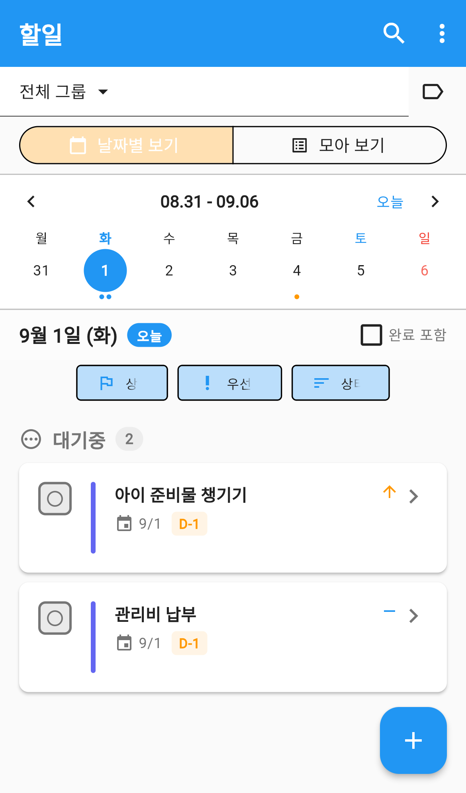
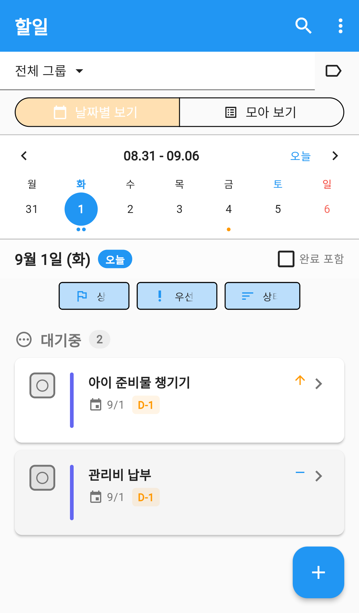
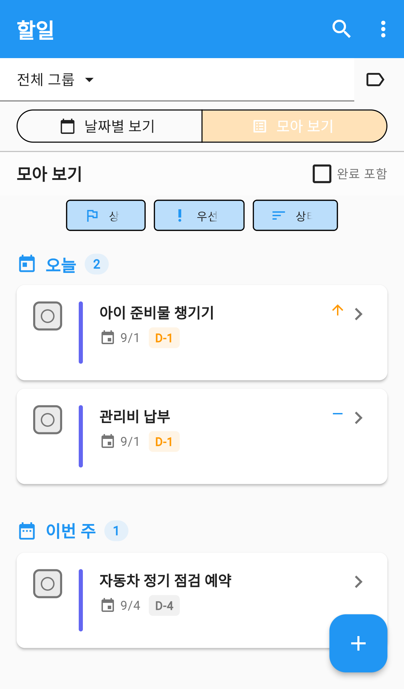

# 할일

가족이 함께 챙겨야 할 일을 모아 관리하는 메뉴입니다.
누가 무엇을 언제까지 해야 하는지, 지금 어디까지 됐는지를 한곳에서 봅니다.

일정과 같은 데이터를 쓰기 때문에, 등록할 때 유형만 바꾸면 달력에도 함께 표시할 수 있습니다.

---

## 화면 구성

*할일 — 주간 날짜 바와 그날의 할일*

| 영역 | 설명 |
|---|---|
| 그룹 선택 | `전체 그룹`을 누르면 볼 그룹을 고릅니다 |
| 보기 전환 | `날짜별 보기` / `모아 보기` |
| 주간 바 | 한 주를 보여주고, 날짜를 눌러 그날 할일만 봅니다 |
| 필터·정렬 | 상태 · 우선순위 · 정렬 기준 |
| 완료 포함 | 체크하면 끝난 할일도 함께 보입니다 |
| 목록 | 할일 카드 |

### 앱바 버튼

| 버튼 | 하는 일 |
|---|---|
| 돋보기 | 할일을 검색합니다 |
| `⋮` | 추가 메뉴 |

---

## 두 가지 보기 방식

### 날짜별 보기

주간 바에서 날짜를 고르면 **그날에 해당하는 할일**만 보여줍니다.
`오늘` 을 누르면 오늘로 돌아옵니다.

시작일과 마감일이 모두 있는 할일은 그 사이 모든 날짜에 표시되고,
마감일만 있는 할일은 마감일 당일에 표시됩니다.

*할일 카드 — 마감일과 남은 기간, 우선순위*

### 모아 보기

*모아 보기 — 기간별로 묶어서 한눈에*

전체 할일을 기간별 묶음으로 보여줍니다.

- 지난 할일
- 오늘
- 내일
- 이번 주
- 다음 주
- 그 이후
- 기한 없음

묶음 이름 옆의 숫자가 그 묶음의 할일 개수입니다.

---

## 할일 카드 읽는 법

| 표시 | 뜻 |
|---|---|
| 왼쪽 동그라미 | 현재 상태 — 누르면 상태를 바꿉니다 |
| 세로 색 막대 | 그룹 색 (누가 만든 그룹의 일인지) |
| 날짜 + `D-N` | 마감일과 남은 기간 |
| 화살표 아이콘 | 우선순위 (긴급·높음일 때만 표시) |
| `>` | 상세 화면으로 이동 |

---

## 상태 바꾸기

할일 카드 왼쪽의 동그라미를 누르면 상태를 고를 수 있습니다.

| 상태 | 뜻 |
|---|---|
| 대기중 | 아직 시작하지 않음 |
| 진행중 | 지금 하고 있음 |
| 완료 | 끝냄 |
| 보류 | 잠시 멈춤 |
| 드롭 | 하지 않기로 함 |
| 실패 | 못 끝냄 |

완료·드롭·실패로 바꾼 할일은 목록에서 사라집니다.
다시 보려면 오른쪽 위 **완료 포함**을 체크하세요.

---

## 걸러 보기와 정렬

목록 위 칩 세 개로 조절합니다.

| 칩 | 고를 수 있는 것 |
|---|---|
| 상태 | 6가지 상태 중 하나만 골라 봅니다 |
| 우선순위 | 긴급 / 높음 / 보통 / 낮음 |
| 정렬 | 상태순 · 우선순위순 · 마감일순 · 생성일순 |

필터를 걸어두면 칩에 고른 값이 표시됩니다. 다시 눌러 해제합니다.

---

## 할일 등록하기

1. 오른쪽 아래 **＋** 버튼을 누릅니다.
2. **제목**을 입력합니다. (필수)
3. **마감일**을 정합니다.
4. 필요하면 우선순위·그룹·메모를 채우고 저장합니다.

등록 화면은 일정과 같습니다. 위쪽 **유형**에서 무엇을 고르는지가 중요합니다.

| 유형 | 어디에 보이나 |
|---|---|
| 할일 전용 | 할일 메뉴에만 |
| 할일 연동 | 할일 메뉴 + 달력 양쪽에 |
| 캘린더 전용 | 달력에만 (할일에는 안 보임) |

자세한 입력 항목은 [일정](../calendar/index.md) 매뉴얼의 `일정 등록하기` 를 봐 주세요.

---

## 자주 묻는 질문

**Q. 등록한 할일이 목록에 안 보입니다.**
`날짜별 보기`에서는 고른 날짜에 해당하는 할일만 나옵니다. 전체를 보려면 `모아 보기`로 바꾸거나 주간 바에서 마감일이 있는 날짜를 고르세요.

**Q. 완료한 할일은 어디로 가나요?**
목록에서 숨겨질 뿐 지워지지 않습니다. 오른쪽 위 **완료 포함**을 체크하면 다시 보입니다.

**Q. 달력에도 같이 표시하고 싶습니다.**
할일을 수정해 유형을 `할일 연동` 으로 바꾸세요.

**Q. 칸반 보드는 어디 있나요?**
칸반 보드는 화면이 넓은 태블릿·데스크톱에서만 나옵니다. 휴대폰에서는 목록 보기만 사용합니다.

**Q. 다른 가족이 만든 할일이 안 보입니다.**
위쪽 **그룹 선택**을 확인하세요. `전체 그룹`으로 두면 참여 중인 모든 그룹의 할일이 함께 보입니다.
