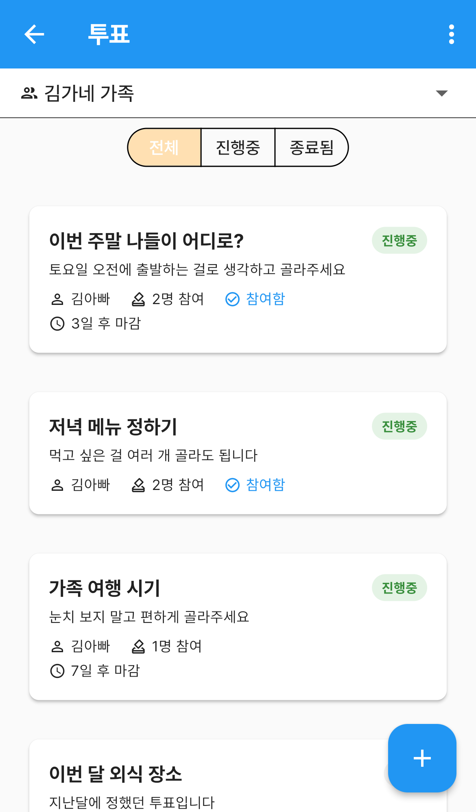
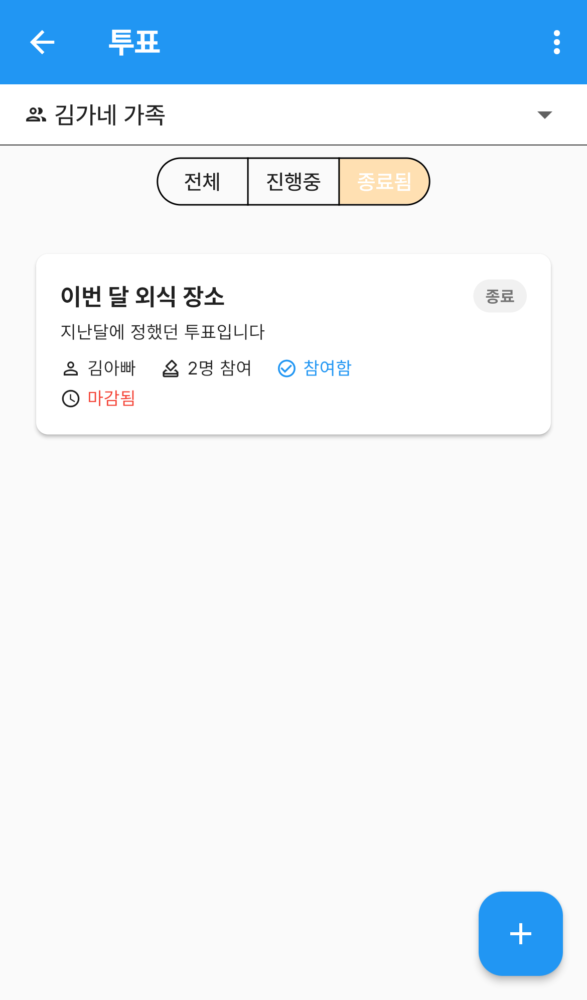
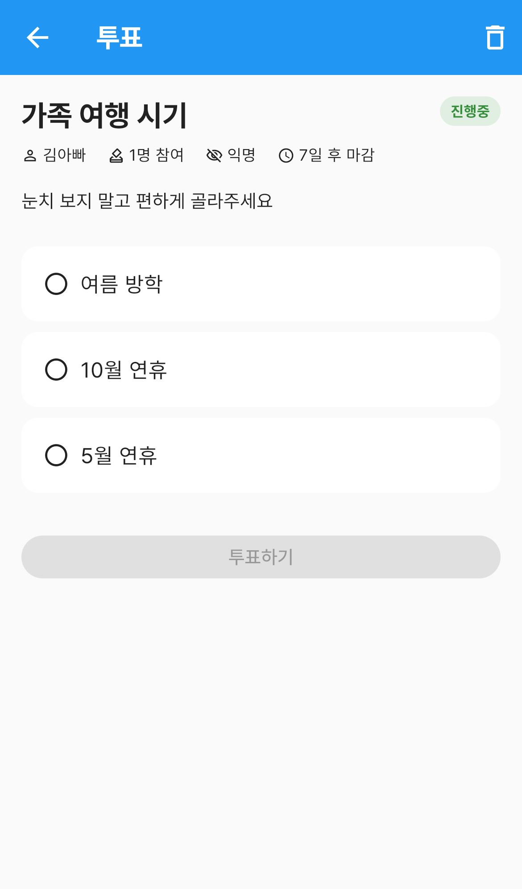
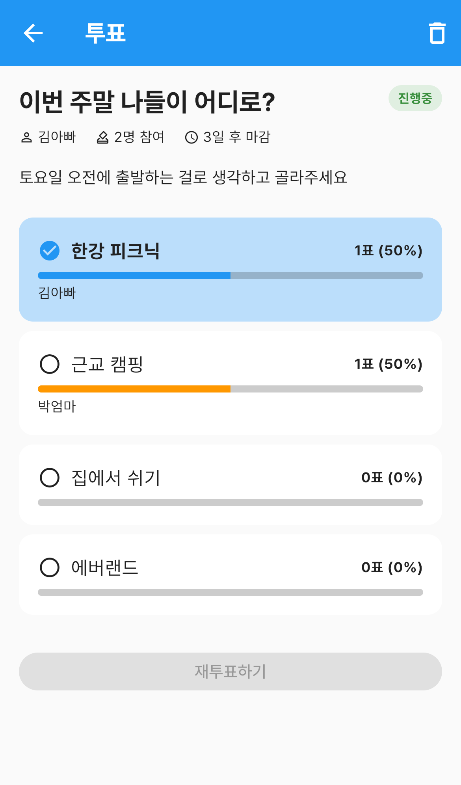
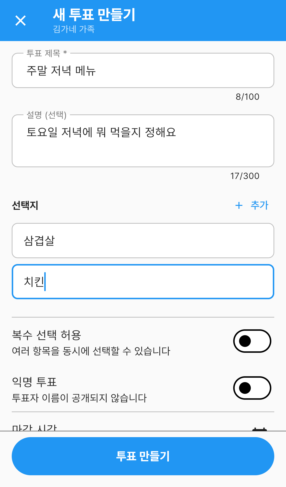
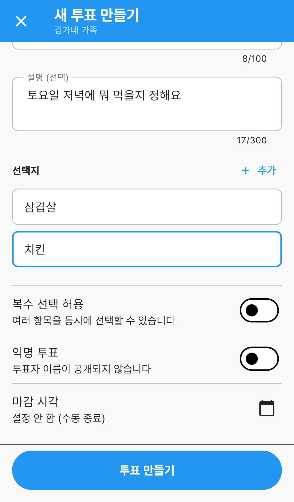

# 투표

가족끼리 **의견을 물어보고 표로 정하는** 메뉴입니다.

"이번 주말 어디 갈까?", "저녁 뭐 먹을까?" 처럼 단톡방에서 흐지부지되기 쉬운 이야기를
선택지로 만들어 두면, 각자 편할 때 눌러 결정할 수 있습니다.

`더보기` 탭 → **투표** 로 들어갑니다.

---

## 화면 구성

*투표 목록 — 진행중과 종료된 투표*

| 영역 | 설명 |
|---|---|
| 그룹 선택 | 어느 가족의 투표를 볼지 고릅니다 |
| 필터 | `전체` · `진행중` · `종료됨` |
| 투표 카드 | 제목, 설명, 만든 사람, 참여 인원, 마감까지 남은 시간 |
| ＋ 버튼 | 새 투표를 만듭니다 |

### 카드 읽는 법

- 오른쪽 위 **진행중 / 종료** — 지금 투표할 수 있는지
- **참여함** — 내가 이미 표를 던진 투표입니다
- **N명 참여** — 지금까지 참여한 사람 수
- **3일 후 마감** — 마감까지 남은 시간. 마감이 지나면 빨간 **마감됨**
- 마감을 정하지 않은 투표에는 이 줄이 아예 없습니다

### 필터

*필터로 종료된 투표만 봅니다*

지난 결정을 다시 찾아볼 때는 **종료됨** 으로 걸러 보세요.

---

## 투표하기

목록에서 카드를 누르면 상세 화면이 열립니다.

*아직 투표하지 않은 투표 — 항목을 고르고 투표하기*

1. 선택지를 눌러 고릅니다. **하나만** 고를 수 있는 투표는 다른 걸 누르면 바뀝니다
2. 아래 **투표하기** 를 누릅니다

고르기 전에는 **투표하기** 버튼이 눌리지 않습니다.

제목 아래 줄에 이 투표의 성격이 표시됩니다.

| 표시 | 뜻 |
|---|---|
| **복수 선택** | 여러 항목을 동시에 고를 수 있습니다 |
| **익명** | 누가 무엇을 골랐는지 이름이 공개되지 않습니다 |
| **7일 후 마감** | 남은 시간 |

### 결과 보기

*투표한 뒤 — 항목별 득표와 비율*

표를 던지면 항목마다 **득표 수와 비율**이 막대로 나옵니다.
내가 고른 항목은 파란 배경에 체크로 표시됩니다.

익명 투표가 아니면 막대 아래에 **누가 골랐는지 이름**이 나옵니다.
익명 투표에서는 숫자만 보이고 이름은 나오지 않습니다.

마음이 바뀌었으면 다른 항목을 고르고 **재투표하기** 를 누르면 됩니다.
마감된 투표에서는 버튼이 눌리지 않고 결과만 볼 수 있습니다.

---

## 새 투표 만들기

목록 오른쪽 아래 **＋** 를 누릅니다.

*새 투표 만들기 — 제목과 선택지*

1. **투표 제목** 을 적습니다. 필수이고 100자까지 들어갑니다
2. **설명** 은 선택입니다. 300자까지 — "토요일 오전 출발 기준으로 골라주세요" 처럼 조건을 적어두면 좋습니다
3. **선택지** 를 채웁니다. 기본 두 칸이 있고 **＋ 추가** 로 늘립니다. **2개 이상** 있어야 만들 수 있습니다

*복수 선택·익명·마감 시각 설정*

아래쪽에 세 가지 설정이 있습니다.

| 설정 | 설명 |
|---|---|
| **복수 선택 허용** | 켜면 여러 항목을 동시에 고를 수 있습니다 |
| **익명 투표** | 켜면 누가 무엇을 골랐는지 공개되지 않습니다 |
| **마감 시각** | 정해두면 그때 자동으로 종료됩니다. 기본은 `설정 안 함 (수동 종료)` |

다 됐으면 아래 **투표 만들기** 를 누릅니다.

> **익명 여부와 복수 선택은 만든 뒤에 바꿀 수 없습니다.** 만들기 전에 확인하세요.

---

## 투표 지우기

상세 화면 오른쪽 위 **휴지통** 으로 지웁니다.
`삭제된 투표는 복구할 수 없습니다` 라고 한 번 더 물어봅니다.

지울 수 있는 사람은 **투표를 만든 사람과 그룹장** 입니다.

---

## 자주 묻는 질문

**Q. 투표 목록이 비어 있습니다.**
위쪽 그룹 선택을 확인하세요. 투표는 그룹마다 따로 관리됩니다.
그 그룹에 아직 투표가 없으면 `아직 투표가 없습니다` 안내가 나옵니다.

**Q. 마감 시각을 안 정하면 투표가 계속 열려 있나요?**
네. 만든 사람이 지우기 전까지 계속 진행중입니다.

**Q. 이미 투표했는데 바꿀 수 있나요?**
진행중이면 됩니다. 다른 항목을 고르고 **재투표하기** 를 누르세요. 마감된 뒤에는 바꿀 수 없습니다.

**Q. 익명 투표인데 참여 인원은 왜 보이나요?**
**몇 명이 참여했는지**는 보이고, **누가 무엇을 골랐는지**만 가려집니다.

**Q. 다른 가족이 만든 투표도 지울 수 있나요?**
아닙니다. **만든 사람과 그룹장**만 지울 수 있습니다.
권한이 없으면 상세 화면에 휴지통 버튼 자체가 보이지 않습니다.
